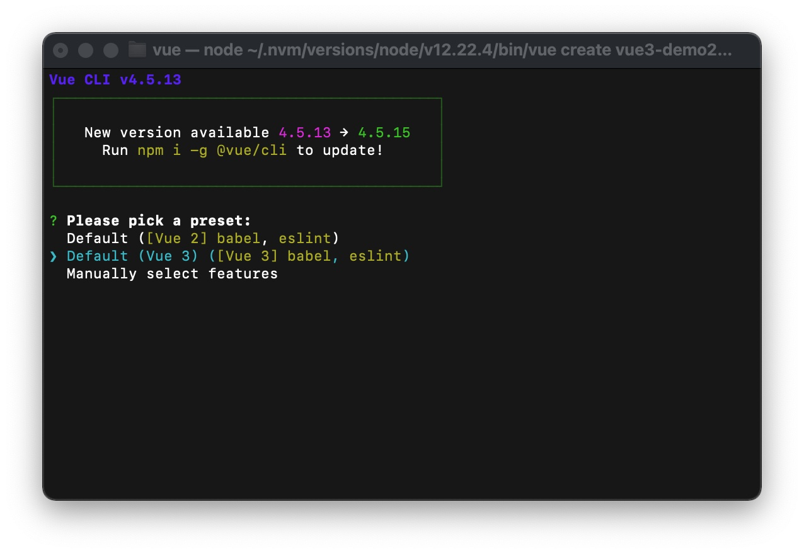
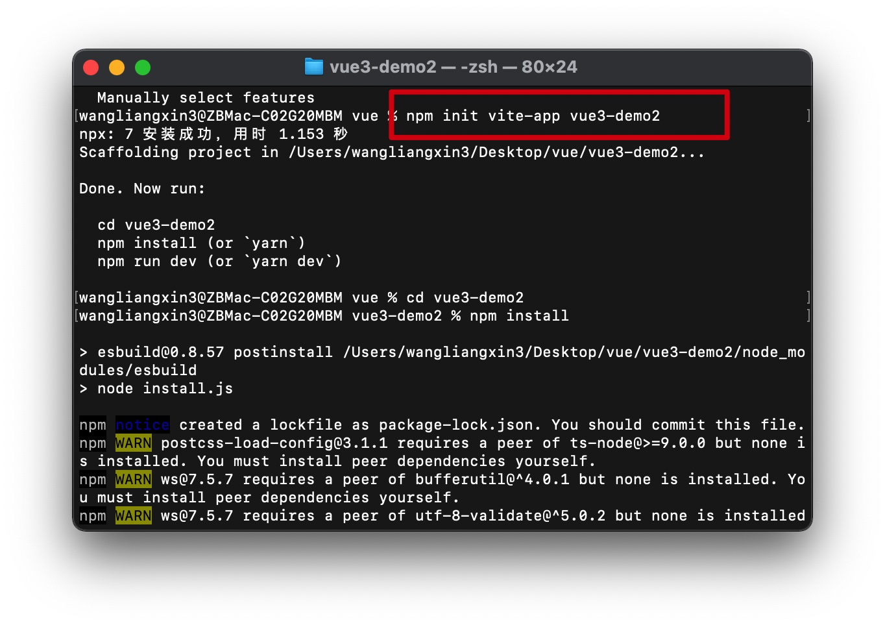

推荐阅读：
[浅学vue3](https://juejin.cn/post/7043986391620911117?utm_source=gold_browser_extension)

[不要再用Vue 2的思维写Vue 3了](https://mp.weixin.qq.com/s/w4n_WhbDqK4kgzxEHUWWfw)


## 组合api思维

我们在使用vue3的时候会发现很能抽出`hook函数`, 很大一部分原因在于我们在关系复用问题，其实这不正确，
好的代码，**可维护性**比**可复用**更重要。

**逻辑关注点**，逻辑关注点是指表达同一个业务的代码内聚到一起，这也是**单一职责**的指导思想，我们内聚的不应该技术类型，而是业务逻辑，因为触发代码变更的往往是业务需求，因此把相同变更理由的代码放在一起，这才不会导致散弹式修改

## 创建Vue3.x项目

- 方法一： vue-cli 脚手架创建

```bash

vue create vue3-demo

// 选择第二个

```



- 方法二： vite 脚手架创建


```bash

npm init vite-app vue3-demo2

```




## 目录结构

1, Vite生成的Vue3目录结构和vue-cli生成的Vue2项目基本一致，入口文件同样为main.js。

2, Vue3入口引入的不再是Vue的构造函数，而是名为createApp的工厂函数，若继续Vue2里边的写法，import Vue from 'vue' 打印出来的Vue则为undefined。也就是说Vue2里边的写法并不被兼容。creatApp(App)相当于Vue2里定义的vm，且会更轻量。


## 

