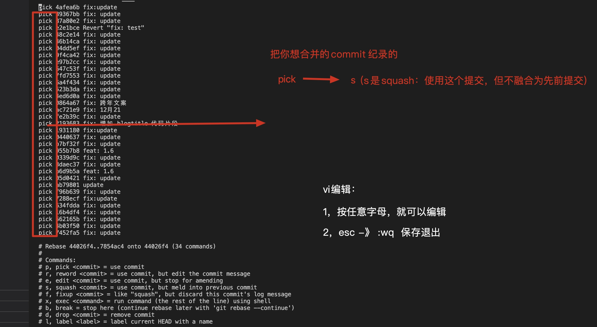

推荐阅读：

[彻底搞懂 Git-Rebase](http://jartto.wang/2018/12/11/git-rebase/)


:strawberry: **及其重要** ```git push -f``` 合并提交后需要强推一次，这样才能保证commit被合并了，千万不能使用git pull，或者在 vscode中点击拉取/更新分支操作, 否则那些合并的提交依然出现，强推到自己的分支后就可以去合并master并代码评审了。

没啥阮用，我试过了。

~~不强制提交的方法: [rebase之后如何避免使用git push -f来提交代码的规范流程](https://blog.chengbo.net/2014/04/10/how-to-prevent-git-push-force.html)~~

:strawberry:  以下才真滴管用。

```rebase -i``` 之后，不要提交代码， 这时可以 ```git log```看看合并成你想要的样子了没有，然后 ```git checkout -b branchName-relase```, 新建一个分支，然后再新分支上提交，就可以了，然后再用新分支 去合并到 master分支，这样master分支就很干净。 


## git rebase

git rebase主要作用：  1，变基； 2，合并提交纪录

- 变基

```
branch1 % git fetch origin master

branch1 % git rebase master

```


- 合并提交纪录（重要）

场景: 在开发时，我们常常会有多条提交纪录，某个功能上线，可能会存在100多条提交，或者**测试**，**走查**时，存在一些并不重要的提交纪录。
我们上线前将自己开发的分支合并到master上时，就会存在超级多的提交纪录，实际上，我们应该只留下一条或几条关键的提交纪录即可，这时，我们就可以用
上```git rebase -i```。

流程如下：

```
git rebase -i HEAD~4     // 准备合并4条提交纪录 

```




保存退出后，可以编辑 信息


**重要：**

1，``git log``` 查看是否合并成功了

2，有时候需要解决冲突，解决完毕 ```git add .```  ```git rebase --continue```

3，任何时候都可以使用 ```git rebase --abort``` 终止变基


:strawberry: **及其重要** ```git push -f``` 合并提交后需要强推一次，这样才能保证commit被合并了，千万不能使用git pull，或者在 vscode中点击拉取/更新分支操作