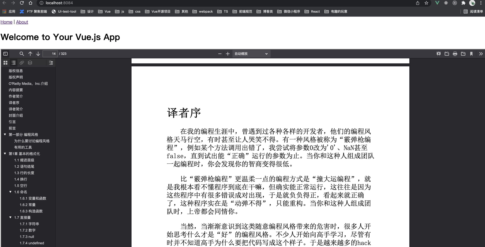
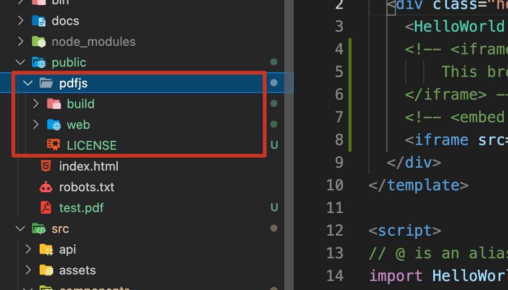

<Boxx type='tip' />

## 代码：

```vue
<template>
  <div class="home">
    <!--方法1 -->
    <!-- <iframe src="/test.pdf" width="100%" height="2000px">
        This browser does not support PDFs. Please download the PDF to view it: <a href="/test.pdf">Download PDF</a>
    </iframe> -->

    <!--方法2 -->
    <!-- <embed src="/test.pdf" width="100%" height="2000px" /> -->

    <!--方法3 pdf.js-->
    <iframe src="/pdfjs/web/viewer.html?file=/test.pdf" width="100%" height="2000px"></iframe>
  </div>
</template>
```
## 效果：




注意静态文件目录： ```vue-cli2： static``` |  ```vue-cli3： public``` 静态资源文件不经过 webpack 处理

- 方法1： 

直接依靠 将pdf的地址给 iframe的src
```html
<iframe src="/test.pdf" width="100%" height="2000px">
    This browser does not support PDFs. Please download the PDF to view it: <a href="/test.pdf">Download PDF</a>
</iframe> 
```

- 方法2：

```html
<embed src="/test.pdf" width="100%" height="2000px" /> 
```

- 方法3： pdf.js

```html
<iframe src="/pdfjs/web/viewer.html?file=/test.pdf" width="100%" height="2000px"></iframe>
```

步骤：

1，在pdf.js官网下载稳定版本

2，将文件拷贝到```public```目录下


3, 需要放 pdf 的页面(注意src的路径 file=相对地址)

```html
<iframe src="/pdfjs/web/viewer.html?file=/test.pdf" width="100%" height="2000px"></iframe>
```

