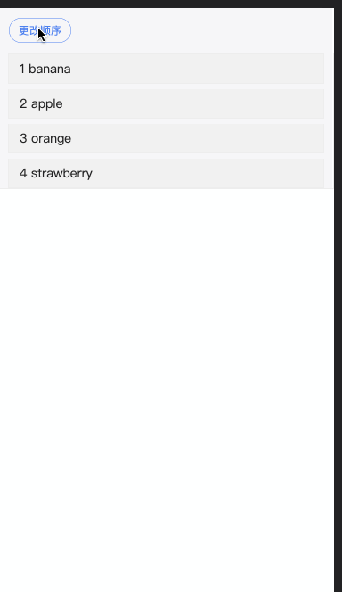

<Boxx type='tip' />

[vue.draggable中文文档](https://www.itxst.com/vue-draggable/tutorial.html)

## 我的demo




## 完整代码

```vue 
<!-- 测试页面 -->
<template>
  <div>
    <!--使用draggable组件-->
    <div class="itxst">
      <div class="control"><wd-button plain size="small" @click="sort">{{ sortable ? "完成排序" : "更改顺序" }}</wd-button></div>
      <div class="col">
        <draggable
          v-model="arr1"
          handle=".mover"
          animation="300"
          @start="onStart"
          @end="onEnd"
        >
          <transition-group>
            <div class="item" v-for="(item,index) in arr1" :key="item.id">
              <span> {{ index + 1 }} {{ item.name }}</span> <span class="mover" v-if="sortable">=</span>
            </div>
          </transition-group>
        </draggable>
      </div>
    </div>
  </div>
</template>
<script>
// 导入draggable组件
import draggable from 'vuedraggable'
export default {
  // 注册draggable组件
  components: {
    draggable
  },
  data () {
    return {
      sortable: false,
      disabled: false,
      // 定义要被拖拽对象的数组
      arr1: [
        { id: 1, name: 'banana' },
        { id: 2, name: 'apple' },
        { id: 3, name: 'orange' },
        { id: 4, name: 'strawberry' }
      ]
    }
  },
  methods: {
    // 设置禁止拖拽
    setJY () {
      this.disabled = true
    },
    // 设置启用拖拽
    setQY () {
      this.disabled = false
    },
    // 开始拖拽事件
    onStart () {
      this.drag = true
    },
    // 拖拽结束事件
    onEnd () {
      this.drag = false
    },
    sort () {
      this.sortable = !this.sortable
      if (!this.sortable) {
        console.log('完成排序了，此时的顺序为：')
        console.log(this.arr1)
      }
    }
  }
}
</script>
<style scoped>
/*定义要拖拽元素的样式*/

.control{
  height: 39px;
  padding-left: 12px;
  padding-top: 11px;
}
.col {
  width: 100%;
  flex: 1;
  /* border: solid 1px #eee; */
}

.item {
  padding: 6px 12px;
  margin: 0px 10px 0px 10px;
  border: solid 1px #eee;
  background-color: #f1f1f1;
  /* text-align: left; */
  display: flex;
  justify-content: space-between;
}
.item + .item {
  border-top: none;
  margin-top: 6px;
}
.mover {
  background-color: #fdfdfd;
  cursor: move;
  padding: 0 8px;
}
</style>

```