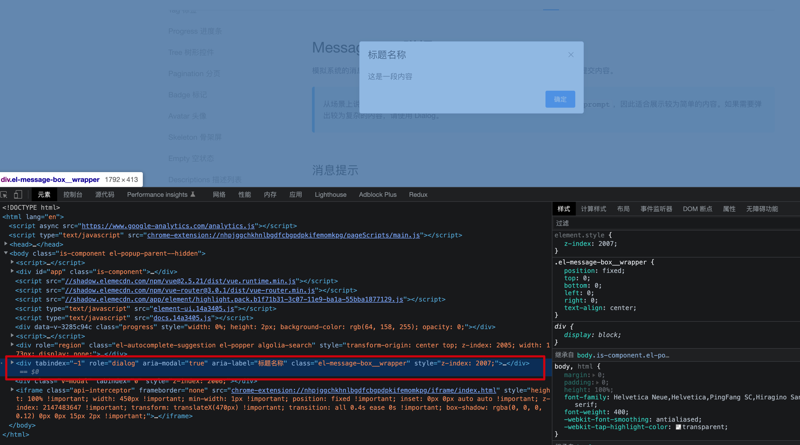

<Boxx type='tip' />


## ```Teleport``` 的使用

在Vue3中新增了一种内置组件 ```Teleport``` 组件，能够将模板内的 DOM 元素移动到其他位置

```Vue
<template>
  <teleport to="body">
    <div class="modal__mask">
      <div class="modal__main">
        ...
      </div>
    </div>
  </teleport>
</template>
```
仔细看，会发现message并没有挂在 ```<div id="app"></div>```, 而是在 ```body```



to - string，必须是**有效的查询选择器**或 HTMLElement (如果在浏览器环境中使用)

```Vue
<!-- 正确 -->
<teleport to="#some-id" />
<teleport to=".some-class" />
<teleport to="[data-teleport]" />

<!-- 错误 -->
<teleport to="h1" />
<teleport to="some-string" />
```

disabled - boolean 此可选属性可用于禁用 ```<teleport>``` 的功能，这意味着其插槽内容将不会移动到任何位置，而是在你在周围父组件中指定了 ```<teleport>``` 的位置渲染。

```Vue
<teleport to="#popup" :disabled="displayVideoInline">
  <video src="./my-movie.mp4">
</teleport>
```


## 结合 ```style```中的 ```v-bind```一起使用问题


v-bind在style中可以直接使用script中的变量

与 ```teleport```配合 在使用```<teleport>```的组件中使用v-bind会使得移动了的节点找不到绑定在根节点中的css变量

```Vue
<script setup lang='ts'>
import { ref } from 'vue'
const color = ref('')
const colorList = ['red','blue','green','pink']
setInterval(() => {
  color.value = colorList[Math.floor(Math.random() * 4)]
}, 1000)
</script>

<template>
  <div class="container">
    这里只是个测试
  </div>
</template>
<style  scoped>
.container{
    color: v-bind(color)
}
</style>
```