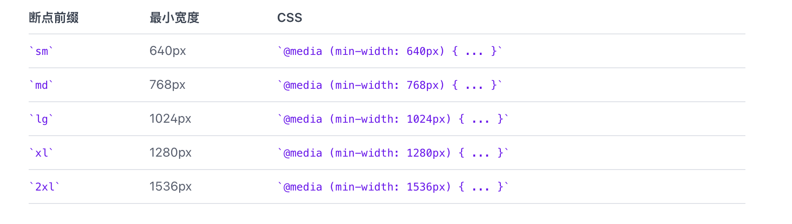

<Boxx type='tip' />

## 背景

参考[官方文档](https://www.tailwindcss.cn)/ [英语文档](https://tailwindcss.com/)

> 原子类css，可以减少写重复的css样式，提高效率， 本公司架构师推荐使用； 公共组件库不建议使用tailwind这类原子化css框架，业务程序猿覆盖样式不方便；


## tailwindcss 优点

- 不用自己想类名    
    我们常常会使用一些结构来作为类名如 ```container、left、right、content、title、footer``` 等，通常我们也会使用 ```BEM```规范, ```block-element-modifier```, 本意是为了html结构更清晰，维护会更方便。 实际上也就那样吧，只要把html的代码格式写好，层次就会比较清晰。 tailwindcss不用起类名，也节约了一定的时间。
- css包体积           
    普通写法，css行数越多，css包体积就越大，无法避免。 tailwindcss使用功能类，所有内容都是可重用的。
- 更改会更安全       
    非全局性，无污染。 


## @apply 的使用

```vue{1,7,10}
<button class="btn btn-green">
  Button
</button>

<style>
  .btn {
    @apply py-2 px-4 font-semibold rounded-lg shadow-md;
  }
  .btn-green {
    @apply text-white bg-green-500 hover:bg-green-700;
  }
</style>
```

1. 在html中写过长的class类名，可能也会被别人diss，这时候我们可以使用 ```@apply```
2. **抽离可重复使用的功能类组合**时，这时候我们可以使用 ```@apply```

## 响应式设计



重要： Tailwind 的断点仅包括 min-width 而没有 max-width, 这意味着在较小的断点上添加的任何功能类都将应用在更大的断点上，所以一般都会采用覆盖的方法，用较大的断点样式覆盖较小的。

```vue
<!-- Width of 16 by default, 32 on medium screens, and 48 on large screens -->
<!--  -->
```


## hover 和 focus

并非对所有的功能类都启用了状态变体, 可以自己在配置文件中添加

```js
// tailwind.config.js
module.exports = {
  // ...
  variants: {
    extend: {
      padding: ['hover'],
      maxHeight: ['focus'],
    }
  },
}
```

所有核心插件都没有启用该 active 变体  
> 您可以在 tailwind.config.js 文件中的 variants 部分控制是否为某个插件启用 active 变体

```js
// tailwind.config.js
module.exports = {
  // ...
  variants: {
    extend: {
      backgroundColor: ['active'],
    }
  },
}
```

### Group-hover

```html
<div class="group border-indigo-500 hover:bg-white hover:shadow-lg hover:border-transparent ...">
  <p class="text-indigo-600 group-hover:text-gray-900 ...">New Project</p>
  <p class="text-indigo-500 group-hover:text-gray-500 ...">Create a new project from a variety of starting templates.</p>
</div>
```

Group-focus 的用法与此类似


## 深色模式

1. 默认未开启，需要自己在配置中开启
2. ```darkMode: false, // or 'media' or 'class' ``` 

> media 将采用 prefers-color-scheme
> class 将采用 html标签中是否有 ```class="dark"``


## 添加基础样式

```@layer base``` Tailwind 将自动将这些样式移到 @tailwind base 的同一位置

```css{4}
@tailwind base;
@tailwind components;
@tailwind utilities;

@layer base {
  @font-face {
    font-family: Proxima Nova;
    font-weight: 400;
    src: url(/fonts/proxima-nova/400-regular.woff) format("woff");
  }
  @font-face {
    font-family: Proxima Nova;
    font-weight: 500;
    src: url(/fonts/proxima-nova/500-medium.woff) format("woff");
  }
}
```

## 配置

1. 前缀

给tailwindcss的功能类添加前缀可以更好的辨识哪些是tailwindcss的功能类和普通自己写的类名，还可以避免覆盖

```js
// tailwind.config.js
module.exports = {
  prefix: 'tw-',
}
```
注意： ```hover: ```等带有响应式或者状态前缀的类仍然会最先出现，自定义前缀要写在冒号后面
```vue
<div class="tw-text-lg md:tw-text-xl tw-bg-red-500 hover:tw-bg-blue-500">
  <!-- -->
</div>
```


## Just-in-Time Mode

重要： 针对 2.1+ 版本 tailwindcss，可以使用 jit 模式, **3.0+ 默认开启**，无需再添加下面的配置

```js{3}
// tailwind.config.js
module.exports = {
 mode: 'jit',
  purge: [
    // ...
  ],
  theme: {
    // ...
  }
  // ...
}
```

官方的文章还是英文版本的，中文文章参考[探索Tailwind CSS中的JIT模式](https://juejin.cn/post/7067092210356846599#heading-14)

- 1. 任意值
```html
<div class="top-[10px] right-[10px] w-[25px] h-[25px] p-[5px] bg-[#07B5D3]"></div>

```

- 2. 所有变体都默认开启
```html
<div class="group w-[100px] h-[100px]">
    <div class="group-hover:backgroundColor-[#000] bg-white w-[50px] h-[50px]"></div>
</div>
```

- 3. 堆叠变体
```html
<div class="sm:hover:bg-black sm:hover:text-white"></div>
```

- 4. 伪元素
```html
<div class="font-medium text-xl before:content-['👉'] before:mr-3">Thank you 🙏</div>
```

- 5. 每条边框颜色

```html
<div class="border-4 border-t-blue-500 border-r-pink-500 border-b-green-500 border-l-yellow-500"></div>
```

## 布局

现在开始真正讲一些我们写的功能类，前面讲述的基本上都是特性和配置。

1. container

```width: 100%;```

2. box-border box-content

这部分我们写的普通css是一一对应的，具体可以参考[官方文档](https://www.tailwindcss.cn/docs/container)/ [英语文档](https://tailwindcss.com/)

