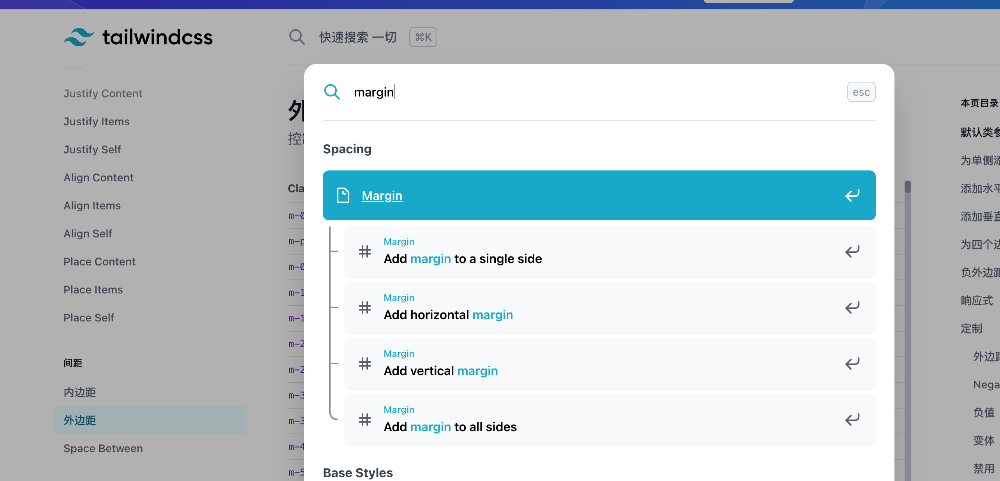

<Boxx type='tip' />

## 参考资料

[官方文档（英语）](https://tailwindcss.com/) V3.1.8  【推荐使用3以后的版本，无需手动开启jit模式，更自由】

[官方文档（中文）](https://www.tailwindcss.cn) V2.2.16

## 写在前面

> 1.原子类css，可以减少写重复的css样式，提高效率；
>  
> 2.公共组件库不建议使用tailwind这类原子化css框架，业务程序猿覆盖样式不方便；


## 优点

- 不用想类名    
    我们常常会使用一些结构来作为类名如 ```container、left、right、content、title、footer``` 等，通常我们也会使用 ```BEM```规范, ```block-element-modifier```, 本意是为了html结构更清晰，维护会更方便。 实际上也就那样吧，只要把html的代码格式（缩进和换行）写好，层次就会比较清晰。 tailwindcss不用起类名，也节约了一定的时间。
- css包体积           
    普通写法，css行数越多，css包体积就越大，无法避免。 tailwindcss使用功能类，所有内容都是可重用的。
- 更改会更安全       
    非全局性，无污染。 


## 初始化

- 按照依赖

```bash
npm install -D tailwindcss@latest postcss@latest autoprefixer@latest
```

- 创建配置文件

```bash
npx tailwindcss init -p
```
这将会在您的项目根目录创建一个最小化的 tailwind.config.js 文件


- 修改配置文件

这里采用 v3以后的写法，也兼容v2写法，具体可查看官方文档
```js{3}
/** @type {import('tailwindcss').Config} */
module.exports = {
  content: ["./src/**/*.{html,js}"],
  theme: {
    extend: {},
  },
  plugins: [],
}

```

- 添加指令到css

```css
/* base.css */
@tailwind base;
@tailwind components;
@tailwind utilities;
```

- 简单应用

```html
<h1 class="text-3xl font-bold underline">
  Hello world!
</h1>
```


- vscode拓展  ```Tailwind CSS IntelliSense```

使用改拓展插件，可自动匹配功能类，并且鼠标悬浮能提示生效css样式


## 其他配置

### 1. 前缀

给tailwindcss的功能类添加前缀可以更好的辨识哪些是tailwindcss的功能类和普通自己写的类名，还可以避免覆盖

```js
// tailwind.config.js
module.exports = {
  prefix: 'tw-',
}
```
注意： ```hover: ```等带有响应式或者状态前缀的类仍然会最先出现，自定义前缀要写在冒号后面
```vue
<div class="tw-text-lg md:tw-text-xl tw-bg-red-500 hover:tw-bg-blue-500">
  <!-- -->
</div>
```

### 2. 主题

在 theme 部分中，您可以定义调色板、字体、类型比例、边框大小、断点等任何与您网站视觉设计有关的东西。

:chestnut: 举个例子： 可以将我们复用较多的配置

```js
/** @type {import('tailwindcss').Config} */
module.exports = {
  prefix: 'tw-',
  content: ['./index.html', './src/**/*.{vue,js,ts,jsx,tsx}'],
  theme: {
    extend: {
      backgroundColor: () => ({
        skyblue: '#F3F6FF',
        success: '#04C76F',
        error: '#ED2828',
        normal: '#BFBFBF',
      }),
      textColor: () => ({
        whitesmoky: '#8C8C8C',
        smokygrey: '#595959', // 解释说明文字
        semibold: '#262626',
      }),
      borderColor: () => ({
        greyE8: '#E8E8E8',
        normal: '#D9D9D9', // 普通边框
      }),
      fontSize: {
        xs: ['12px', '20px'],
        sm: ['14px', '22px'], // font-size: 14; line-height: 22px;
        base: ['16px', '24px'],
        lg: ['20px', '28px'],
        xl: ['24px', '32px'],
        xxl: ['32px', '38px'],
      },
      fontFamily: {
        JDZhengHT: 'JDZhengHT-Light',
      },
    },
  },
};

```

```css
@font-face {
  font-family: 'JDZhengHT-Light';
  src: url(xxxxxxxxxxxxxxxxxxxxxxxxx);
  font-weight: normal;
  font-style: normal
}
```
使用
```html
<span class="tw-text-whitesmoky tw-font-JDZhengHT tw-text-xs">tailwindcss</span>
```

### 3. 其他配置

参考[configuration](https://tailwindcss.com/docs/configuration)/[配置](https://www.tailwindcss.cn/docs/configuration)

## @apply 的使用

```html{1,7,10}
<button class="btn btn-green">
  Button
</button>

<style>
  .btn {
    @apply py-2 px-4 font-semibold rounded-lg shadow-md;
  }
  .btn-green {
    @apply text-white bg-green-500 hover:bg-green-700;
  }
</style>
```

1. 在html中写过长的class类名，可能也会被别人diss，这时候我们可以使用 ```@apply```
2. **抽离可重复使用的功能类组合**时，这时候我们可以使用 ```@apply```


## Just-in-Time Mode

重要： 针对 2.1+ 版本 tailwindcss，可以使用 jit 模式, **3.0+ 默认开启**，无需再添加下面的配置

```js{3}
// tailwind.config.js
module.exports = {
 mode: 'jit',
  purge: [
    // ...
  ],
  theme: {
    // ...
  }
  // ...
}
```

官方的文章还是英文版本的，中文文章参考[探索Tailwind CSS中的JIT模式](https://juejin.cn/post/7067092210356846599#heading-14)

- 1. 任意值
```html
<div class="top-[10px] right-[10px] w-[25px] h-[25px] p-[5px] bg-[#07B5D3]"></div>

```

- 2. 所有变体都默认开启
```html
<div class="group w-[100px] h-[100px]">
    <div class="group-hover:backgroundColor-[#000] bg-white w-[50px] h-[50px]"></div>
</div>
```

- 3. 堆叠变体
```html
<div class="sm:hover:bg-black sm:hover:text-white"></div>
```

- 4. 伪元素
```html
<div class="font-medium text-xl before:content-['👉'] before:mr-3">Thank you 🙏</div>
```

- 5. 每条边框颜色

```html
<div class="border-4 border-t-blue-500 border-r-pink-500 border-b-green-500 border-l-yellow-500"></div>
```

## 布局

现在开始真正讲一些我们写的功能类，前面讲述的基本上都是特性和配置。

1. container

```width: 100%;```

2. box-border box-content

这部分我们写的普通css是一一对应的，具体可以参考[官方文档](https://www.tailwindcss.cn/docs/container)/ [英语文档](https://tailwindcss.com/)

## 响应式设计


重要： Tailwind 的断点仅包括 min-width 而没有 max-width, 这意味着在较小的断点上添加的任何功能类都将应用在更大的断点上，所以一般都会采用覆盖的方法，用较大的断点样式覆盖较小的。

```vue
<!-- Width of 16 by default, 32 on medium screens, and 48 on large screens -->
<!--  -->
```


## hover 和 focus

并非对所有的功能类都启用了状态变体, 可以自己在配置文件中添加

```js
// tailwind.config.js
module.exports = {
  // ...
  variants: {
    extend: {
      padding: ['hover'],
      maxHeight: ['focus'],
    }
  },
}
```

所有核心插件都没有启用该 active 变体  
> 您可以在 tailwind.config.js 文件中的 variants 部分控制是否为某个插件启用 active 变体

```js
// tailwind.config.js
module.exports = {
  // ...
  variants: {
    extend: {
      backgroundColor: ['active'],
    }
  },
}
```

### Group-hover

```html
<div class="group border-indigo-500 hover:bg-white hover:shadow-lg hover:border-transparent ...">
  <p class="text-indigo-600 group-hover:text-gray-900 ...">New Project</p>
  <p class="text-indigo-500 group-hover:text-gray-500 ...">Create a new project from a variety of starting templates.</p>
</div>
```

Group-focus 的用法与此类似

## 添加基础样式

```@layer base``` Tailwind 将自动将这些样式移到 @tailwind base 的同一位置

```css{4}
@tailwind base;
@tailwind components;
@tailwind utilities;

@layer base {
  @font-face {
    font-family: Proxima Nova;
    font-weight: 400;
    src: url(/fonts/proxima-nova/400-regular.woff) format("woff");
  }
  @font-face {
    font-family: Proxima Nova;
    font-weight: 500;
    src: url(/fonts/proxima-nova/500-medium.woff) format("woff");
  }
}
```


## 最后

tailwindcss 功能类特别丰富，`transform`、`rotate` 等都有，具体可参考文档， 推荐查找时，可以使用文档中的搜索功能。


