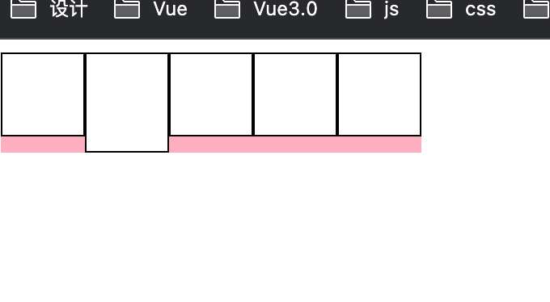
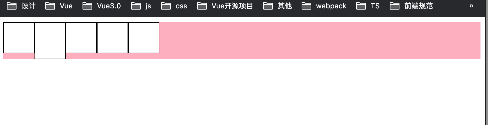

<Boxx type='tip' />

阅读element plus 源码，学习vue3、ts、组件封装、代码风格等等。
注释版见[github](https://github.com/wangliangxin/element-plus.git)

## button


### useGlobalConfig

获取button的配置
```ts
const globalConfig = useGlobalConfig('button')
```

useGlobalConfig 实际上是利用inject注入配置

```ts
export function useGlobalConfig(
  key?: keyof ConfigProviderContext,
  defaultValue = undefined
) {
  const config = getCurrentInstance()
    ? inject(configProviderContextKey, globalConfig)
    : globalConfig
  if (key) {
    return computed(() => config.value?.[key] ?? defaultValue)
  } else {
    return config
  }
}
```

configProviderContextKey 

```ConfigProviderProps``` 是组件 ```config-provider`` 的 ``props``

```ts
import type { ConfigProviderProps } from '@element-plus/components/config-provider'
import type { InjectionKey, Ref } from 'vue'

export type ConfigProviderContext = Partial<ConfigProviderProps>

export const configProviderContextKey: InjectionKey<
  Ref<ConfigProviderContext>
> = Symbol()
```

是不是有点晕？ 那就看看实际的使用案例

```vue
<template>
    <el-config-provider :button="config">
      <el-button>中文</el-button>
    </el-config-provider>   
</template>

<script lang="ts" setup>
import { reactive } from 'vue'

const config = reactive({
  autoInsertSpace: true,
})
</script>
```

### useDeprecated

弃用提醒： 3.0.0 已经弃用了 type = text的按钮，使用link 替代， 任使用text将触发警告

第二个参数传递的是个计算属性，在useDeprecated中采用watch的形式，实现响应式

```ts{9}
useDeprecated(
  {
    from: 'type.text',
    replacement: 'link',
    version: '3.0.0',
    scope: 'props',
    ref: 'https://element-plus.org/en-US/component/button.html#button-attributes',
  },
  computed(() => props.type === 'text')
)
```

```ts
export const useDeprecated = (
  { from, replacement, scope, version, ref, type = 'API' }: DeprecationParam,
  condition: MaybeRef<boolean>
) => {
  watch(
    () => unref(condition),
    (val) => {
      if (val) {
        debugWarn(
          scope,
          `[${type}] ${from} is about to be deprecated in version ${version}, please use ${replacement} instead.
For more detail, please visit: ${ref}
`
        )
      }
    },
    {
      immediate: true,
    }
  )
}
```

:::details watch

```ts
const x = ref(0)
const y = ref(0)

// 单个 ref
watch(x, (newX) => {
  console.log(`x is ${newX}`)
})

// getter 函数
watch(
  () => x.value + y.value,
  (sum) => {
    console.log(`sum of x + y is: ${sum}`)
  }
)

// 多个来源组成的数组
watch([x, () => y.value], ([newX, newY]) => {
  console.log(`x is ${newX} and y is ${newY}`)
})
```

```ts
const obj = reactive({ count: 0 })

// 错误，因为 watch() 得到的参数是一个 number
watch(obj.count, (count) => {
  console.log(`count is: ${count}`)
})
```

```ts
// 提供一个 getter 函数
watch(
  () => obj.count,
  (count) => {
    console.log(`count is: ${count}`)
  }
)
```

```ts
watch(
  () => state.someObject,
  (newValue, oldValue) => {
    // 注意：`newValue` 此处和 `oldValue` 是相等的
    // *除非* state.someObject 被整个替换了
  },
  { 
    deep: true, // 深度监听， 谨慎使用，大型数据结构性能开销大
    immediate: true // 监听立即执行
  }
)
```
:::

:::details 双向绑定

父组件
```vue
<template>
    <Child :someData="someData" @changeVal="changeVal"></Child>
</template>
<script>
import { ref } from 'vue'
const someData = ref('')

function changeVal(val){
    someData.value = val
}
</script>
```


子组件

```vue
<template>
    <input type="text" v-model="inputVal" />
</template>

<script setup lang="ts">

import { computed } from "vue";

const props = defineProps<{
    someData: string;
}>();
const emits = defineEmits(["changeVal"]);
const inputVal = computed({
    get() {
        return props.fatherRef;
    },
    set(val: string) {
        emits("changeVal", val);
    },
});
</script>
```

**方式二**

```vue
<template>
    <Child :modelValue="searchText" @update:modelValue="changeVal"> </Child>
</template>
```
```ts
<script setup lang="ts">

import { ref } from "vue";

import Child from "./Child.vue";

const searchText = ref(1);

function changeVal(val: number) {

    searchText.value = val;

}
</script>

```

子组件

```vue
<template>
     <input v-model="modelValue" />
</template>
<script setup lang="ts">

import { computed, useAttrs, useSlots } from "vue";

const props = defineProps<{
    modelValue: number;
}>();

</script>

```
::: 

### useNamespace

```ts
function useNamespace(){
  const b = ()=>{}
  const e = ()=> {}
  const be = ()=>{}
  return {
    namespace,
    b,
    e,
    m,
    be,
    em,
    bm,
    bem,
    is,
    // css
    cssVar,
    cssVarName,
    cssVarBlock,
    cssVarBlockName,
  }
}

```

### inline-flex 和 flex

设置flex的容器如果未设置宽度会默认按照父盒子100%，inline-flex 的容器宽度将按照 内容（item）的宽度。

- inline-flex
  


- flex




## el-link

与button一样，icon组件作为属性时，会被放在内容前面，作为插槽时，会被放在内容后面。
```vue{12,17}
<template>
  <a
    :class="[
      ns.b(),
      ns.m(type),
      ns.is('disabled', disabled),
      ns.is('underline', underline && !disabled),
    ]"
    :href="disabled || !href ? undefined : href"
    @click="handleClick"
  >
    <el-icon v-if="icon"><component :is="icon" /></el-icon>
    <span v-if="$slots.default" :class="ns.e('inner')">
      <slot />
    </span>

    <slot v-if="$slots.icon" name="icon" />
  </a>
</template>
```

## scrollbar 滚动条

浏览器默认的滚动条有点难看u1s1

::: demo 默认滚动条（此处被vuepress的主题样式覆盖了）
```html
<!DOCTYPE html>
<html lang="en">

<head>
    <meta charset="UTF-8">
    <meta http-equiv="X-UA-Compatible" content="IE=edge">
    <meta name="viewport" content="width=device-width, initial-scale=1.0">
    <title>Document</title>
    <style>
        .main {
            width: 100px;
            height: 100px;
            border: 1px solid #000;
            overflow: scroll;
        }
    </style>
</head>

<body>
    <div class="main">
        <p>123</p>
        <p>123</p>
        <p>123</p>
        <p>123</p>
        <p>123</p>
        <p>123</p>
        <p>123</p>
        <p>123</p>
    </div>
</body>

</html>
```
:::

一般来说我们会通过覆盖样式的方式去修改滚动条

