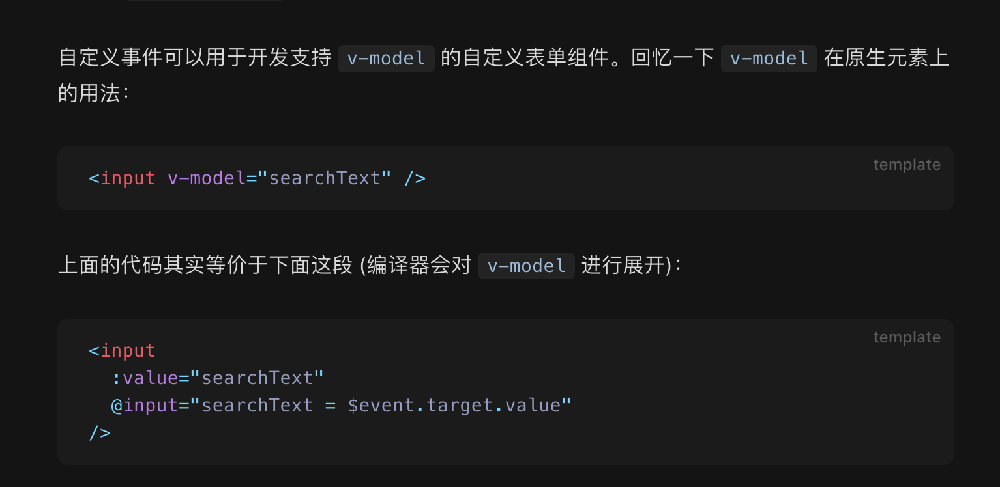
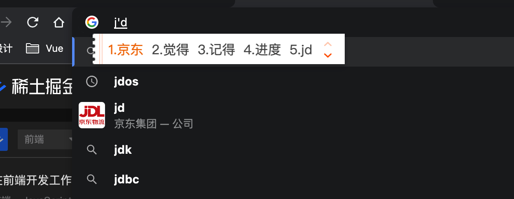

<Boxx type='tip' />

## input的change事件

在vue官方文档中有下面一段描述：

:dolphin: **其实不完全正确**

v-model 触发 @update:modelValue 事件的前提是 searchText 更新(改变)了，但实际上input的输入框有这么一种状态，如下图：

改变了输入值，但没完全改变，如使用v-model，此时searchText是null。

:book: **总结：输入框的绑定值，要根据实际情况，选择使用上面图1两种的其中一种。**

## 防抖和节流

为了避免搜索结果接口频繁被触发，这里设置了防抖。 

- 防抖：函数防抖就是法师发技能的时候要读条，技能读条没完再按技能就会重新读条。

- 节流：函数节流就是fps游戏的射速，就算一直按着鼠标射击，也只会在规定射速内射出子弹。或者类似于游戏攻击，普攻按的再快也会受攻速限制；

参考： [7分钟理解JS的节流、防抖及使用场景](https://juejin.cn/post/6844903669389885453)