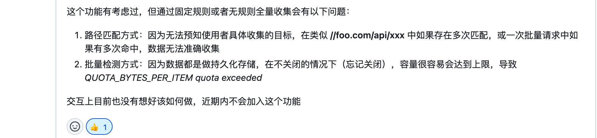

<Boxx type='tip' />


## 背景

>1、个人开发的Chrome插件，供学习和提高工作效率使用； </br>
>2、在markdown中，超链接格式 [] 中放文字 和 () 放链接，看见好的文章想快速复制标题和链接有点点费劲，就想着使用chrome拓展一键快速复制。

## 参考资料

- [浏览器扩展程序开发笔记 - Benbinbin的专栏 - 掘金](https://juejin.cn/column/7000004091955036173)
- [【干货】Chrome插件(扩展)开发全攻略](https://cloud.tencent.com/developer/article/1667242) (v2版本比较详细的文档，不是特别推荐，可作为阅读参考)


## 插件能力

> 对插件能力做个纪录（避免你想不到:smile:），实际使用可以搜索最新实现方法。
- 右键菜单（可自定义右键菜单，还可添加快捷键）
- 弹出页面（这里指点击图标后popup.html）

## 基础知识

> 这里先介绍v2版本做个了解， 开发可直接看v3版本， v2版本将在2023废弃

```
.
├── README.md  
├── background.js   // 常驻后台
├── icon            // 图标
├── manifest.json  // 核心文件，表示插件的一些基本配置，类似于小程序中的
├── popup.html   // 弹出页面
└── popup.js     // js
```

```manifest.json``` 一些配置如下：

```json
{
    "name": "will-plugin",
    "description" : "something by wangliangxin",
    "version": "0.0.0.1",
    "manifest_version": 2,
    "browser_action": {
      "default_popup": "popup.html"
    },
    "permissions": [
      "contextMenus",
      "activeTab",
      "clipboardWrite"
    ],
    "background": {
      "scripts": ["background.js"],
      "persistent": true
    },
    "icons": {
      "16": "icon/sharpicons_Bat.png",
      "32": "icon/sharpicons_Bat1.png",
      "48": "icon/sharpicons_Bat2.png",
      "128": "icon/sharpicons_Bat3.png"
    },
    "commands": {
      "run-share": {
        "suggested_key": {
          "default": "Ctrl+Shift+L",
          "mac": "Command+Shift+L"
        },
        "description": "Run \"share\" on the current page."
      }
    }
}
```


## 我的第一个chrome扩展

1、功能：

- 文章快速分享（右键 or 快捷键）
- 快速跳转到我的博客
- ……（抽空完善中）


2、源码

[will-chrome-plugin](https://github.com/wangliangxin/will-chrome-plugin)


## ajax拦截并修改返回结果插件

- [Ajax-Interceptor-JD](https://github.com/wangliangxin/Ajax-Interceptor-JD)
  
在源工程 [ajax-interceptor修改ajax请求返回结果的chrome插件](https://github.com/YGYOOO/ajax-interceptor)的基础上做了部分修改，原本打算做一个可以 批量自动导入本页面的请求和请求结果的功能。在摸索过程中发现了个新插件 [g0ngjie/ajax-proxy: Browser extension for Chromium kernel. For modifying your Ajax responses](https://github.com/g0ngjie/ajax-proxy)，vue+element做的，页面交互较好，咨询作者是否会加我想做的功能后。



然后放弃了，有时间再做吧(集中精力干干其他的) :smile:

## 其他知识

1、安装扩展

代码写完后，在chrome浏览器右上角点击 拼图icon -> 管理扩展程序 -> 加载已解压的扩展程序 -> (选择你的文件夹即可) 

2、更新拓展

更改代码， 然后 在加载已解压的扩展程序旁边点击更新按钮，扩展就已经更新了

3、发布到chrome应用商店

[Chrome Web Store - Chrome Developers](https://developer.chrome.com/docs/webstore/?visit_id=638022635635650209-565267790&hl=zh-Hans&rd=1)
