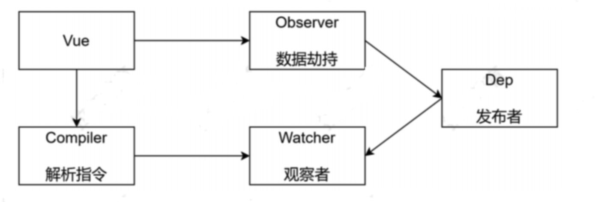

<Boxx type='tip' />

## 单页面应用

### 1、什么是单页应用

- 多页面应用： **每个页面是一个html文件**，点击某个超链接，就跳转到新的html页面。每次浏览器访问html时，需要重新下载整个html文档、JS和CSS依赖，才能展现出整个页面。这个效率很低。让我想起上学那会儿做的一个纯静态网页（入口： index.html; 关于页面： about.html; ……）还有jsp做的项目页面。
- 单页面应用：**一个网站的所有页面，都是同一份html文档**，用JS判断路由，并动态展示内容，这个过程完全避免了网络请求，极大提高了网站用户体验。

现代Web开发，大多数网站是用React或Vue开发的，它们基本都是单页面应用；

拿vue举例：vue项目中只有一个 public/index.html(vue2)、 index.html(vue3), 路由管理通过 vue-router

### 2、简单实现单页应用

下面几个知识点要知晓

- history.pushState （不刷新页面[不重新加载资源]，给history中添加一条纪录，改变url）


### 3、参考资料

- [不用React Vue，只用原生JS，如何开发单页面应用(SPA)？ - 掘金](https://juejin.cn/post/7147654933435645960)
- [简单聊聊H5的pushState与replaceState - 掘金](https://juejin.cn/post/6844903558576341000)


## Vue2.x 响应式原理

通过**数据劫持**和**观察者模式**实现

### 1、Object.defineProperty()

```Object.defineProperty()``` 方法会直接在一个对象上定义一个新属性，或者修改一个对象的现有属性，并返回此对象。

### 2、观察者模式

当一个对象改变需要同时改变其他对象的时候，而且不需要知道有多少个对象需要改变。

🌰：  写字楼中，电脑跟前。一堆程序员趁老板出差的机会在电脑上NBA球赛，时不时激动的大喊大叫。此时，老板出差回来。前台小姐姐看到老板回来，立马给看球赛的小哥哥们发通知。此时小哥哥们赶紧切换成工作的状态

### 3、简单实现vue2响应式



- [code]([vue2响应式 · willwong/vue-knowledge](https://gitee.com/willwong/vue-knowledge/tree/master/vue2%E5%93%8D%E5%BA%94%E5%BC%8F))

参考资料：

- [Vue2.x响应式原理 - 掘金](https://juejin.cn/post/6996329769709076493)
- [观察者模式 - 掘金](https://juejin.cn/post/6995865134132363295)
- [Vue2.x之defineProperty深入理解 - 掘金](https://juejin.cn/post/7026266930386305032)

