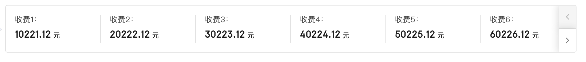
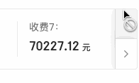

<Boxx type='tip' />

阅读本文章，你将了解Vue3的写法；

## 功能点

- 响应式
- 向前翻页
- 向后翻页


## 效果图




## 实现

- 逻辑部分

这里将分页的逻辑封装到`useCarousel`中, 将相关的数据与函数封装在一起体现Vue3组合式api的思想。

::: details  js部分 

```Vue
<script setup lang='ts'>
import {
  ref,
} from 'vue';
import { useResizeObserver } from '@vueuse/core';
import useCarousel from '../../hooks/useCarousel';
import { CarouselItem } from '../../types/index';

const container = ref<HTMLElement|null>(null);
const cardMinWidth = ref(167);

const dataList = ref<CarouselItem[]>([
  { label: '收费1：', value: 10221.12, unit: '元' },
  { label: '收费2：', value: 20222.12, unit: '元' },
  { label: '收费3：', value: 30223.12, unit: '元' },
  { label: '收费4：', value: 40224.12, unit: '元' },
]); // 数据源

const {
  pageSize,
  leftDisabled,
  rightDisabled,
  isShowBtns,
  getPrePage,
  getNextPage,
  carouselList,
} = useCarousel({ dataList });

useResizeObserver(container, (entries) => {
  const entry = entries[0];
  const { width } = entry.contentRect;
  pageSize.value = Math.floor(width / cardMinWidth.value);
});
</script>
```
:::

::: details useCarousel (hooks部分)

```ts
import { computed, ref, watch } from 'vue';
import { CarouselItem } from '../types/index';

interface useCarouselType{
    dataList: any,
    pageNum?: number,
    pageSize?: number
}
export default function useCarousel(option:useCarouselType) {
  const pageNum = ref(option.pageNum ?? 1);
  const pageSize = ref(option.pageSize ?? 0);
  const totalNum = computed(() => option.dataList.value.length);
  const carouselList = ref<CarouselItem[]>(option.dataList.value.slice(0, pageSize.value)); // 当前页数据

  const leftDisabled = computed(() => pageNum.value <= 1);
  const rightDisabled = computed(() => pageSize.value * pageNum.value >= totalNum.value);

  const isShowBtns = computed(() => !(leftDisabled.value && rightDisabled.value));

  watch([pageNum, pageSize], ([num, size]) => {
    if (size * num >= totalNum.value) { // 最后一页时，总是取最后pageSize个
      carouselList.value = option.dataList.value.slice(totalNum.value - size);
    } else {
      carouselList.value = option.dataList.value.slice(size * (num - 1), size * num);
    }
  });

  function getPrePage() {
    if (leftDisabled.value) return;
    pageNum.value -= 1;
  }
  function getNextPage() {
    if (rightDisabled.value) return;
    pageNum.value += 1;
  }
  return {
    pageNum,
    pageSize,
    totalNum,
    leftDisabled,
    rightDisabled,
    isShowBtns,
    getPrePage,
    getNextPage,
    carouselList,
  };
}

```
:::

- 页面结构部分

ref绑定 container 的使用
::: details template部分
```Vue
<template>
  <div class="container" ref="container">
    <div class="carousel-item" v-for="item in carouselList" :key="item.label">
        <div class="carousel-item__label">{{ item.label }}</div>
        <div class="carousel-item__value">{{ item.value }}<span class="carousel-item__unit">{{ item.unit }}</span></div>
    </div>
    <div class="btns-group" v-if="isShowBtns">
        <button class="btns-group__item" :class="{ 'btns-group__item--disable' : leftDisabled}" @click="getPrePage" :disabled="leftDisabled">
            <el-icon><arrow-left /></el-icon>
        </button>
        <button class="btns-group__item" :class="{ 'btns-group__item--disable' : rightDisabled}" @click="getNextPage" :disabled="rightDisabled">
            <el-icon><arrow-right /></el-icon>
        </button>
    </div>
  </div>
</template>
```
:::

- 样式部分

1. ```flex: 1; min-width: 150px;``` 结合使用
2. 按钮的```hover、active```的样式细节
3. 按钮禁用时： ```cursor: not-allowed;```


::: details 样式部分
```scss
<style scoped lang="scss">
@import "~@/assets/style/mixin";
@include b(container){
    position: relative;
    width: 100%;
    border: 1px solid rgba(232,232,232,1);
    border-radius: 4px;
    overflow: hidden;
    display: flex;
    padding: 17px 0px;
}

@include b(carousel-item){
    border-right: 1px solid #E8E8E8;
    padding-left: 16px;
    flex: 1;
    min-width: 150px;
    @include e(label){
        font-size: 14px;
        color: #595959;
        margin-bottom: 7px;
    }
    @include e(value){
        font-size: 18px;
        line-height: 26px;
        color: rgba(38,38,38,1);
    }
    @include e(unit){
        margin-left: 4px;
        font-size: 12px;
        font-weight: 500;
        color: rgba(38,38,38,1);
    }
    &:last-child{
        border-right: none;
    }
}
@include b(btns-group){
    height: 100%;
    width: 30px;
    position: absolute;
    top: 0;
    right: 0;
    border-left: 1px solid rgba(232,232,232,1);
    cursor: pointer;
    @include e(item){
        width: 100%;
        height: 50%;
        border-bottom: 1px solid rgba(232,232,232,1);
        display: flex;
        align-items: center;
        justify-content: space-around;
        cursor: pointer;
        box-shadow: -2px 0 12px 1px rgba(0, 0, 0, 0.1);
        i{
            color: #8C8C8C;
        }
        &:hover{
            background-color: #EBF0FF;
        }
        &:hover i{
            color: #3768FA;
        }
        &:active i{
            color: #2C53C8;
        }
        @include m(disable){
            background: rgba(247,247,247,1) !important;
            cursor: not-allowed;
            i{
                color: #BFBFBF !important;
            }
        }
        &:nth-child(2){
            border-bottom: none;
        }
    }
}
</style>
```
:::

