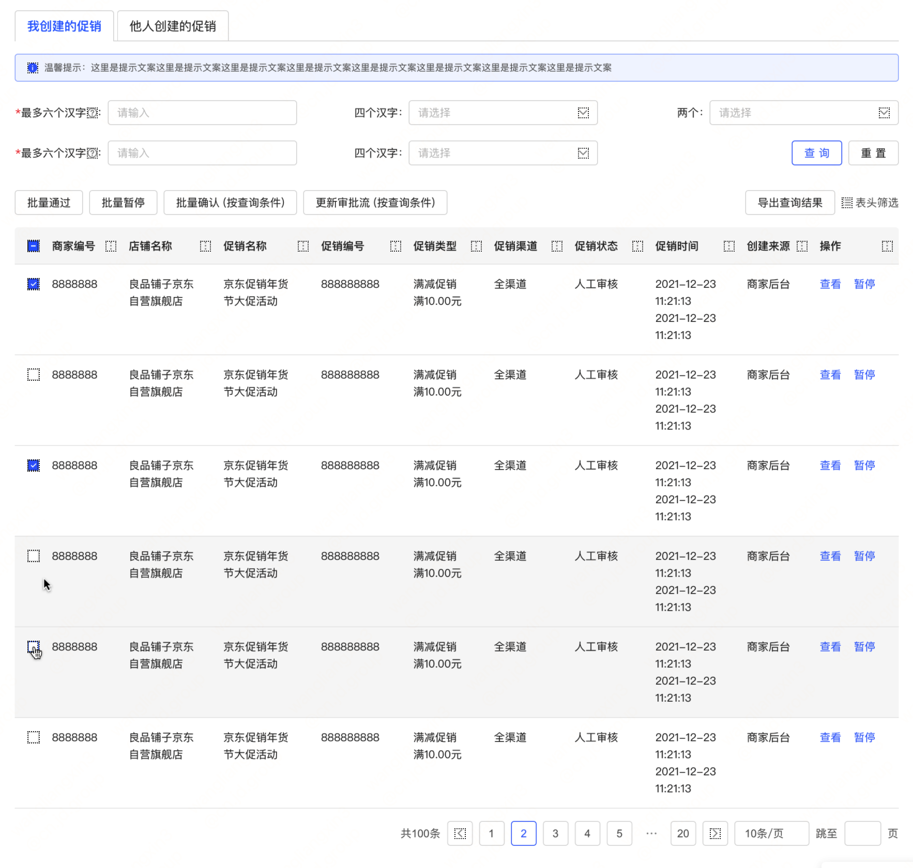
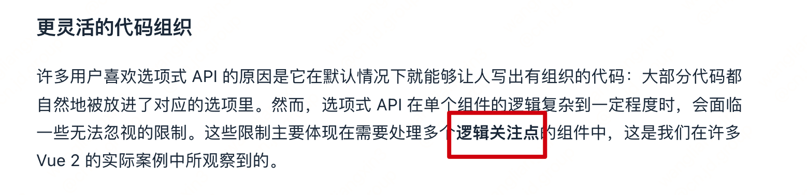

<Boxx type='tip' />

参考阅读: [组合式 API 常见问答](https://cn.vuejs.org/guide/extras/composition-api-faq.html)

- 在```Vue2```中，响应数据放到```data```、逻辑方法放到```methods```，这样的做法非常方便，也让我们很容易组织代码；
- 在`Vue3`中，如果还是用```Vue2```的形式组织代码，这不但不会提升代码质量，反而因为**缺乏约束**而降低可读性；


我们用一个经典页面进行举例：



未进行逻辑抽离，我们很可能将代码写成这样：（你认为如下组织代码与vue2对比有提升吗？）

```Vue
<script setup lang='ts'>
import { ref, reactive } from 'vue';
import * as api from '@/api';

const activeTabName = ref('first');
const tableList = ref([]);

const pageInfo = reactive({
  pageNum: 1,
  pageSize: 10,
  totalCount: 0,
});

const columnDefs = ref([]);

const searchInfo = reactive({ // 搜索项
  orderId: '',
  orderName: '',
});

const handleTabClick = () => {
  // ……
};

const getList = async () => {
  // ……
};

const handleSizeChange = () => {
  getList();
};

const handleCurrentChange = () => {
  // ……
  getList();
};

const submitSearchForm = () => {
  // ……
  getList();
};
getList();
</script>
```

实际上，以上代码过于关注语法（使用了 ref，reactive）层面改变，而忽略官方文档提到一个词叫：```逻辑关注点！！！！！！```



继续用上面的例子，其中的逻辑关注点：

- tab切换 
- 查询获取列表
- 重置查询项
- 分页功能（翻页，……）
- ……

或许，我们能将代码改成下面这样：

``` Vue VueTemp.vue
<!--  -->
<script setup lang='ts'>
import { watch, reactive } from 'vue';
import { VANE_DICT } from '@/dict/index';
import useTabs from '@/composition-api/useTabs';
import useTable from './hooks/useTable';
import usePagination from './hooks/usePagination';

const searchInfo = reactive({
  orderId: '',
  orderName: '',
});
const {
  activeTabName,
  tabsList,
  handleTabClick,
} = useTabs(VANE_DICT.tabsList, { initActive: 'shopStarRate' });

const { tableList, total, getTableList } = useTable();

const { pageInfo, handleSizeChange, handleCurrentChange } = usePagination({ total });

// const { searchInfo, submitSearchForm } = useSearch();

watch([() => pageInfo.pageNum, () => pageInfo.pageSize], () => {
  console.log('获取列表');
  getTableList();
}, { deep: true });

const submitSearchForm = async () => {
//   await formEl.validate((valid, fields) => {
  // if (valid) {
  //    getTableList();
  // }
//   });
};

</script>
```

```Vue
<!-- 简单案例代码，非完整代码 -->
<template>
    <div>
        <el-tabs v-model="activeTabName" type="card" @tab-click="handleTabClick">
            <template v-for="item in tabsList" :key="item.name">
                <el-tab-pane :label="item.label" :name="item.name" v-if="item.auth"></el-tab-pane>
            </template>
        </el-tabs>
    </div>
    <div>
        <el-form
              :model="searchInfo"
              class="filter-container tw-mt-4"
              label-width="120px"
            >
            <el-form-item class="filter-button">
              <el-button type="primary" plain @click="submitSearchForm()">查 询</el-button>
            </el-form-item>
        </el-form>
    </div>
    <div>
        <ElTableAg
          class="ag-theme-alpine"
          :row-data="tableList"
        >
        </ElTableAg>
    </div>
    <div>
         <!-- 分页 -->
        <el-pagination
          v-model:currentPage="pageInfo.pageNum"
          v-model:page-size="pageInfo.pageSize"
          :page-sizes="[10, 20]"
          layout="total, prev, pager, next, sizes, jumper"
          :total="pageInfo.totalCount"
          @size-change="handleSizeChange"
          @current-change="handleCurrentChange" />
    </div>
</template>
```

<!-- useTable.ts -->
```ts
import { ref, reactive } from 'vue';
import * as api from '@/api';

export default function useTable() {
  const tableList = ref([]);
  const total = ref(0);
  const getTableList = async () => {
    try {
    //   const res = api.queryListById();
      const res :any = { list: [], totalCount: Math.floor(Math.random() * 100) };
      //   const res: any = {};
      const { list = [], totalCount = 0 } = res;
      tableList.value = list;
      total.value = totalCount;
    } catch (error) {
      console.log(error);
    }
  };

  return {
    tableList, getTableList, total,
  };
}

```

<!-- usePagination.ts -->
```ts
import { reactive, Ref, watch } from 'vue';

interface usePaginationOptions {
  total: Ref<number>
}
export default function usePagination(options:usePaginationOptions) {
  const pageInfo = reactive({
    pageNum: 1,
    pageSize: 10,
    totalCount: 100,
  });

  const updateTotal = (val: number) => {
    pageInfo.totalCount = val;
  };

  const handleSizeChange = (val: number) => {
    pageInfo.pageSize = val;
    pageInfo.pageNum = 1;
  };
  const handleCurrentChange = (val: number) => {
    pageInfo.pageNum = val;
  };

  watch(options.total, (val) => {
    updateTotal(val);
  });

  return {
    pageInfo,
    handleSizeChange,
    handleCurrentChange,
  };
}

```

<!-- useTabs.ts -->
```ts
import {
  ref, computed, watch, Ref,
} from 'vue';
import type { TabsPaneContext } from '@jd/element-plus-shop';
import { commonMaiDian } from '@/utils/index';

interface useTabsOptions{
    initActive?: string, // 默认选中
    tabClick?: (tab: TabsPaneContext, event: Event)=> void
    noAuthList?:Ref<Array<string>> // 无权tabsList
}
interface tabsObject{
    name: string,
    label: string,
    auth?: boolean,
    clstag?: string
}
/**
 * @description: tabs 组合api
 * @param {Array} list : tabs 初始list
 * @param {useTabsOptions} options 配置项
 * @return {*}
 */
export default function useTabs(list: Array<tabsObject>, options?:useTabsOptions) {
  const tabsList = ref(list);
  const noAuthList = ref(options?.noAuthList);
  const activeTabName = ref(options?.initActive ?? tabsList.value[0]?.name);
  
  const handleTabClick = (tab: TabsPaneContext, event: Event) => {
    // ……
  };
  
  return {
    activeTabName,
    tabsList,
    handleTabClick,
  };
}
```


1. 并非所有的逻辑点都要使用hooks函数
 
过多过细的拆分，可能会增加理解难度和维护成本，本案例中就没有写useSearch函数，一般遵循以下情况：

- 封装了多个逻辑任务的大型组件（数百行）
- 需要在多个组件之间共享此类任务的逻辑。

2. 避免过于关注逻辑复用

compostion API一个特点是提升逻辑复用，（hooks函数可以在不同的组件中复用），但是并非只有复用的逻辑才应该封装到hook中，
应该按照逻辑关注点，进行拆分，将**某个逻辑和与之关联的数据绑定在一个函数中**。对于大多数应用，可维护性比可重用性更加重要。

特别复用的逻辑，应该交给工具函数处理，这里推荐 [vueuse](https://vueuse.org/)，或者自己封装顶层hooks函数。


怎么将逻辑关注点拆分，怎么将hooks函数串联起来，只能多总结经验了。
