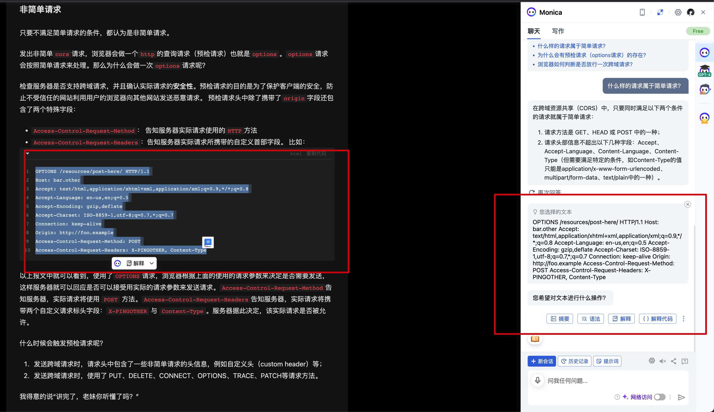

<Boxx type='tip' />

参考阅读： [https://juejin.cn/post/7206264862657445947](测试妹子提了个bug,为什么你多了个options请求？)

这里我阅读完这篇文章后有一定大致了解，发现插件 Monica （大语言模型可以辅助阅读），我就简单使用了一下；

下面是我和ai的交流，看看是否真的提升了阅读体验；

> 本文讲解了跨域资源共享（CORS）中简单请求和非简单请求的区别，以及浏览器对它们的不同处理方式。对于简单请求，浏览器会直接放行让请求发出，而对于非简单请求，浏览器会先发出一个预检请求（options请求），以检查服务器是否支持跨域请求，并确认实际请求的安全性。预检请求的目的是为了保护客户端的安全，防止不受信任的网站利用用户的浏览器向其他网站发送恶意请求;

> <b>我：</b> 什么样的请求属于简单请求？

> <b>ai：</b> 在跨域资源共享（CORS）中，只要同时满足以下两个条件的请求就属于简单请求：
请求方法是 GET、HEAD 或 POST 中的一种；
请求头部信息不超出以下几种字段：Accept、Accept-Language、Content-Language、Content-Type（但需要满足特定的条件，如Content-Type的值只能是application/x-www-form-urlencoded、multipart/form-data、text/plain中的一种）。

> <b>我：</b> 那什么又是非简单请求呢

> <b>ai：</b> 在跨域资源共享（CORS）中，不满足简单请求条件的请求就属于非简单请求。具体来说，以下情况会使请求变成非简单请求：
> 1. 请求方法是 PUT、DELETE 或其他不属于简单请求的方法；
> 2. 请求头部信息超出了简单请求所规定的字段范围；
> 3. Content-Type 的值不属于以下几种：application/x-www-form-urlencoded、multipart/form-data、text/plain。

> <b>我：</b>  为什么有预检查请求就能保护客户端的安全，讲详细一点?

> <b>ai：</b>  预检请求（options请求）的存在是为了保护客户端的安全，防止不受信任的网站利用用户的浏览器向其他网站发送恶意请求。具体来说，跨域资源共享（CORS）规范要求在发送非简单请求之前，浏览器必须先发送一个预检请求（options请求），向服务器获取许可。预检请求中包含了一些头部信息，这些信息可以让服务器判断实际请求是否安全。如果服务器认为实际请求是安全的，就会在预检请求的响应头中加入 Access-Control-Allow-Origin 字段，告诉浏览器实际请求可以被放行。如果服务器认为实际请求不安全，则不会加入 Access-Control-Allow-Origin 字段，浏览器就不会发出实际请求，从而保护了客户端的安全。因此，预检请求是一种重要的安全措施，可以有效防止跨站点攻击和数据泄露等安全问题。

:strawberry:  总结： 可以的，能提供文章之外的知识解答，并且比较准确；