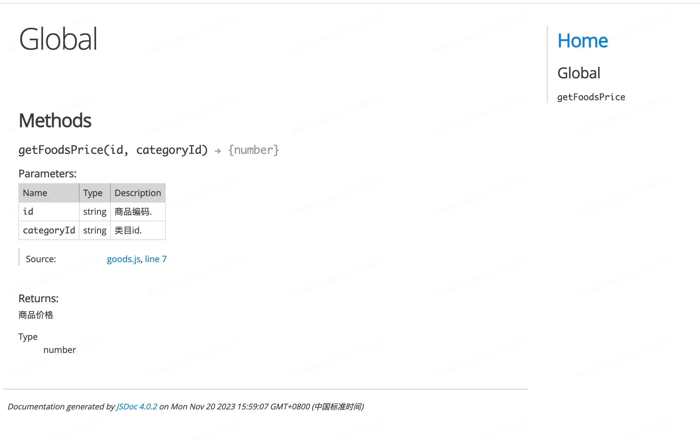

<Boxx type='tip' />


## 什么是 JSDoc

首先，JSDoc并不是新东西，早在几年前就有了，为什么现在又被拿出来说一说呢？ 主要是最近Svelte 弃用 TypeScript，改用 JSDoc 了。TypeScript 我们知道，是用来给 JS 加上类型的，可以实现类型提示和编译时的类型检查。

那 JSDoc 能够完成一样的功能么？Svelte 是出于什么原因弃用 TS 的呢？

### JSDoc 的作用

- 用于为 JavaScript 代码添加注释，使代码更易读、更易维护、更易理解
- 用于为 JavaScript 代码生成文档，使代码更易于使用、更易于维护、更易于理解
- 像ts一样实现类型提示和类型检查

## JSDoc 的使用

goods.js

```js
/**
 * @param {string} id - 商品编码.
 * @param {string} categoryId - 类目id.
 * @returns {number} 商品价格
 */
function getGoodsPrice(id, categoryId) {
  // ...
  let price = 120;
  return price;
}
```

执行命令：

```bash
jsdoc goods.js
```

得到结果： （out目录下）


