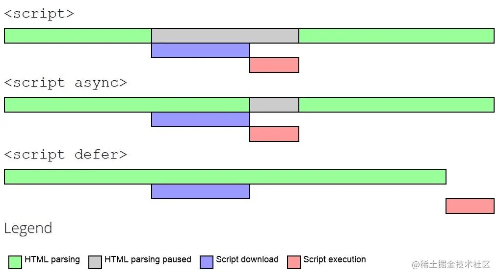

## Html5 新增

1. 语义化标签

header、footer、nav、article、section、aside（...）

2. 本地存储

localStorage、sessionStorage

::: details localStorage、sessionStorage、cookie

- localStorage：数据限制5Mb，除非被清除，否则永久保存，仅在客户端（即浏览器）中保存，不参与和服务器的通信。
- sessionStorage：数据限制5Mb，仅在当前会话下有效，关闭页面或浏览器后被清除，仅在客户端（即浏览器）中保存，不参与和服务器的通信。
- cookie：数据限制4kb，可设置失效时间，如果在浏览器端生成Cookie，默认是关闭浏览器后失效，**每次都会携带在HTTP头中**，如果使用cookie保存过多数据会带来性能问题。（常常用来保存登录状态）

注意：sessionStorage，页面会话在浏览器打开期间一直保持，并且重新加载或恢复页面仍会保持原来的页面会话；在新标签或窗口打开一个页面时会复制顶级浏览会话的上下文作为新会话的上下文（仅仅是复制，复制后将失去联系，没有响应式）；所以sessionStorage不能在不同的标签页面共享状态，但是在某些特定场景下新开（window.open, 带有opener的a标签）的页面会复制之前页面的sessionStorage。

:::

3. canvas 画布

Canvas是HTML5中的一个元素，用于在网页上绘制图形、动画和其他可视化内容。它提供了一个可编程的区域，可以使用JavaScript来操作和绘制图形。通过Canvas，开发者可以绘制2D和3D图形，包括线条、形状、图像和文本等。Canvas具有强大的绘图功能，可以实现各种交互式和动态效果，是Web开发中常用的工具之一。

4. websocket

- [WebSocket 教程](https://ruanyifeng.com/blog/2017/05/websocket.html)

5. 设备相关的api

- [HTML5新增API](https://blog.csdn.net/weixin_70568389/article/details/132482378)


## script 标签中 defer 和 async 的区别

当浏览器加载 HTML 并遇到```<script>...</script>```标签时，它无法继续构建 DOM。它必须立即执行脚本。外部脚本```<script src="..."></script>```也是如此：浏览器必须等待脚本下载，执行下载的脚本，然后才能处理页面的其余部分。有一个解决方法，就是把脚本放到最底部。
但是对于长 HTML 文档，这可能会有明显的延迟。

script 是会阻碍 HTML 解析的，只有下载好并执行完脚本才会继续解析 HTML
defer 和 async有一个共同点：下载此类脚本都不会阻止页面呈现（异步加载），区别在于：

async 执行与文档顺序无关，异步下载完后，立即执行，会打乱 html 中 script 的顺序，对于有前后依赖关系的多个 script 标签，不适合使用 async，而defer会按照文档中的顺序执行；async 脚本加载完成后立即执行，可以在DOM尚未完全下载完成就加载和执行；而defer脚本需要等到文档所有元素解析完成之后才执行；




- [script 标签中 defer 和 async 的区别](https://juejin.cn/post/7111693402579664932)

## 讲一下事件模型

完整的事件流是从事件捕获开始的，再到触发该事件，最后到事件冒泡，也称为3个阶段，捕获阶段、目标阶段、冒泡阶段；

比如点击页面上的按钮，会先触发按钮的点击事件，之后事件向上冒泡，再触发 document 的点击事件。 基于冒泡可以实现事件委托，常见的是在动态渲染节点时，通过给已存在的父级元素或者 document 绑定点击事件，通过判断当前触发点击事件的元素，来给动态渲染的子节点实现点击事件。 这种做法可以减少大量的事件监听，内存消耗少；同时也可以避免对动态渲染的节点没有触发事件的情况。

举个例子：

```html
<ul id="list">
  <li>1</li>
  <li>2</li>
  <li>3</li>
</ul>

<script>
  // 给已有的li节点绑定点击事件 
  document.getElementById('list').addEventListener('click', function(e) {
    console.log(e.target.innerText);
  });

  // 3s后插入一个 li, 动态插入的，实际上没有上面的点击事件    
  setTimeout(function(){        
    // 插入        
    const ul =document.querySelector('ul');        
    // 创建一个 li节点：<li></li>        
    const li =document.createElement('li');        
    li.innerHTML = '4444';        
    ul.appendChild(li);    
  },3000) 

</script>

```

因为存在冒泡机制，所以可以给父级元素绑定点击事件，然后判断当前点击的元素是否是子元素，如果是，则执行相应的事件；（事件委托）

```js
const ul =docum .querySelector('ul');        
  ul.addEventlistener('click',function(event){        
  const target = event.target;        
  console.log(target.innerText);   
})
```

## 讲讲


