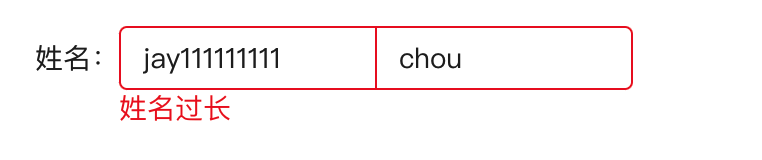

<Boxx type='tip' />

## provide/inject

无意间看见一篇掘金文章，文章说provide/inject不支持响应式，我记得好像是支持响应式，但是不推荐这样用吧，于是我去翻阅了[官方文档](https://cn.vuejs.org/guide/components/provide-inject.html#working-with-reactivity)，略有所收获；

1. 响应式数据

> 当提供 / 注入响应式的数据时，**建议尽可能将任何对响应式状态的变更都保持在供给方组件中**。这样可以确保所提供状态的声明和变更操作都内聚在同一个组件内，使其**更容易维护**。  -- 官方文档

往反向想，如果在多个子组件中都有修改响应式数据的不同操作，那该响应式的数据将难以维护； 如果必要修改该值时，应该抽成通用方法，然后写在供给方组件中； 具体可以看下面官方文档的例子：

```vue {11,12,13,14}
<!-- 在供给方组件内 -->
<script setup>
import { provide, ref } from 'vue'

const location = ref('North Pole')

function updateLocation() {
  location.value = 'South Pole'
}

provide('location', {
  location,
  updateLocation
})
</script>
```

```vue {5}
<!-- 在注入方组件 -->
<script setup>
import { inject } from 'vue'

const { location, updateLocation } = inject('location')
</script>

<template>
  <button @click="updateLocation">{{ location }}</button>
</template>
```

详细介绍： 参考 [依赖注入](https://cn.vuejs.org/api/composition-api-dependency-injection.html)

这里提到inject的参数：

> 第一个参数是注入的 key。Vue 会遍历父组件链，通过匹配 key 来确定所提供的值。如果父组件链上多个组件对同一个 key 提供了值，那么离得更近的组件将会“覆盖”链上更远的组件所提供的值。如果没有能通过 key 匹配到值，inject() 将返回 undefined，除非提供了一个默认值。

> 第二个参数是可选的，即在没有匹配到 key 时使用的默认值。它也可以是一个工厂函数，用来返回某些创建起来比较复杂的值。如果默认值本身就是一个函数，那么你必须将 false 作为第三个参数传入，表明这个函数就是默认值，而不是一个工厂函数。

> 与注册生命周期钩子的 API 类似，inject() 必须在组件的 setup() 阶段同步调用。

```ts
function inject<T>(
  key: InjectionKey<T> | string,
  defaultValue: () => T,
  treatDefaultAsFactory: true
): T
```

```treatDefaultAsFactory: true``` 表示是否将默认值（第二个参数）做为工厂函数，作为工厂函数后，工厂函数的返回值才是inject的默认值；

```js
const upiAge = inject('upiAge', () => 1, true); // 1
const upiAge = inject('upiAge', () => 1, false); // () => 1
const upiAge = inject('upiAge', () => 1); // () => 1
```

类型安全-`InjectionKey`

参考文档：

- [如何在 vue3 中提供一个类型安全的 inject](https://www.jianshu.com/p/7064c5f8f143)
- [Symbol](https://developer.mozilla.org/zh-CN/docs/Web/JavaScript/Reference/Global_Objects/Symbol)


## 组件v-model

试想一下下面图片的功能如何实现




```vue {32}
<script setup lang='ts'>
const formData = reactive({
  username: {
    firstName: 'jay',
    lastName: 'chou',
  },
  age: 30,
});

const validateName = (rule: any, value: any, callback: any) => {
  console.log(value, '当前名字');
  if (!value.firstName || !value.lastName) {
    callback(new Error('请输入完整的姓名'));
  }
  if (value.firstName?.length > 10 || value.lastName?.length > 10) {
    callback(new Error('姓名过长'));
  }
};

const formRule = reactive({
  username: [{ validator: validateName, trigger: 'change' }],
  age: [{ required: true, message: '请输入年纪', trigger: 'change' }],
});
</script>

<div class="container">
  <el-form :model="formData" :rules="formRule">
    <el-form-item prop="age" label="年龄">
      <el-input v-model="formData.age"></el-input>
    </el-form-item>
    <el-form-item prop="username" label="姓名">
      <UserName v-model="formData.username"></UserName>
    </el-form-item>
  </el-form>
</div>
```

```vue
<script setup>
const userName = computed({
  set(value) {
    emit('update:modelValue', value);
  },
  get() {
    return props.modelValue;
  },
})
</script>
<template>
  <div class="container">
    <el-input v-model="userName.firstName" placeholder="firstName" class="left-input"></el-input>
    <el-input v-model="userName.lastName" placeholder="lastName" class="right-input"></el-input>
  </div>
</template>
```

