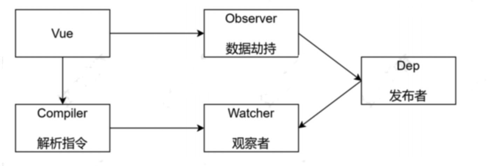
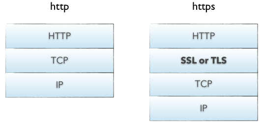

<Boxx type='tip' />

## 说说你对vue的理解

Vue是目前国内比较流行的用于**构建用户界面**的javascript框架，有易学易用，性能出色，灵活多变的特点。它的设计哲学是渐进式的，关注视图层，配合使用其他库和工具（例如： vue-router、vuex、Typescript等），它也能够帮助开发者构建复杂的前端应用。它的要素在于 *响应式系统、组件化、模版语法、虚拟dom*、有健全的工具链和生态系统，社区文档都比较齐全。

- 响应式系统：Vue通过使用响应式系统自动追踪依赖和管理DOM更新。当模型状态改变时，视图会自动更新，这使得状态管理变得简单高效。
- 组件化：Vue鼓励开发者通过组件化的方式构建应用，每个组件都有自己的视图、数据逻辑和样式，这样有助于提高代码的复用性和测试性。
- 模板语法：Vue使用基于HTML的模板语法，允许开发者声明式地将DOM绑定到底层Vue实例的数据上。模板支持数据绑定、指令（如v-if、v-for等）、事件处理等。
- 虚拟DOM：Vue使用虚拟DOM来优化DOM的更新，通过计算前后两次数据变化产生的差异，然后高效地批量更新DOM，而不是直接操作DOM。

## 那你讲讲Vue的响应式

- [深入响应式原理](https://v2.cn.vuejs.org/v2/guide/reactivity.html)
- [深入响应式系统](https://v2.cn.vuejs.org/v2/guide/reactivity.html)

*首先什么是响应式？*

个经常被拿来当作典型例子的用例即是 Excel 表格：
单元格 A2 中的值是通过公式 = A0 + A1 来定义的 (你可以在 A2 上点击来查看或编辑该公式)，因此最终得到的值为 3，正如所料。但如果你试着更改 A0 或 A1，你会注意到 A2 也随即自动更新了。

而 JavaScript 默认并不是这样的。如果我们用 JavaScript 写类似的逻辑

```js
let A0 = 1
let A1 = 2
let A2 = A0 + A1

console.log(A2) // 3

A0 = 2
console.log(A2) // 仍然是 3
```

我们无法直接追踪对上述示例中局部变量的读写，原生 JavaScript 没有提供任何机制能做到这一点。但是，我们是可以**追踪对象属性的读写**的。

### Vue2中响应式的实现

vue2中响应式的实现核心api：`Object.defineProperty`

1、监听属性的读写 

[Object.defineProperty](https://developer.mozilla.org/zh-CN/docs/Web/JavaScript/Reference/Global_Objects/Object/defineProperty)

```js
// obj：要定义属性的对象
// prop：要定义或修改的属性的名称
// descriptor：要定义或修改的属性描述符
Object.defineProperty(obj, prop, descriptor)
```

```js
function updateView(){
  console.log("视图更新");
}

function defineReactive(target, key, value) {
  
  Object.defineProperty(target, key, {
    get() {
      console.log('监听到读')
      return value
    },
    set(newValue) {
      console.log('监听到写')
      if(newValue !== value) {
        value = newValue
        updateView()
      }
    }
  })
}


function observe(target){
  if(typeof target !== 'object' || target === null) {
    return target;
  }

  // 将对象的属性用 defineProperty 重新定义
  for(let key in target) {
    defineReactive(target, key, target[key])
  }
}

let data = {
  name: 'will',
  age: 25,
  job: 'FE',
  likes: ['basketball', 'football', 'swimming'],
  relate: {
    father: 'will father',
    son: 'will son'
  }
}

observe(data)


data.name = 'will wong' // 监听到写 ->  视图更新

data.likes[2] = 'tennis' //  ❌ 无法监听到写，视图未更新 

data.relate.son = 'will wong son' //  ❌ 无法监听到写，视图未更新

```

2、视图更新优化（实现对象深度监听）

**因为考虑性能问题实际上，vue没有这么做。因为不确定数组的长度，对数组遍历进行劫持性能会损失很大**，vue而是提供了 Vue.vue方法 来解决数组和深对象的响应式问题。

```js{3}
function defineReactive(target, key, value) {

  observe(value)
  
  Object.defineProperty(target, key, {
    get() {
      console.log('监听到读')
      return value
    },
    set(newValue) {
      console.log('监听到写')
      if(newValue !== value) {
        value = newValue
        updateView()
      }
    }
  })
}

data.name = 'will wong' // 监听到写 ->  视图更新

data.likes[2] = 'tennis' //  监听到读和写 ->  视图更新 

data.relate.son = 'will wong son' //   监听到读和写 ->  视图更新 

```

### Vue2 $set()方法实现原理

set 方法主要作用是向响应式对象中添加一个属性，并确保这个新属性同样是响应式的，且触发视图更新。它必须用于向响应式对象上添加新属性，对象不能是 Vue 实例，或者 Vue 实例的根数据对象。

```
Vue.set( target, key, value ) / this.$set( target, key, value )
target：要更改的数据源(可以是对象或者数组)
key：要更改的具体数据，或者新增的属性名
value ：重新赋的值
```

1、如果是 undefined 、null 、基本数据类型，直接报错;

2、如果为数组，取当前数组长度与 key 这两者的最大值作为数组的新长度，然后使用数组的 splice 方法将传入的索引 key 对应的 val 值添加进数组。target 在 observe 的时候，原型链被修改了， splice 方法也已经被重写了，触发之后会再次遍历数组，进行数据劫持，也就是说当使用 splice 方法向数组内添加元素时，该元素会自动被变成响应式的

3、如果为对象，会先判断 key 值是否存在于对象中，如果在，则直接替换 value。如果不在，就判断 target 是不是响应式对象（其实就是判断它是否有 __ob__ 属性），接着判断如果它是不是 Vue 实例，或者是 Vue 实例的根数据对象，如果是则抛出警告并退出程序。如果 target 不是响应式对象，就直接给 target 的 key 赋值，如果 target 是响应式对象，就调用 defineReactive 将新属性的值添加到 target 上，并进行依赖收集，更新视图

```js
function set(target: Array<any> | Object, key: any, val: any): any {
  // isUndef 是判断 target 是不是等于 undefined 或者 null 。
  // isPrimitive 是判断 target 的数据类型是不是 string、number、symbol、boolean 中的一种
  if (process.env.NODE_ENV !== 'production' &&
    (isUndef(target) || isPrimitive(target))
  ) {
    warn(`Cannot set reactive property on undefined, null, or primitive value: ${(target: any)}`)
  }

  // 数组的处理
  if (Array.isArray(target) && isValidArrayIndex(key)) {
    target.length = Math.max(target.length, key)
    target.splice(key, 1, val)
    return val
  }

  // 对象，并且该属性原来已存在于对象中，则直接更新
  if (key in target && !(key in Object.prototype)) {
    target[key] = val
    return val
  }

  // vue给响应式对象(比如 data 里定义的对象)都加了一个 __ob__ 属性，
  // 如果一个对象有这个 __ob__ 属性，那么就说明这个对象是响应式对象，修改对象已有属性的时候就会触发页面渲染
  // 非 data 里定义的就不是响应式对象。
  const ob = (target: any).__ob__

  if (target._isVue || (ob && ob.vmCount)) {
    process.env.NODE_ENV !== 'production' && warn(
      'Avoid adding reactive properties to a Vue instance or its root $data ' +
      'at runtime - declare it upfront in the data option.'
    )
    return val
  }

  // 不是响应式对象
  if (!ob) {
    target[key] = val
    return val
  }

  // 是响应式对象，进行依赖收集
  defineReactive(ob.value, key, val)

  // 触发更新视图
  ob.dep.notify()
  return val
}

```

### Vue3中的响应式

在 Vue 3 中则使用了 Proxy 来创建响应式对象，仅将 getter / setter 用于 ref。下面的伪代码将会说明它们是如何工作的

```js
function reactive(obj) {
  return new Proxy(obj, {
    get(target, key) {
      track(target, key)
      return target[key]
    },
    set(target, key, value) {
      target[key] = value
      trigger(target, key)
    }
  })
}

function ref(value) {
  const refObject = {
    get value() {
      track(refObject, 'value')
      return value
    },
    set value(newValue) {
      value = newValue
      trigger(refObject, 'value')
    }
  }
  return refObject
}

```

先理解 Proxy

> Proxy 可以理解成，在目标对象之前架设一层“拦截”，外界对该对象的访问，都必须先通过这层拦截，因此提供了一种机制，可以对外界的访问进行过滤和改写。Proxy 这个词的原意是代理，用在这里表示由它来“代理”某些操作，可以译为“代理器”。

```js
// 代理整个对象，从而侦测数据变化
function defineReactive(obj) {
  return new Proxy(obj, {
    get(target, key) {
      console.log("get", key);
      return target[key]    
    },
    set(target, key, val) {
      console.log("set", key);
      target[key] =val
      update()    
    }  
  })
}
function update() {
  console.log(obj.a);
}

// test
const obj= {}
const observed = defineReactive(obj)
observed.a='前端'

```

## 说说事件委托

**事件委托**，也可以叫做事件代理，利用了事件冒泡的原理来优化事件处理。事件委托允许你不必直接在目标元素上绑定事件处理器，而是在其父元素上设置单一的事件处理器来管理所有子元素的相应事件。

举个例子，现在有100个按钮，循环给每个按钮添加点击事件，那么会增加内存损耗，影响性能。此时可以给button的父元素添加点击事件，这时相当于每个按钮都绑定了点击事件。这里就涉及到了 事件冒泡的原理了。

**事件冒泡**，当我们给子元素和父元素都绑定了click事件时，点击子元素，父元素的click事件也会被触发，这就是事件冒泡。当我们子元素没有绑定click事件，但是父元素绑定了click事件，当我们点击子元素时，由于事件冒泡，我们会将这个事件e传递给父元素，父元素也会触发click事件。

``` html
<!DOCTYPE html>
<html lang="en">
<head>
  <meta charset="UTF-8">
  <meta name="viewport" content="width=device-width, initial-scale=1.0">
  <title>Document</title>
  <style>
    .container {
      width: 600px;
      height: 600px;
      border: 1px solid #000;
      display: flex;
      flex-wrap: wrap;
    }

    .item {
      width: 100px;
      height: 100px;
      background-color: slategray;
      margin-right: 10px;
      margin-bottom: 10px;
    }
  </style>
</head>


<body>
  <div class="container" id="container">
    <div class="item" id="btn1"></div>
    <div class="item" id="btn2"></div>
    <div class="item" id="btn3"></div>
    <div class="item" id="btn4"></div>
    <div class="item" id="btn5"></div>
    <div class="item" id="btn6"></div>
    <div class="item" id="btn7"></div>
    <div class="item" id="btn8"></div>
    <div class="item" id="btn9"></div>
  </div>
</body>

<script>
  const container = document.getElementById('container')
  container.addEventListener('click', function(event){
    console.log(event.target.id) // btn1、btn2 、btn3 ……
  })
</script>

</html>

```


## 常见的页面布局

参考[常见的布局](https://heptaluan.github.io/2019/09/12/CSS/11/)


## css 权重

```
!important > 行内样式 > ID选择器 > 类选择器 | 属性选择器 | 伪类选择器 > 元素选择器
```

权重规则总结:

1、!important 优先级最高，但也会被权重高的!important所覆盖
2、行内样式总会覆盖外部样式表的任何样式(除了!important)

3、单独使用一个选择器的时候，不能跨等级使css规则生效

例如： 无论多少个class组成的选择器，都没有一个ID选择器权重高 

4、如果两个权重不同的选择器作用在同一元素上，权重值高的css规则生效
5、如果两个相同权重的选择器作用在同一元素上：以后面出现的选择器为最后规则.
6、权重相同时，与元素距离近的选择器生效


其中通配符选择器 *，组合选择器 + ~ >，否定伪类选择器 :not() 对优先级无影响

> 通配符 *	权重固定为 0-0-0，
> 组合符 +, ~, > 仅描述元素关系，不参与权重计算
> 否定伪类 :not() 本身不增加权重，但括号内的选择器会正常计算优先级

建议：
- 避免使用!important;
- 利用id增加选择器权重;
- 减少选择器的个数（避免层层嵌套）;

参考[你对CSS权重真的足够了解吗？](https://juejin.cn/post/6844903608199151630)

## ’+’ 与 ’~’ 选择器有什么不同

```
+ 选择器匹配紧邻的兄弟元素

~ 选择器匹配随后的所有兄弟元素
```

## z-index 与层叠上下文

z-index用于设置元素的堆叠顺序，而层叠上下文则是决定这些z-index值如何相互作用的环境。

层叠上下文是一个三维的概念，它决定了页面中一组元素的堆叠顺序。每个层叠上下文都有自己的z-index层级，层叠上下文内的元素只会与同一上下文中的其他元素进行z-index比较，这也导致了z-index小的可能在z-index大的元素上。

## 实现水平垂直居中

需要考虑元素固定宽高和不定宽高，行内或者块状

1、绝对定位的方法

- 绝对定位 + transform

```css
.box {
  postion: absolute;
  top: 50%;
  bottom: 50%;
  width: 100px;
  height: 100px;
  transform: translate(-50%, -50%);
}
```

- 绝对定位 + 负margin

缺点：需要知道box的宽高

```css
.wp {
    position: relative;
}
.box {
    position: absolute;;
    top: 50%;
    left: 50%;
    margin-left: -50px;
    margin-top: -50px;
}
```

- 绝对定位，四个方向都写0
```css
.container {
  position: relative;
  height: 300px;
  border: 1px solid red;
}
.item {
  width: 100px;
  height: 50px;
  position: absolute;
  left: 0;
  top: 0;
  right: 0;
  bottom: 0;
  margin: auto;
  border: 1px solid green;
}
```

2、flex布局法

```css
.box {
  display: flex;
}
.item {
  margin: auto;
}
```


## javascript部分


### 常见的手写题

参考： https://juejin.cn/post/7031322059414175774?utm_source=gold_browser_extension 


#### 1、防抖
防抖好比法师发动技能，每次都要重新蓄力读条，进度条100%才会发出。（有点像回城）

直接调用原函数肯定无法实现防抖的效果，所以需要构建一个新函数，所以我们这个debounce函数接收两个参数，第一个参数是原函数，第二个参数是延迟时间，返回的是一个（新）函数，使用时调用新函数，就会实现防抖效果。调用新函数时，怎么做到每点发动技能都要重新蓄力呢？在函数中设置一个定时器，在定时器结束之后才调用原函数，执行函数时先检查有没有之前的计时器，有的话就清除，重新计时。记住，这个timer需要定义在这个新函数的外层，因为每次调用新函数时，这个timer都需要时同一个，而不是重新创建的，最后需要考虑函数的this指向和参数传递。

```js
function debounce(fn, delay) {
  let timer
  return function (...args) {
    if (timer) {
      clearTimeout(timer)
    }
    timer = setTimeout(() => {
      fn.apply(this, args)
    }, delay)
  }
}

// 测试
function scrolling(a,b) {
  console.log('is scrolling', a, b)
}
const debounceTask = debounce(scrolling, 1000)
window.addEventListener('scroll', debounceTask('1','2'))
```

#### 2、节流
节流好比fps射击游戏，你手速再快也会枪械射速的限制，单位时间内只会射出一颗子弹。

```js

function throttle(fn, delay) {
  let last = 0; // 上次触发的时间戳
  return (...args ) => {
    let now = Date.now()
    if(now - last > delay) {
      last = now
      fn.apply(this, args)
    }
  }
}

// 测试
function scrolling() {
  console.log('is scrolling')
}
const throttleTask = throttle(scrolling, 1000)
window.addEventListener('scroll', throttleTask)
```

:::details 防抖和节流的场景
- 防抖：搜索输入框、窗口大小调整、按钮提交等

- 节流：滚动事件处理、滚动事件的懒加载
:::

#### 3、深拷贝

深拷贝是指将原对象或数组的值复制到一个新的对象或数组中，并且新的对象或数组的属性或元素完全独立于原对象或数组，即它们不共享引用地址。因此，当我们修改其中一个对象或数组时，另一个对象或数组不会受到任何影响。

```js
// 不支持值为undefined、函数和循环引用的情况
const cloneObj = JSON.parse(JSON.stringify(obj))
```

递归实现
```js
const deepClone = (obj, cache = new WeakMap()) => {
  // 非引用类型 返回原值，注意 type null === 'object' 是js的历史缺陷
  if(obj === null || typeof obj !== 'object') return obj;
  if(obj instanceof Date) return new Date(obj)
  if(obj instanceof RegExp) return new RegExp(obj)

  // 如果出现循环引用，则返回缓存的对象，防止递归进入死循环
  if(cache.has(obj)) return cache.get(obj)

  let cloneObj = obj.constructor()
  cache.set(obj, cloneObj)

  for(let key in obj) {
    if(obj.hasOwnProperty(key)) { // 只克隆自身的属性，不克隆原型链上的属性
      cloneObj[key] = deepClone(obj[key], cache)
    }
  }

  return cloneObj
}

const a = { name: 'will', score: { english: '150', math: '150' } }

const b = deepClone(a)

console.log(b)
```

::: details 常使用的浅拷贝和深拷贝

- 浅拷贝：

浅拷贝，指的是创建新的数据，这个数据有着原始数据属性值的一份精确拷贝

如果属性是基本类型，拷贝的就是基本类型的值。如果属性是引用类型，拷贝的就是内存地址

即浅拷贝是拷贝一层，深层次的引用类型则共享内存地址

需要理解这里的一层的意思，例如拷贝：`const  arr = [1,2,3,4] `和`const arr = [{ name: will }]`

1. `Object.assign()`
2. `cons arr1 = [...arr]` 拓展运算符
3. `Array.prototype.slice()`
4. `Array.prototype.concat()`


- 深拷贝：
1. `JSON.parse(JSON.stringify(obj))` // 弊端会忽略undefined、symbol和函数
2. `lodash.cloneDeep()`

:::


#### 4、手写 Function.prototype.call() \ apply() \ bind()

```js
var name = "lucy";
var obj = {
    name: "martin",
    say: function () {
        console.log(this.name);
    }
};
obj.say(); // martin，this 指向 obj 对象
setTimeout(obj.say,0); // lucy，this 指向 window 对象
```

`call `方法的作用是 改变函数执行时的 this 指向

::: details 大白话讲this
在 JavaScript 中，this 就像是一个指针，它指向"谁在调用当前代码"。简单来说，this 就是函数运行时的上下文，也就是这个函数是"谁"在执行。举例：

想象你是一名服务员，你说："我来为您服务"。这里的"我"就相当于 JavaScript 中的 this，它指的是"谁在说这句话"。
如果是张三在说，那么"我"就是张三
如果是李四在说，那么"我"就是李四
:::


```js {8}
Function.prototype.myCall = function(context, ...args) {
  context = context || window; // 如果没有传入context，则默认指向全局对象

  const fnSymbol = Symbol('fn'); // 创建一个唯一的属性名，避免冲突
  context[fnSymbol] = this; // 将函数作为context的一个属性

  // 这一步是关键，因为当一个函数作为对象的方法调用时，this 会指向该对象
  const result = context[fnSymbol](...args); 
  delete context[fnSymbol]; // 删除这个属性，避免污染context
  return result; // 返回函数执行的结果
}
```

```js
Function.prototype.myApply = function (context, args) {
  context = context || window;
  const fn = symbol('fn');
  context[fn] = this;
  let result;
  
  if(!args) {
    result = context[fn]();
  } else {
    if(!Array.isArray(args)) {
      throw new TypeError('args must be an array');
    }
    result = context[fn](...args);
  }

  delete context[fn];
  return result;
}
```

```js
Function.prototype.myBind = function (context, ...args) {
  // 保存原始函数的引用
  const originalFunc = this;
  context = context || (typeof window !== 'undefined' ? window : global);
  const boundFunc = function (..args2) {
    // 合并参数
    const allArgs = [...args, ...args2];
    // 处理构造函数的情况
    // 如果是通过 new 调用，this 应该指向新创建的对象（即 boundFunc 的实例）
    // 否则，this 应该指向 context
    return originalFunc.apply(
      this instanceof boundFunc ? this : context,
      allArgs
    );
  }

  // 设置原型链，使得通过 new 调用时能够继承原始函数的原型
  // 创建一个空函数作为中介，避免直接修改原始函数的原型
  const EmptyFunc = function () {};
  EmptyFunc.prototype = originalFunc.prototype;
  boundFunc.prototype = new EmptyFunc();

  return boundFunc
}

```


#### 5、手写promise

Promise 用大白话来说就是一个"承诺"，它代表了一个异步操作的最终结果。当我们进行异步操作时（比如网络请求、文件读取等），不能立即得到结果，Promise 就像是一张"欠条"，承诺在未来某个时刻给你一个结果。

Promise 有三种状态：

- pending（等待中）：初始状态，既没有成功也没有失败
- fulfilled（已成功）：操作成功完成
- rejected（已失败）：操作失败

Promise 一旦状态改变（从 pending 变为 fulfilled 或 rejected），就不会再变，这个结果是固定的。

参考：[手写Promise](https://juejin.cn/post/6850037281206566919), 推荐阅读，一步一步的实现

```js
const PENDING = 'pending';
const FULFILLED = 'fulfilled';
const REJECTED = 'rejected';

class Promise {
  constructor(executor) {
    // 初始状态为 pending
    this.status = PENDING;
    // 成功的值
    this.value = undefined;
    // 失败的原因
    this.reason = undefined;
    // 成功的回调函数队列
    this.onFulfilledCallbacks = [];
    // 失败的回调函数队列
    this.onRejectedCallbacks = [];

    const resolve = (value) => {
      // 只有在 pending 状态才能转变为 fulfilled
      // 防止 executor 中调用了两次 resovle/reject 方法
      if (this.status === PENDING) {
        this.status = FULFILLED;
        this.value = value;
        this.onFulfilledCallbacks.forEach(fn => fn());
      }
    }

    const reject = (reason) => {
      // 只有在 pending 状态才能转变为 rejected
      // 防止 executor 中调用了两次 resovle/reject 方法
      if (this.status === PENDING) {
        this.status = REJECTED;
        this.reason = reason;
        // 执行失败的回调
        this.onRejectedCallbacks.forEach(fn => fn());
      }
    };

    try {
      // 立即执行
      executor(resolve, reject);
    } catch(error) {
      // 如果executor执行出错，直接reject
      reject(error);
    }
  };

  then(onFulfilled, onRejected) { 
    // 参数可选，如果不是函数，则 v => v 是为了值可以继续往下传
    onFulfilled = typeof onFulfilled === 'function' ? onFulfilled : v => v;
    onRejected = typeof onRejected === 'function' ? onRejected : reason => { throw reason };

    // 创建一个新的Promise2，用于链式调用
    const promise2 = new MyPromise((resolve, reject) => {
      // （这里是成层的promise完成，并且成功）成功状态处理
      if(this.status === FULFILLED) {
        setTimeout(() => {
          try {
            const x = onFulfilled(this.value);
            // 这里需要继续处理x，是因为x可能是一个promise
            this.resolvePromise(promise2, x, resolve, reject);
          } catch (error) {
            reject(error);
          }
        },0)
      }
      // 失败状态处理
      if(this.status === REJECTED) {
        setTimeout(() => {
          try {
            const x = onRejected(this.reason);
            this.resolvePromise(promise2, x, resolve, reject);
          }
        }, 0)
      }
      // pending状态处理
      if(this.status === PENDING) {
        // 将回调存入队列，等待状态改变时执行
        this.onFulfilledCallbacks.push(() => {
          setTimeout(() => {
            try {
              const x = onFulfilled(this.value);
              this.resolvePromise(promise2, x, resolve, reject);
            } catch (error) {
              reject(error);
            }
          })
        })

        this.onRejectedCallbacks.push(() => {
          setTimeout(() => {
            try {
              const x = onRejected(this.reason);
              this.resolvePromise(promise2, x, resolve, reject);
            } catch (error) {
              reject(error);
            }
          }, 0)
        })
      }
    }) 
    return promise2;   
  }

  // 处理Promise解析过程
  resolvePromise(promise2, x, resolve, reject) { 
    if (promise2 === x) {
      return reject(new TypeError('Chaining cycle detected for promise'));
    }

    // 防止多次调用
    let called = false;

    if (x !== null && (typeof x === 'object' || typeof x === 'function')) { 
      try { 
        const then = x.then;
        // 如果then是函数，认为x是promise
        if (typeof then === 'function') {
          // 执行x的then，传入resolvePromise和rejectPromise
          // 这里不能使用x.then, 因为会链式调用，导致then被多次调用
          then.call(x, (y) => { 
            if (called) return;
            called = true;
            this.resolvePromise(promise2, y, resolve, reject)
          }, (r) => { 
            if (called) return;
            called = true;
            reject(r)
          })
         }
      }
    }
  }

}
```

#### 6、数组排序 sort


# 作用域
参考文章：[深入理解JS作用域和作用域链](https://juejin.cn/post/7096818495450513445)

作用：
>1. 作用域最为重要的一点是安全。变量只能在特定的区域内才能被访问，外部环境不能访问内部环境的任何变量和函数，即可以向上搜索，但不可以向下搜索， 有了作用域我们就可以避免在程序其它位置意外对某个变量做出修改导致程序发生事故。
> 2. 作用域能够减轻命名的压力。我们可以在不同的作用域内定义相同的变量名，并且这些变量名不会产生冲突。


## 闭包

在理解闭包前，请先理解作用域；

[深入理解js闭包](https://juejin.cn/post/7097141521102667813)


作用：
> 1. 在函数外部可以读取函数内部的变量
> 2. 让这些变量的值始终保持在内存中

## 微任务和宏任务

微任务和宏任务都是异步任务

[微任务和宏任务](https://juejin.cn/post/7098313596869804068)


## provide/inject

无意间看见一篇掘金文章，文章说provide/inject不支持响应式，我记得好像是支持响应式，但是不推荐这样用吧，于是我去翻阅了[官方文档](https://cn.vuejs.org/guide/components/provide-inject.html#working-with-reactivity)，略有所收获；

1. 响应式数据

> 当提供 / 注入响应式的数据时，**建议尽可能将任何对响应式状态的变更都保持在供给方组件中**。这样可以确保所提供状态的声明和变更操作都内聚在同一个组件内，使其**更容易维护**。  -- 官方文档

往反向想，如果在多个子组件中都有修改响应式数据的不同操作，那该响应式的数据将难以维护； 如果必要修改该值时，应该抽成通用方法，然后写在供给方组件中； 具体可以看下面官方文档的例子：

```vue {11,12,13,14}
<!-- 在供给方组件内 -->
<script setup>
import { provide, ref } from 'vue'

const location = ref('North Pole')

function updateLocation() {
  location.value = 'South Pole'
}

provide('location', {
  location,
  updateLocation
})
</script>
```

```vue {5}
<!-- 在注入方组件 -->
<script setup>
import { inject } from 'vue'

const { location, updateLocation } = inject('location')
</script>

<template>
  <button @click="updateLocation">{{ location }}</button>
</template>
```

详细介绍： 参考 [依赖注入](https://cn.vuejs.org/api/composition-api-dependency-injection.html)

这里提到inject的参数：

> 第一个参数是注入的 key。Vue 会遍历父组件链，通过匹配 key 来确定所提供的值。如果父组件链上多个组件对同一个 key 提供了值，那么离得更近的组件将会“覆盖”链上更远的组件所提供的值。如果没有能通过 key 匹配到值，inject() 将返回 undefined，除非提供了一个默认值。

> 第二个参数是可选的，即在没有匹配到 key 时使用的默认值。它也可以是一个工厂函数，用来返回某些创建起来比较复杂的值。如果默认值本身就是一个函数，那么你必须将 false 作为第三个参数传入，表明这个函数就是默认值，而不是一个工厂函数。

> 与注册生命周期钩子的 API 类似，inject() 必须在组件的 setup() 阶段同步调用。

```ts
function inject<T>(
  key: InjectionKey<T> | string,
  defaultValue: () => T,
  treatDefaultAsFactory: true
): T
```

```treatDefaultAsFactory: true``` 表示是否将默认值（第二个参数）做为工厂函数，作为工厂函数后，工厂函数的返回值才是inject的默认值；

```js
const upiAge = inject('upiAge', () => 1, true); // 1
const upiAge = inject('upiAge', () => 1, false); // () => 1
const upiAge = inject('upiAge', () => 1); // () => 1
```

类型安全-`InjectionKey`

参考文档：

- [如何在 vue3 中提供一个类型安全的 inject](https://www.jianshu.com/p/7064c5f8f143)
- [Symbol](https://developer.mozilla.org/zh-CN/docs/Web/JavaScript/Reference/Global_Objects/Symbol)


## 组件v-model

试想一下下面图片的功能如何实现


```vue {32}
<script setup lang='ts'>
const formData = reactive({
  username: {
    firstName: 'jay',
    lastName: 'chou',
  },
  age: 30,
});

const validateName = (rule: any, value: any, callback: any) => {
  console.log(value, '当前名字');
  if (!value.firstName || !value.lastName) {
    callback(new Error('请输入完整的姓名'));
  }
  if (value.firstName?.length > 10 || value.lastName?.length > 10) {
    callback(new Error('姓名过长'));
  }
};

const formRule = reactive({
  username: [{ validator: validateName, trigger: 'change' }],
  age: [{ required: true, message: '请输入年纪', trigger: 'change' }],
});
</script>

<div class="container">
  <el-form :model="formData" :rules="formRule">
    <el-form-item prop="age" label="年龄">
      <el-input v-model="formData.age"></el-input>
    </el-form-item>
    <el-form-item prop="username" label="姓名">
      <UserName v-model="formData.username"></UserName>
    </el-form-item>
  </el-form>
</div>
```

```vue
<script setup>
const userName = computed({
  set(value) {
    emit('update:modelValue', value);
  },
  get() {
    return props.modelValue;
  },
})
</script>
<template>
  <div class="container">
    <el-input v-model="userName.firstName" placeholder="firstName" class="left-input"></el-input>
    <el-input v-model="userName.lastName" placeholder="lastName" class="right-input"></el-input>
  </div>
</template>
```


## Vue3+Ts 项目中 定义 ref 实例 的类型

先看下面一段代码


<iframe src='https://sfc.vuejs.org/#eNqVUrFSwzAM/RWdlyZca5e1pAUOGFkYmLyERG1TEttnOwWul39HsdNSysGVTZaenp6lt2O3xvBti2zGMlfYynhw6FsDda5W85F3o4VUVWO09XC3ruryuUVYWt3AiItiSPQEowNsBxaX0A2oWJKq0Mp5CB1PVJ73oCTd59e5Kmu8q6vilUpJOl/spIIDnG/zusVr3poy9xh03Oc+T9IrqTqpMhGlk1R6eGxMTTB6AWRltQ0BhQf9NHou2Z5cskUm9rU99qX1Xiu4KXpJBD4SSPgIAoh6hhYRe+JYEedm4khN5vxHjQCu0AbLUA2ZBRuzuLtJkxu+cVrROcIC5FBwks0gZPoc7bR/kyrvjZsJ4ZZFf4ON49quBEXctspXDXJ0zeTF6jeHloglGx9xCEpu0U4sqhIt2r84T6A/eHtaukRHXzl2xTm2Cn4ZQ4nLSuHDu9EOf3OPpl+RP4J3pgfznLjim4H6jugeSj/mfs0LrOokRJZuqpskvbicTlMITpL0vS8ZSeA4oSccTT7XdGEZdLrdIL6jIf+2R/cJYt9DCQ==' width='100%' height='500px' frameborder="1">

</iframe>

### 发现问题

在ts中将报错，因为在` app.vue `中的 定义的 `childRef `实例并不存在 `updateChildData()`方法;


### 解决方案

```InstanceType<T>``` 是 ts 自带的类型， 能够直接获取组件完整的实例类型

```vue{5,6}
<script setup lang='ts'>
import ChildVue from './childVue.vue'
import { ref } from 'vue'

type ChildRefInstance = InstanceType<typeof ChildVue>
const childRef = ref<ChildRefInstance | null>(null);

const handleClick = ()=>{
  childRef.value?.updateChildData();
}
</script>

```


## 单页面应用

### 1、什么是单页应用

- 多页面应用： **每个页面是一个html文件**，点击某个超链接，就跳转到新的html页面。每次浏览器访问html时，需要重新下载整个html文档、JS和CSS依赖，才能展现出整个页面。这个效率很低。让我想起上学那会儿做的一个纯静态网页（入口： index.html; 关于页面： about.html; ……）还有jsp做的项目页面。
- 单页面应用：**一个网站的所有页面，都是同一份html文档**，用JS判断路由，并动态展示内容，这个过程完全避免了网络请求，极大提高了网站用户体验。

现代Web开发，大多数网站是用React或Vue开发的，它们基本都是单页面应用；

拿vue举例：vue项目中只有一个 public/index.html(vue2)、 index.html(vue3), 路由管理通过 vue-router

### 2、简单实现单页应用

下面几个知识点要知晓

- history.pushState （不刷新页面[不重新加载资源]，给history中添加一条纪录，改变url）


### 3、参考资料

- [不用React Vue，只用原生JS，如何开发单页面应用(SPA)？ - 掘金](https://juejin.cn/post/7147654933435645960)
- [简单聊聊H5的pushState与replaceState - 掘金](https://juejin.cn/post/6844903558576341000)


## Vue2.x 响应式原理

通过**数据劫持**和**观察者模式**实现

### 1、Object.defineProperty()

```Object.defineProperty()``` 方法会直接在一个对象上定义一个新属性，或者修改一个对象的现有属性，并返回此对象。

### 2、观察者模式

当一个对象改变需要同时改变其他对象的时候，而且不需要知道有多少个对象需要改变。

🌰：  写字楼中，电脑跟前。一堆程序员趁老板出差的机会在电脑上NBA球赛，时不时激动的大喊大叫。此时，老板出差回来。前台小姐姐看到老板回来，立马给看球赛的小哥哥们发通知。此时小哥哥们赶紧切换成工作的状态

### 3、简单实现vue2响应式



- [code]([vue2响应式 · willwong/vue-knowledge](https://gitee.com/willwong/vue-knowledge/tree/master/vue2%E5%93%8D%E5%BA%94%E5%BC%8F))

参考资料：

- [Vue2.x响应式原理 - 掘金](https://juejin.cn/post/6996329769709076493)
- [观察者模式 - 掘金](https://juejin.cn/post/6995865134132363295)
- [Vue2.x之defineProperty深入理解 - 掘金](https://juejin.cn/post/7026266930386305032)

## vue3 响应式原理


## Vue.set()

请看下面两段代码: 

明明数据已经修改了，但是页面却没有按照数据响应式来显示。

```Vue { }
<template>
  <div>
    <div>
      <span>用户名: {{ userInfo.name }}</span>
      <span>用户性别: {{ userInfo.sex }}</span>
      <span v-if="userInfo.officialAccount">
        公众号: {{ userInfo.officialAccount }}
      </span>
    </div>
    <button @click="handleAddOfficialAccount">添加公众号</button>
  </div>
</template>
<script>
export default {
  data() {
    return {
      userInfo: {
        name: 'will',
        sex: '男'
      }
    }
  },
  methods: {
    // 在这里添加用户的公众号
    handleAddOfficialAccount() {
      this.userInfo.officialAccount = '椰子鑫png'
    }
  }
}
</script>

```

```Vue {}
<template>
  <div>
    <ul>
      <li v-for="item in list" :key="item">
        {{ item }}
      </li>
    </ul>
    <button @click="handleChangeName">修改名称</button>
  </div>
</template>
<script>
export default {
  data() {
    return {
      list: ['张三', '李四']
    }
  },
  methods: {
    // 修改用户名称
    handleChangeName() {
      this.list[0] = '王五'
    }
  }
}
</script>
```

**原因：** 在Vue内部，数据响应是通过使用Object.definePrototype监听对象的每一个键的getter,setter方法来实现的，但通过这种方法只能监听到已有属性，新增的属性是无法监听到的

**解决方案：** 


Vue官方专门提供了一个新的方法```Vue.set```用来解决新增属性无法触发数据响应。

```js
Vue.set(this.list,0,'王五')
```

但是每次要用到set方法的时候，还要把Vue引入进来，好麻烦，所以为了简便起见，Vue又将set方法挂载到了Vue的原型链上了，即
```Vue.prototype.$set = Vue.set```,所以在Vue组件内部可以直接使用this.$set代替Vue.set

```js
this.$set(this.userInfo,'officialAccount', '椰子鑫png')
```


## 场景

:strawberry: 场景1: mounted()中对事件event1进行监听，在beforeDestroy()生命周期时对event1进行销毁，但是mounted和eforeDestroy()中间可能
隔着很多业务逻辑代码，可读性比较差。 **[内部监听生命周期函数]**

```Vue
<script>
export default {
  mounted() {
    window.addEventListener('scroll', this.handleWindowScroll)
  },
  updated() {
    // 干了一堆活
  },
  created() {
    // 干了一堆活
  },
  beforeDestroy() {
    // 组件销毁时，销毁监听事件
    window.removeEventListener('scroll', this.handleWindowScroll)
  },
}
</script>
```


:strawberry: 场景2: 我在我的页面中引入了一个外部的组件，例如 ```Table``` 组件, ```Table``` 每次更新都会花较长时间，我希望在```Table```的数据更新时加一个 ```loading``` 效果,但是 该```Table```组件并没有提供 ```change```事件，这时我们会想到生命周期函数 ```updated()```, 但是在组件外部，我们怎么才能监听组件中的周期函数呢？


## 案例

:chestnut:

```Vue
<script>
export default {
  mounted() {
    window.addEventListener('scroll', this.handleWindowScroll)
    // 通过hook监听组件销毁钩子函数，并取消监听事件
    this.$once('hook:beforeDestroy', () => {
      window.removeEventListener('scroll', this.handleWindowScroll)
    })
  }
}

```


```Vue
<template>
  <!--通过@hook:updated监听组件的updated生命钩子函数-->
  <!--组件的所有生命周期钩子都可以通过@hook:钩子函数名 来监听触发-->
  <custom-Table @hook:updated="handleTableChange" />
</template>
```


## JavaScript中的this

参考文章： [再也不怕面试官问我this了](https://juejin.cn/post/7137329574920552484)

1.  普通函数的this是动态绑定的，谁调用this指向谁

```js
function fn() {
  console.log(this)
}

// fn()  === window.fn()
fn()//window  

```

```js
function fn1() {
  console.log(this)
}
let obj = {
  fn1:fn1
}
obj.fn1()//obj
```

这里其实是 ```window.fn2()```
```js
function fn1() {
  console.log(this)
}

let obj = {
  fn1:fn1
}

let fn2 = obj.fn1
fn2()//window
```

2. this的丢失问题

定时器里面是一个函数，这个函数是直接调用的，不是obj调用的，因此this是window

```js
const obj = {
  a:1,
  fn1:function(){
    console.log(this.a)
  },
  fn2:function(){
    setTimeout(function(){
      console.log(this.a)
    }, 1000);
  }
}
var a = 2
obj.fn1()//1
obj.fn2()//2
```

```js
const obj = {
  fn:function(){
    console.log(this)
  }
}
setTimeout(obj.fn,1000)//window
```

```js
 //简写
 setTimeout(obj.fn,1000)
 
 //还原后，其实是将obj.fn传递给了参数fn。所以fn它是单独调用，fn函数内部永远指向window
 setTimeout((fn) => {
   fn()
 }, timeout);

```


## JavaScript中的this

参考文章： [再也不怕面试官问我this了](https://juejin.cn/post/7137329574920552484)

1.  普通函数的this是动态绑定的，谁调用this指向谁

```js
function fn() {
  console.log(this)
}

// fn()  === window.fn()
fn()//window  

```

```js
function fn1() {
  console.log(this)
}
let obj = {
  fn1:fn1
}
obj.fn1()//obj
```

这里其实是 ```window.fn2()```
```js
function fn1() {
  console.log(this)
}

let obj = {
  fn1:fn1
}

let fn2 = obj.fn1
fn2()//window
```

2. this的丢失问题

定时器里面是一个函数，这个函数是直接调用的，不是obj调用的，因此this是window

```js
const obj = {
  a:1,
  fn1:function(){
    console.log(this.a)
  },
  fn2:function(){
    setTimeout(function(){
      console.log(this.a)
    }, 1000);
  }
}
var a = 2
obj.fn1()//1
obj.fn2()//2
```

```js
const obj = {
  fn:function(){
    console.log(this)
  }
}
setTimeout(obj.fn,1000)//window
```

```js
 //简写
 setTimeout(obj.fn,1000)
 
 //还原后，其实是将obj.fn传递给了参数fn。所以fn它是单独调用，fn函数内部永远指向window
 setTimeout((fn) => {
   fn()
 }, timeout);

```


## 数组扁平化

```[1,[2,[3,[4,5]]]]``` 数组拍平，得到一维数组

- Array.flat()

```arr.flat(depth)``` depth表示深度，默认为1，```Infinity``` 表示递归所有层级

```js
[1,[2,3],[[[4,5,6,7]]]].flat(Infinity) // [1, 2, 3, 4, 5, 6, 7]
```

- reduce方法


## 反转字符串

```js
let str = 'hello world'
str.split('').reverse().join('')
```

## 生成随机字符串
生成一个随机的字符串，包含字母和数字

```js
const randomString = () => Math.random().toString(36).slice(2);
//函数调用
randomString();
```

## 数组去重

```js
const unique = (arr) => [...new Set(arr)];
```

## 数组对象去重

```js
const uniqueObj = (arr, fn) => 
    { 
        return arr.reduce((acc, v) => {if (!acc.some(x => fn(v, x))) acc.push(v);return acc;}, [])
    };
```

## 网站变成黑白


## git cherry-pick 教程

写代码时遇到需要将另一个分支的某次提交，追加到本分支上，可以使用 git cherry-pick

参考[git cherry-pick 教程](https://www.ruanyifeng.com/blog/2020/04/git-cherry-pick.html)


## js中的this

参考：

- [JS中this指向哪儿？你是如何确定this的？](https://juejin.cn/post/7115390077353590792)

- [改变 this 指向、深入理解 call/apply/bind 的原理](https://juejin.cn/post/6962037968013885448) [推荐:star:]


## 深拷贝和浅拷贝

### 参考： 

[深拷贝与浅拷贝](https://juejin.cn/post/7134970746580762637)

### 知识点： 
- 赋值和浅拷贝的区别
- 实现浅拷贝的方式
- 深拷贝实现、 手写递归实现深拷贝


### 经典案例

```js
// 展开运算符... 实现浅拷贝
let obj1 = {
    name: 'Chen',
    hobby: ['see a film', 'write the code', 'play basketball', 'tourism']
}

let obj2 = {...obj1};
obj2.hobby[1] = 'swim';
obj2.hobby[2] = 'alpinism';
obj2.name = 'Forever';
console.log('obj1===>', obj1); // obj1===> { name: 'Chen',hobby: [ 'see a film', 'swim','alpinism', 'tourism']}
console.log('obj2===>', obj2); // obj2===> { name: 'Forever',hobby: [ 'see a film', 'swim','alpinism', 'tourism']}
```


## WeakMap

在手写深拷贝时，看见下面一段代码，引出WeakMap知识；
``` js
export function deepClone(obj, hash = new WeakMap()) {
  // 处理null或者undefined
  if (obj === null) return obj;
  // 处理日期类型
  if (obj instanceof Date) return new Date(obj);
  // 处理正则类型
  if (obj instanceof RegExp) return new RegExp(obj);
  // 普通值或函数不需要深拷贝
  if (typeof obj !== "object") return obj;
  // 对象进行深拷贝
  if (hash.get(obj)) return hash.get(obj);
  let cloneObj = new obj.constructor();
  // 找到的是所属类原型上的constructor,而原型上的 constructor指向的是当前类本身
  hash.set(obj, cloneObj);
  for (let key in obj) {
    if (obj.hasOwnProperty(key)) {
      // 实现一个递归拷贝
      cloneObj[key] = deepClone(obj[key], hash);
    }
  }
  return cloneObj;
}

```
###  参考

- [你不知道的 WeakMap](https://juejin.cn/post/6844904169417998349)


## font-display: swap; 

 能确保网络字体加载完成前，使用浏览器的默认字体，能提高页面性能

```css
@font-face {
  font-family: 'MyWebFont';
  src: url('webfont.eot');
  font-display: swap;
}
```


## 静态资源使用长时间的缓存

配置您的服务器以返回Cache-ControlHTTP 响应标头：

```
Cache-Control: max-age=31536000
```


## Html5 新增

1. 语义化标签

header、footer、nav、article、section、aside（...）

2. 本地存储

localStorage、sessionStorage

::: details localStorage、sessionStorage、cookie

- localStorage：数据限制5Mb，除非被清除，否则永久保存，仅在客户端（即浏览器）中保存，不参与和服务器的通信。
- sessionStorage：数据限制5Mb，仅在当前会话下有效，关闭页面或浏览器后被清除，仅在客户端（即浏览器）中保存，不参与和服务器的通信。
- cookie：数据限制4kb，可设置失效时间，如果在浏览器端生成Cookie，默认是关闭浏览器后失效，**每次都会携带在HTTP头中**，如果使用cookie保存过多数据会带来性能问题。（常常用来保存登录状态）

注意：sessionStorage，页面会话在浏览器打开期间一直保持，并且重新加载或恢复页面仍会保持原来的页面会话；在新标签或窗口打开一个页面时会复制顶级浏览会话的上下文作为新会话的上下文（仅仅是复制，复制后将失去联系，没有响应式）；所以sessionStorage不能在不同的标签页面共享状态，但是在某些特定场景下新开（window.open, 带有opener的a标签）的页面会复制之前页面的sessionStorage。

:::

3. canvas 画布

Canvas是HTML5中的一个元素，用于在网页上绘制图形、动画和其他可视化内容。它提供了一个可编程的区域，可以使用JavaScript来操作和绘制图形。通过Canvas，开发者可以绘制2D和3D图形，包括线条、形状、图像和文本等。Canvas具有强大的绘图功能，可以实现各种交互式和动态效果，是Web开发中常用的工具之一。

4. websocket

- [WebSocket 教程](https://ruanyifeng.com/blog/2017/05/websocket.html)

5. 设备相关的api

- [HTML5新增API](https://blog.csdn.net/weixin_70568389/article/details/132482378)


## script 标签中 defer 和 async 的区别

当浏览器加载 HTML 并遇到```<script>...</script>```标签时，它无法继续构建 DOM。它必须立即执行脚本。外部脚本```<script src="..."></script>```也是如此：浏览器必须等待脚本下载，执行下载的脚本，然后才能处理页面的其余部分。有一个解决方法，就是把脚本放到最底部。
但是对于长 HTML 文档，这可能会有明显的延迟。

script 是会阻碍 HTML 解析的，只有下载好并执行完脚本才会继续解析 HTML
defer 和 async有一个共同点：下载此类脚本都不会阻止页面呈现（异步加载），区别在于：

async 执行与文档顺序无关，异步下载完后，立即执行，会打乱 html 中 script 的顺序，对于有前后依赖关系的多个 script 标签，不适合使用 async，而defer会按照文档中的顺序执行；async 脚本加载完成后立即执行，可以在DOM尚未完全下载完成就加载和执行；而defer脚本需要等到文档所有元素解析完成之后才执行；


- [script 标签中 defer 和 async 的区别](https://juejin.cn/post/7111693402579664932)

## 讲一下事件模型

完整的事件流是从事件捕获开始的，再到触发该事件，最后到事件冒泡，也称为3个阶段，捕获阶段、目标阶段、冒泡阶段；

比如点击页面上的按钮，会先触发按钮的点击事件，之后事件向上冒泡，再触发 document 的点击事件。 基于冒泡可以实现事件委托，常见的是在动态渲染节点时，通过给已存在的父级元素或者 document 绑定点击事件，通过判断当前触发点击事件的元素，来给动态渲染的子节点实现点击事件。 这种做法可以减少大量的事件监听，内存消耗少；同时也可以避免对动态渲染的节点没有触发事件的情况。

举个例子：

```html
<ul id="list">
  <li>1</li>
  <li>2</li>
  <li>3</li>
</ul>

<script>
  // 给已有的li节点绑定点击事件 
  document.getElementById('list').addEventListener('click', function(e) {
    console.log(e.target.innerText);
  });

  // 3s后插入一个 li, 动态插入的，实际上没有上面的点击事件    
  setTimeout(function(){        
    // 插入        
    const ul =document.querySelector('ul');        
    // 创建一个 li节点：<li></li>        
    const li =document.createElement('li');        
    li.innerHTML = '4444';        
    ul.appendChild(li);    
  },3000) 

</script>

```

因为存在冒泡机制，所以可以给父级元素绑定点击事件，然后判断当前点击的元素是否是子元素，如果是，则执行相应的事件；（事件委托）

```js
const ul =docum .querySelector('ul');        
  ul.addEventlistener('click',function(event){        
  const target = event.target;        
  console.log(target.innerText);   
})
```


## js

### js常用api

- 下面代码会输出什么？
```js
[[1,0],[1,1]].reduce((acc,cur)=>{
    return acc.concat(cur);
},[0,1]);
```
```reduce()``` 接收一个函数作为累加器，数组中的每个值（从左到右）开始缩减，最终计算为一个值。  
参数： 


```concat```  连接两个或多个数组,参数可以是具体的值，也可以是数组对象。可以是任意多个。

[0,1] 就是 acc 的初始值，[0,1].concat([1,0]).concat([1,1]) 返回结果为 

```js
var res = [[1,0],[1,1]].reduce((acc,cur)=>{
    return acc.concat(cur);
},[0,1]);
console.log(res);  // [0,1,1,0,1,1]
```
---


### 类 class

- 下面代码会输出什么？
```js
class Counter {
    #number = 10
    increment() {
      this.#number++
    }
    getNum() {
      return this.#number
    }
}
const counter = new Counter()
counter.increment()
console.log(counter.#number)
```

**报错**
在 ES2020 中，通过 # 我们可以给 class 添加私有变量。在 class 的外部我们无法获取该值。当我们尝试输出 counter.#number，语法错误被抛出：我们无法在 class Counter 外部获取它!


---

```localStroage ``` API不支持设置过期时间  （true）

localstorage 原生是不支持设置过期时间的，想要设置的话，就只能自己来封装一层逻辑来实现，

---


## 算法

- 插入排序的定义？      
直接插入排序（Straight Insertion Sort）是一种最简单的排序方法，其基本操作是将一条记录插入到已排好的有序表中，从而得到一个新的、记录数量增1的有序表


## 计算机

- 进程和线程的区别  
 
> 进程是运行中的程序，线程是进程的内部的一个执行序列         
> 进程是资源分配的单元，线程是执行单元       
> 进程间切换代价大，线程间切换代价小        
> 进程拥有资源多，线程拥有资源少        
> 多个线程共享进程的资源        


---

## css

- transition有什么需要注意的地方？

transition 表示过渡，可以用来做过渡动作，简易的动画。
transition：(pro)


- px和rem的区别，举个例子说明一下?

px(css 像素,逻辑像素)   


### 常见状态码知道哪些？ 304 403 405分别是什么？
- 1xx,  继续，服务器接收到了请求 
- 2xx,  成功，服务器成功处理了请求
- 3xx,  重定向，
- 4xx,  客户端错误，
- 5xx,  服务器错误，

---

### 常见的状态码

- 200   ok，请求成功
- 206   partile content, 内容不完全， 表示服务器完成了请求，但是返回的文件过大。

---

- 301  （永久）Moved Permanently， 所有的请求已经转移到了新的url
- 302  （临时）所请求的页面已经临时转移至新的URL
- 304   not modified  缓冲的文档还可以继续使用

---

- 400   bad request  客户端有语法错误，不被服务器理解，可能是url不对，或者参数不对
- 401   请求未经授权，大多出现在一些需要授权的网页
- 403   访问被禁止（服务器理解客户端的请求，但是拒绝处理）
- 404   未找到，请求的资源不存在

---

- 500   服务器发生不可预料的错误但原来缓冲的文档还可以继续使用
- 503   请求未完成，服务器临时过载或当机，一段时候后可能恢复正常


### GET和POST 的区别？

- get参数在url中，有长度限制 4k， post 参数在 报文中，长度为 5M
- get由于暴露参数相对于post，不安全
- get回退无害，post会重新提交
- get会被浏览器主动缓存，post不会，除非手动设置
- get请求参数会被完整的保留在浏览器的历史记录里面，post不会


---

### tcp和udp 的区别？

- tcp 面向连接(如打电话要先拨号建立连接)、 udp无连接
---
- TCP 提供可靠的服务，保证无差错、不重复、不丢失，当数据不正确时，要求重新发送
- udp 最大努力交付，不保证可靠
---
- TCP 传输效率低， UDP传输效率高（适用于 与高速、实时性有较高要求的通信或广播通信）
---
- TCP 点对点， UDP一对一、一对多、多对一、多对多


### 同源是什么意思？
所谓同源是指"协议+域名+端口"三者相同，即便两个不同的域名指向同一个 ip 地址，也非同源。所以这里要注意一定是要相同的 **域名**


## setTimeout 和 promise

```js
console.log('打印'+1);
setTimeout(function(){
    console.log('打印'+2);
})
new Promise(function(resolve){
        console.log('打印'+3);
        resolve();
      }).then(function(){
        console.log(4);
      }
  );
console.log('打印'+10);
new Promise(function(resolve){
      setTimeout(function () {
        console.log('打印'+5);
      });
      resolve();
  }).then(function(){

  console.log('打印'+6)});
setTimeout(function(){
    new Promise(function(resolve){
        console.log('打印'+7);
      });
})
//执行结果：
//1;3;10;4;6;2;5;7
```

**Promise比setTimeout()先执行。**

因为Promise定义之后便会立即执行（宏事件），其后的.then()是异步里面的微任务。

而setTimeout()是异步的宏任务。

## 微任务与宏任务
:dolphin: **推荐阅读**   

宏任务和微任务表示异步任务的两种分类。  
先执行宏任务，当所有的宏任务执行完毕后，取出微任务顺序执行，当所有的微任务执行完毕后，开启新的宏任务。

## vue 的特征？
5大特性：

- 组件： 为了更好的管理大型程序，往往将应用切割成小而独立具有复用性的组件
- 模板渲染：在底层的实现上，Vue.js 将模板编译成虚拟DOM渲染函数
- 响应式设计：
- 过渡效果：
- 单文件组件： .vue 文件

## 父子组件传值的方式？  数据上的限制？


## 选择器分类

- 元素选择器 ```a{}```
- 伪元素选择器 ```::before{}```
- 类元素选择器```.headerNav{}```
- id选择器  ```#mainContent{}```
- 属性选择器  ```[type=radio]{}```
- 伪类选择器  ```:hover{}```
- 组合选择器   ```[type=checkbox] + label{}```
- 否定选择器 ```:not(.link){}```
- 通用选择器  ```*{}```

---

## 选择器权重

- ID选择器 #id{}+100
- 类 属性 伪类 +10
- 元素 伪元素 +1
- 其它选择器 +0

!important 优先级最高，相同权重 后写的生效

---

## 非布局样式
CSS中，有很多非布局样式（与布局无关），包括：字体、行高、颜色、大小、背景、边框、滚动、换行、装饰性属性（粗体、斜体、下划线）等。
### 字体

``` css
p{
	font-size: 50px; 		/*字体大小*/
	line-height: 30px;      /*行高*/
	font-family: 幼圆,黑体; 	/*字体类型：如果没有幼圆就显示黑体，没有黑体就显示默认*/
	font-style: italic ;		/*italic表示斜体，normal表示不倾斜*/
	font-weight: bold;	/*粗体*/
	font-variant: small-caps;  /*小写变大写*/
}
```
为了严格保证字在行里面居中，我们的工程师有一个约定： 行高、字号，一般都是偶数。这样可以保证，它们的差一定偶数，就能够被2整除。

---

### 行高
[推荐阅读](https://github.com/qianguyihao/Web/blob/master/02-CSS%E5%9F%BA%E7%A1%80/01-CSS%E5%B1%9E%E6%80%A7%EF%BC%9A%E5%AD%97%E4%BD%93%E5%B1%9E%E6%80%A7%E5%92%8C%E6%96%87%E6%9C%AC%E5%B1%9E%E6%80%A7.md) 

:unicorn: **垂直居中**    
- 单行文本：  设置行高 = 盒子高，就可以保证单行文本垂直居中
- 多行文本：  设置padding = （height - line-height * 行数）/ 2 

或者使用 ``` vertical-align: middle; ```

---

:dolphin: **图片底部3px空隙问题**   
- 原理：img是inline元素，垂直对齐方式vertical-align默认值是baseline，而baseline和底线之间有偏差，偏差视字体大小而定，例如字体的大小是12px，那么缝隙就是3px左右。   

- 解决方案：      
1，将图片的垂直对齐方式vertical-align的值设置为bottom。   
2，将图片display设置为block，并且指定width和height。        
3，设置图片所在的容器元素和width和height与图片一样。      


---

### 边框

:unicorn: **利用边框画三角形**  

demo1(等腰三角形)
```css
#demo {
    width: 0;
    height: 0;
    border: 30px solid red;
    border-left: 30px solid transparent;
    border-right: 30px solid transparent;
    border-top: 30px solid transparent;
}
```

demo2(直角三角形)
```css
#demo2 {
    width: 0;
    height: 0;
    border: 30px solid red;
    border-right: 30px solid transparent;
    border-top: 30px solid transparent;
}
```

---

### 滚动

overflow：visible|hidden|scroll|auto|no-display|no-content;
overflow-x、 overflow-y


### 装饰性属性 

- 字重（粗体）font-weight
- 斜体 font-style:itatic
- 下划线 text-decoration
- 指针 cursor


## CSS真题

### 选择器优先级
- 计算权重确定（id>class>元素）
- !important
- 内联样式
- 后写的优先级高（覆盖前面写的）


### 浮动
[浮动知识点](https://github.com/qianguyihao/Web/blob/master/02-CSS%E5%9F%BA%E7%A1%80/07-%E6%B5%AE%E5%8A%A8.md)


### 如何画一个不占空间的边框
边框的方式：    
- border
- outline（不占空间）
- box-shadow （不占空间）

三者的比较可见《css揭秘》


### 画一个半圆

```css {2,3,6}
.demo {
    width: 500px;
    height: 250px;
    background-color: pink;
    margin: 10px auto;
    border-radius: 500px 500px 0 0;
}
```


## 数据类型
:unicorn: **基本数据类型**     
字符串（String）、数字(Number)、布尔(Boolean)、空（Null）、未定义（Undefined）、Symbol（ES6）。    
:unicorn: **引用数据类型**     
对象(Object)、数组(Array)、函数(Function)。

> 注：Symbol 是 ES6 引入了一种新的原始数据类型，表示独一无二的值。

:strawbreey: js拥有动态类型
```js
var x;               // x 为 undefined
var x = 5;           // 现在 x 为数字
var x = "John";      // 现在 x 为字符串

// 在java中是不被允许的
```

:dolphin: **注意**
```js {7,8}
var arr = [1, 2, 3]
console.log(typeof(add)) //function
console.log(typeof(undefined)) // undefined
console.log(typeof(1)) // number
console.log(typeof('abc')) //  string
console.log(typeof(true)) //  boolean
console.log(typeof(arr)) // object
console.log(typeof(null)) // object
```

## this 的理解
推荐阅读：   
[Javascript 的 this 用法](http://www.ruanyifeng.com/blog/2010/04/using_this_keyword_in_javascript.html)   
this 是JavaScript语言中的宇哥关键字，它是函数运行时，在函数体内部自动生成的一个对象，只能在函数体内部使用。 


## apply 和 call
推荐阅读：   
[apply()与call()的区别](https://www.cnblogs.com/lengyuehuahun/p/5643625.html) 


推荐阅读：  
1，[超逸の博客](https://yangchaoyi.vip/posts/vue-family/)


## 页面布局
题目： 假设高度已知，请写出三栏布局，其中左、右栏宽度各为300px，中间自适应  
- 浮动解决方式
- 绝对定位
- flexbox 解决方式，  [flex 布局](http://www.ruanyifeng.com/blog/2015/07/flex-grammar.html?utm_source=tuicool)
- 表格布局
- 网格布局

:dolphin: **优缺点**   
- 浮动
> 优点：兼容性比较好 

> 缺点：设置浮动之后，脱离了文档流，（需要清除浮动和其它浮动周边元素的关系处理好）处理不好的话，会带来很多问题，这是它本身的局限性。

- 绝对定位
> 优点: 快捷，不容易出问题       

> 缺点：本身脱离了文档流，就会导致子元素跟着脱离文档流。因此，导致绝对定位的有效性、可使用性比较差。

- flexbox

> css3中推出的flex布局，就是为了解决上述两种方式不足而出现的，算是比较完美的一种方式，尤其是对于移动端

- table
> 优点: 尽管多数人吐槽表格布局，但其实，表格布局在很多场景都适用的。比如上文写的三栏布局设计当中，表格布局是不是很轻松就实现了呢？同时，表格布局的兼容性是非常好的，当用flex解决不了问题的时候，对于PC端 IE8是不支持flex的，此时就可以尝试表格布局

> 缺点: 除开历史上一些诟病外，还有一个：比如我们把三栏理解成为三个小单元格，那么当其中某一个单元格高度超出的时候，其余两侧也会跟着调整，于是对于有些场景是不合适的。因此，对于不同场景，我们可以在flex和表格布局进行选优操作


## HTTP

```
POST和GET的区别（重点前5条）
get在浏览器回退时是无害的，而post会再次提交请求

get请求会被浏览器主动缓存，而post不会，除非手动设置

get请求参数会被完整保留在浏览器历史记录里，而post中的参数不会被保留

get请求在URL中传送的参数是有长度限制的，而POST没有限制

get参数通过URL传递，post放在Request body中

get请求只能进行url编码，而post支持多种编码方式

对参数的数据类型，get只接受ASCALL字符，而post没有限制

get比post更不安全，因为参数直接暴露在URL上，所以不能用来传递敏感信息

get产生的URL地址可以被收藏，而post不可以

```


## 浏览器的渲染机制
在浏览器的输入栏输入url到你看见的网页，是个怎样的过程？       

:strawberry: 一共可分为下面几步：     
- DNS 解析
- TCP 连接
- 发送HTTP 请求
- 服务器处理请求并返回HTTP报文
- 浏览器解析渲染页面
- 连接结束

#### 具体过程
1，DNS 解析   
DNS解析，就是**ip地址解析**，（例如将www.google.com 解析成 64.233.189.104），就是寻找哪台机器上有你需要资源的过程。
当你在浏览器中输入一个地址时，例如www.baidu.com，其实不是百度网站真正意义上的地址。互联网上每一台计算机的唯一标识是它的IP地址，但是IP地址并不方便记忆。用户更喜欢用方便记忆的网址去寻找互联网上的其它计算机，也就是上面提到的百度的网址。所以互联网设计者需要在用户的方便性与可用性方面做一个权衡，这个权衡就是一个网址到IP地址的转换，这个过程就是DNS解析。它实际上充当了一个翻译的角色，实现了网址到IP地址的转换。  

DNS 的解析是一个**递归查询的过程**， 举个例子,:chestnut: 查找www.google.com的IP地址过程。首先在本地域名服务器中查询IP地址，如果没有找到的情况下，本地域名服务器会向根域名服务器发送一个请求，如果根域名服务器也不存在该域名时，本地域名会向com顶级域名服务器发送一个请求，……， 解析过程为: . -> .com -> google.com. -> www.google.com.。

:dolphin: 拓展  
DNS 缓存： DNS存在着多级缓存，从离浏览器的距离排序的话，有以下几种: 浏览器缓存，系统缓存，路由器缓存，IPS服务器缓存，根域名服务器缓存，顶级域名服务器缓存，主域名服务器缓存。（例如：系统缓存主要存在/etc/hosts）， 这样的话就不需要经历上面的所有查询过程

DNS 负载均衡：不知道大家有没有思考过一个问题: DNS返回的IP地址是否每次都一样？   
如果每次都一样是否说明你请求的资源都位于同一台机器上面，那么这台机器需要多高的性能和储存才能满足亿万请求呢？其实真实的互联网世界背后存在成千上百台服务器，大型的网站甚至更多。但是在用户的眼中，它需要的只是处理他的请求，哪台机器处理请求并不重要。DNS可以返回一个合适的机器的IP给用户，例如可以根据每台机器的负载量，该机器离用户地理位置的距离等等，这种过程就是DNS负载均衡

DNS 重定向：也就是DNS负载均衡，大家耳熟能详的CDN(Content Delivery Network)就是利用DNS的重定向技术，DNS服务器会返回一个跟用户最接近的点的IP地址给用户，CDN节点的服务器负责响应用户的请求，提供所需的内容。

---


2，TCP 连接(三次握手,四次挥手)   
[简单理解](https://www.jianshu.com/p/d3725391af59)      
什么是TCP连接？为什么要TCP连接？       
> 为实现数据的可靠传输，TCP要在应用进程间建立传输连接。它是在两个传输用户之间建立一种逻辑联系，使得通信双方都确认对方为自己的传输连接端点。

通俗理解：    
三次握手：     
1，clint： 服务器啊，我是客户端，你能听见我说话吗？  （证明客户端能发送数据）          
2，server：客户端啊，我收到了。  （证明客户端能接收数据，发送数据）            
3，client：服务器啊，我收到了你的消息，下面我们可以互相发数据了。（证明客户端能接收数据）          

四次挥手：  
1）Client：我所有东西都说完了      
2）Server：我已经全部听到了，但是等等我，我还没说完      
3）Server：好了，我已经说完了        
4）Client：好的，我接收完了，那我们的通信结束l

---

3，发送HTTP 请求     
发送HTTP请求的过程就是构建HTTP请求报文并通过TCP协议中发送到服务器指定端口  

http 与 https：      
HTTPS协议的本质就是HTTP + SSL(or TLS)。在HTTP报文进入TCP报文之前，先使用SSL对HTTP报文进行加密。 



HTTP请求报文是由三部分组成: 请求行, 请求报头和请求正文。（在网页中发f12中的network查看请求的报文）

- 请求行
```
Method Request-URL HTTP-Version CRLF
```
常见的method： GET, POST, PUT, DELETE, OPTIONS, HEAD。

::: details GET 和 POST 的区别
GET请求在URL中传送的参数是有长度限制的，而POST没有。

GET比POST更不安全，因为参数直接暴露在URL上，所以不能用来传递敏感信息。

GET参数通过URL传递，POST放在Request body中。

GET请求参数会被完整保留在浏览器历史记录里，而POST中的参数不会被保留。

GET请求只能进行url编码，而POST支持多种编码方式。

GET请求会被浏览器主动cache，而POST不会，除非手动设置。

GET产生的URL地址可以被Bookmark，而POST不可以。

GET在浏览器回退时是无害的，而POST会再次提交请求。
:::

---

4，服务处理请求并返回http报文
HTTP响应报文也是由三部分组成: 状态码, 响应报头和响应报文。    
常见的状态码：      
1xx：指示信息——表示请求已接收，继续处理     
2xx：成功——表示请求已经被成功接收        
3xx：重定向——要完成请求必须进行更进一步的操作      
4xx：客户端错误——请求有语法错误或请求无法实现       
5xx：服务器错误——服务器未能实现合法的请求    


200 OK：客户端请求成功          
206 Partial Content：客户发送了一个带有Range（范围）头的GET请求，服务器完成了它（比如客户端请求0-1w字节，服务器就会返回206,常见播放视频和音频地址，文件过大时一般返回206）

---

301 Moved Permanently：所请求的页面已经转移至新的URL           
302 Found：所请求的页面已经临时转移至新的URL             
304 Not Modified：客户端有缓冲的文档并发出一个条件性的请求，服务器告诉客户，原来缓冲的文档还可以继续使用             

---

400 Bad Request：客户端请求有语法错误，不能被服务器所理解         
401 Unauthorized：请求未经授权，这个状态码必须和WWW-Authenticate报头域一起使用          
403 Forbidden：请求访问的页面被禁止（比如页面只能通过服务端去访问）           
404 Not Found：请求资源不存在      

---

500 Internal Server Error：服务器发生不可预料的错误但原来缓冲的文档还可以继续使用       
503 Server Unavailable：请求未完成，服务器临时过载或当机，一段时候后可能恢复正常        

响应报文：服务器返回给浏览器的文本信息，通常HTML, CSS, JS, 图片等文件就放在这一部分。

---

5， 浏览器渲染页面


第一步，HTML经过HTML解析器解析成为DOM Tree

第二步，CSS通过CSS解析器形成样式规则

第三步，将两个DOM结合形成Render Tree(渲染树)，这里就类似于告诉浏览器渲染树结构基本出来了，此时有一个平行操作，Layout，经过这个，就能知道元素具体应该显示在屏幕在哪个位置（宽、高、颜色等）

最后一步，浏览器通过GUI画图，呈现页面内容，最后Display显示页面

::: details reflow(回流) 和 repaint(重绘) 
当render tree的一部分或者全部元素因改变了自身的宽高，布局，显示或隐藏，或元素内部的文字结构发生变化，导致需要重新构建页面的时候，回流就产生了.

当一个元素自身的宽高，布局，及显示或隐藏没有改变，而只是改变了元素的外观风格的时候，就产生了重绘。

回流必定触发重绘，而重绘不一定出发回流
:::

:fish: js解析   
js 的解析是由浏览器中的js 解析引擎完成的，**js 是单线程运行的**， 也就是说，在同一个时间内只能做一件事情，所有的任务都需要排队
，前一个任务结束，后一个任务才开始。 但是很多任务是很耗时间的（比如下载文件），所以需要一种机制可以先执行排在后面的任务，这就是：同步任务(synchronous)和异步任务(asynchronous)。JS的执行机制就可以看做是一个主线程加上一个任务队列(task queue)。同步任务就是放在主线程上执行的任务，异步任务是放在任务队列中的任务。所有的同步任务在主线程上执行，形成一个执行栈;异步任务有了运行结果就会在任务队列中放置一个事件；脚本运行时先依次运行执行栈，然后会从任务队列里提取事件，运行任务队列中的任务，这个过程是不断重复的，所以又叫做事件循环(Event loop)。

举个例子： 输出结果为 1,3,2,
```js
console.log(1)
setTimeout(() => {
    console.log(2)
}, 0);
console.log(3)
```

当文档加载过程中遇到JS文件，HTML文档会挂起渲染过程，不仅要等到文档中JS文件加载完毕还要等待解析执行完毕，才会继续HTML的渲染过程。原因是因为JS有可能修改DOM结构，这就意味着JS执行完成前，后续所有资源的下载是没有必要的，这就是JS阻塞后续资源下载的根本原因。CSS文件的加载不影响JS文件的加载，但是却影响JS文件的执行。JS代码执行前浏览器必须保证CSS文件已经下载并加载完毕。


---

## 网站优化

推荐阅读：   
1，[雅虎WEB前端网站优化—34条军规](https://blog.csdn.net/damys/article/details/11521809)
- 减少http请求数
- 利用CDN技术
- 设置头文件过期或者静态缓存
- Gzip压缩
- 把css放顶部
- 把js放底部
……

提升页面性能的方法有哪些？              
1、资源压缩合并，减少HTTP请求        
2、非核心代码异步加载——异步加载的方式——异步加载的区别           
3、利用浏览器缓存——缓存的分类——缓存的原理         
4、使用CDN             
5、预解析DNS          

你知道浏览器与缓存相关的http头有哪些？ 

- 强缓存（不用任何请求，拿过来就用，如果两个都下发，以第二个Cache为准）

**Expires**（过期时间-服务器绝对时间） Expires:Thu,21 Jan 2017 23:39:02 GMT
（会导致客户端时间和服务器时间之间时间差问题）
**Cache-Control**（客户端相对时间，单位秒） Cache-Control:max-age=3600

- 协商缓存（浏览器发现本地有这个副本，但是不确定用不用它，于是得向服务器问一下，这个副本要不要用）

**Last-Modified**（拿到某个资源文件时，通过这个字段服务器下发一个时间）
**If-Modified-Since** （当下次请求这个资源是否发生变化时，是用这个key值，对比两个时间）

Last-Modified: Web,26 Jan 2017 00:35:11 GMT

（上述方式会存在问题，例如我可能时间上修改了，但是内容并没有修改）

**Etage**（解决上述问题，服务器给Etage值，当过了强缓存时间，浏览器请求是否可用副本时，会在http请求头中用 If-None-Match 当做key值，加上value，此value就是Etage的值）  


## html5 新特性
html5 新特性，移除了哪些元素？               
说到 h5 当然要说到语义化标签啦，比如article、footer、header、nav、section       
绘画： canvas
媒体：video、audio
存储：localStorage（长期存储数据）、sessionStorage（页面关闭删除）
表单控件：calendar、date、time、email、url、search

:unicorn: 移除元素：   
纯表现的元素：basefont、big、center、font、 s、strike、tt、u    
对可用性产生负面影响的元素：frame、frameset、noframes 

---

:dolphin: **请描述一下 cookies，sessionStorage 和 localStorage 的区别？**        
- ```cookie``` 是网站为了标示用户身份而存储在用户本地终端（client Side）上的数据（例如： Token）

- ```cookie``` 数据失踪在同源的http请求中携带，即使不需要，即会在浏览器和服务器来回传递

- ```sessionStrorage```和```localStorage```不会自动把数据发给服务器，仅保存在本地

存储大小： 

- ```cookie```数据大小不能超过 4k
- ```sessionStorage``` 和```localStorage``` 可以达到5M或者更大

有效时间：  

- ```localStorage``` 存储持久数据，浏览器关闭后数据不会丢失，除非主动删除
- ```sessionStorage``` 数据在当前浏览器窗口关闭后自动删除
- ```cookie``` 在设置的 expires（过期时间）之前，一直有效，即使当前浏览器关闭


---

:dolphin: **行内元素有哪些？块级元素有哪些？空（void）元素有哪些？**  
行内元素不可以设置宽高，不独占一行    
块级元素可以设置宽高，独占一行      

- :unicorn:  行内
```
<a>、<abbr>、<acronym>、<b>、<bdo>、<big>、<br>、
<cite>、<code>、<dfn>、<em>、<i>、、<input>、
<kbd>、<label>、<q>、<samp>、<select>、<small>、<span>、
<strong>、<sub>、<sup>、<textarea>、<tt>、<var>
``` 
- :unicorn:  块级 

```
<address>、<caption>、<dd>、<div>、<dl>、<dt>、<fieldset>、
<form>、<h1>、<h2>、<h3>、<h4>、<h5>、<h6>、<hr>、<legend>、
<li>、<noframes>、<noscript>、<ol>、<ul>、<p>、<pre>、<table>、
<tbody>、<td>、<tfoot>、<th>、<thead>、<tr>
```


--- 


## 1. 设置字体
```css
/* 引入字体源 */
@font-face {
  font-family: 'JDZhengHT-Regular';
  src: url('https://xxxxxx.ttf') format('truetype'); 
  font-weight: normal;
  font-style: normal
}

/* 设置字体 */
font-family: 'JDZhengHT-Regular';
```

## 2. Vue Filter 处理   
注意：不支持异步      
一般场景： 用于一些常见的文本格式化      
场景：560002347 =》 ￥560,002,347     
推荐阅读： [Vue实现过滤器（filter）及应用场景](https://blog.csdn.net/ZYS10000/article/details/104119475) 
```js
{{ sum | numberTocurrency}}

// ……
import  { numberTocurrency } from './filters/index'
export default{
    // 在组件中注册过滤器
    filters:{
        numberTocurrency
    }
}
```
```js
/* 数字金额逢三加， 比如 123,464.23 */
export function numberToCurrency(value) {
  if (!value) return '0.00'
  // 将数值截取，保留两位小数
  value = value.toFixed(2)
  // 获取整数部分
  const intPart = Math.trunc(value)
  // 整数部分处理，增加,
  const intPartFormat = intPart.toString().replace(/(\d)(?=(?:\d{3})+$)/g, '$1,')
  // 预定义小数部分
  let floatPart = '.00'
  // 将数值截取为小数部分和整数部分
  const valueArray = value.toString().split('.')
  if (valueArray.length === 2) { // 有小数部分
    floatPart = valueArray[1].toString() // 取得小数部分
    return intPartFormat + '.' + floatPart
  }
  return intPartFormat + floatPart
}
```
## 3. 修改element样式    

场景：element-ui不能满足我们的样式需求时。   
[vue中scoped与/deep/深度选择器原理总结](https://blog.csdn.net/weixin_43693458/article/details/107713848)
```css
/* /deep/ 表示深入查找dom */
/deep/ .el-progress__text{
        color: #74A1F2FF;
    }
```
推荐使用::v-deep，并且也要在前面加上父类，避免污染其他样式。
```css
.page-brand-list__list-table::v-deep  td.el-table__cell{
  padding: 10px 15px;
  height: 36px;
  line-height: 18px;
}
```

## 4. 弹性布局
不废话，弹性布局真好用，解决大多数布局样式。  
[Flex 布局教程：语法篇](https://www.ruanyifeng.com/blog/2015/07/flex-grammar.html)
```css
display: flex； 
align-items: center
```
**拓展**  
瀑布流布局：


## 5. box-shadow
```css
/* x偏移量 | y偏移量 | 阴影模糊半径 | 阴影颜色 */
box-shadow: 10px 5px 5px black;
```

## 6. box-sizing ,  border 不撑大盒子  

推荐阅读： [面试官：谈谈你对 CSS 盒模型的认识?（你确定会？）](https://segmentfault.com/a/1190000015235886)

场景：```hover```一个```div```，改变其`border `, 思考对页面布局的影响。

>1, 标准盒模型（默认）: ```div```的```width```为 content    (```box-sizing: cotent-box```) 2, IE盒模型 : ```div```的```width```为 content + padding + border  (```box-sizing: cotent-box```) 

问题：hover时给div加一个border，会影响div中内容的布局（造成页面抖动一样）

解决：通过定位或者box-sizing:border-box

```html 
<div class="test1">123</div>
    <hr>
<div class="test2">123</div>
```
```css
.test1,.test2{
    width: 200px;
    height: 200px;
    background-color: skyblue;
    text-align: center;
    /* line-height: 200px; */
    box-sizing: border-box;
    padding-top: 10px;
}
.test2:hover{
    border:10px solid #000;
    padding-top:0;
}
```

## 7.  hover 控制其他div
```css
.className1:hover .className2{
    background: #000;
}
```

## 8. 显示与隐藏

- display
```css
display: none | block | inline-block
```


## 9. echarts 配置详细说明  

https://blog.csdn.net/miaodichiyou/article/details/102466788

## 10. commit lint 常用类型
```bash
git commit -m 'feat: 增加 xxx 功能'
```

```bash
feat:  # 新功能
fix:  # 修补bug
docs: # 文档
style:   # 格式
refactor:  # 重构
test:    # 增加测试
chore:   # 构建过程或辅助工具的变动
upgrade: # 第三方库
revert: # 回滚
```
