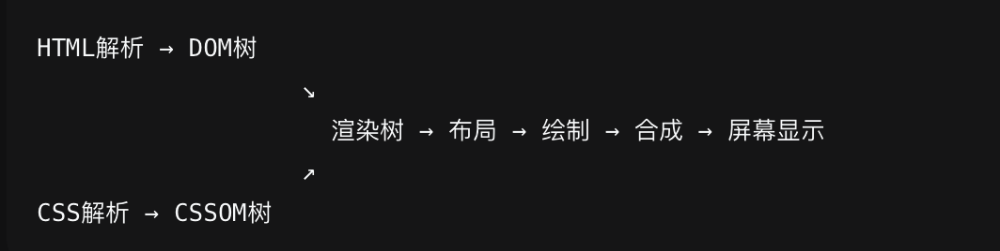

<Boxx type='tip' />

## 说说事件委托

**事件委托**，也可以叫做事件代理，利用了事件冒泡的原理来优化事件处理。事件委托允许你不必直接在目标元素上绑定事件处理器，而是在其父元素上设置单一的事件处理器来管理所有子元素的相应事件。

举个例子，现在有100个按钮，循环给每个按钮添加点击事件，那么会增加内存损耗，影响性能。此时可以给button的父元素添加点击事件，这时相当于每个按钮都绑定了点击事件。这里就涉及到了 事件冒泡的原理了。

**事件冒泡**，当我们给子元素和父元素都绑定了click事件时，点击子元素，父元素的click事件也会被触发，这就是事件冒泡。当我们子元素没有绑定click事件，但是父元素绑定了click事件，当我们点击子元素时，由于事件冒泡，我们会将这个事件e传递给父元素，父元素也会触发click事件。

``` html
<!DOCTYPE html>
<html lang="en">
<head>
  <meta charset="UTF-8">
  <meta name="viewport" content="width=device-width, initial-scale=1.0">
  <title>Document</title>
  <style>
    .container {
      width: 600px;
      height: 600px;
      border: 1px solid #000;
      display: flex;
      flex-wrap: wrap;
    }

    .item {
      width: 100px;
      height: 100px;
      background-color: slategray;
      margin-right: 10px;
      margin-bottom: 10px;
    }
  </style>
</head>


<body>
  <div class="container" id="container">
    <div class="item" id="btn1"></div>
    <div class="item" id="btn2"></div>
    <div class="item" id="btn3"></div>
    <div class="item" id="btn4"></div>
    <div class="item" id="btn5"></div>
    <div class="item" id="btn6"></div>
    <div class="item" id="btn7"></div>
    <div class="item" id="btn8"></div>
    <div class="item" id="btn9"></div>
  </div>
</body>

<script>
  const container = document.getElementById('container')
  container.addEventListener('click', function(event){
    console.log(event.target.id) // btn1、btn2 、btn3 ……
  })
</script>

</html>

```

## 常见的手写题

参考： https://juejin.cn/post/7031322059414175774?utm_source=gold_browser_extension 


### 1、防抖
防抖好比法师发动技能，每次都要重新蓄力读条，进度条100%才会发出。（有点像回城）

直接调用原函数肯定无法实现防抖的效果，所以需要构建一个新函数，所以我们这个debounce函数接收两个参数，第一个参数是原函数，第二个参数是延迟时间，返回的是一个（新）函数，使用时调用新函数，就会实现防抖效果。调用新函数时，怎么做到每点发动技能都要重新蓄力呢？在函数中设置一个定时器，在定时器结束之后才调用原函数，执行函数时先检查有没有之前的计时器，有的话就清除，重新计时。记住，这个timer需要定义在这个新函数的外层，因为每次调用新函数时，这个timer都需要时同一个，而不是重新创建的，最后需要考虑函数的this指向和参数传递。

```js
function debounce(fn, delay) {
  let timer
  return function (...args) {
    if (timer) {
      clearTimeout(timer)
    }
    timer = setTimeout(() => {
      fn.apply(this, args)
    }, delay)
  }
}

// 测试
function scrolling(a,b) {
  console.log('is scrolling', a, b)
}
const debounceTask = debounce(scrolling, 1000)
window.addEventListener('scroll', debounceTask('1','2'))
```

### 2、节流
节流好比fps射击游戏，你手速再快也会枪械射速的限制，单位时间内只会射出一颗子弹。

```js

function throttle(fn, delay) {
  let last = 0; // 上次触发的时间戳
  return (...args ) => {
    let now = Date.now()
    if(now - last > delay) {
      last = now
      fn.apply(this, args)
    }
  }
}

// 测试
function scrolling() {
  console.log('is scrolling')
}
const throttleTask = throttle(scrolling, 1000)
window.addEventListener('scroll', throttleTask)
```

:::details 防抖和节流的场景
- 防抖：搜索输入框、窗口大小调整、按钮提交等

- 节流：滚动事件处理、滚动事件的懒加载
:::

### 3、深拷贝

- 深拷贝

深拷贝是指将原对象或数组的值复制到一个新的对象或数组中，并且新的对象或数组的属性或元素完全独立于原对象或数组，即它们不共享引用地址。因此，当我们修改其中一个对象或数组时，另一个对象或数组不会受到任何影响。

```js
// 不支持值为undefined、函数和循环引用的情况
const cloneObj = JSON.parse(JSON.stringify(obj))
```

递归实现
```js
const deepClone = (obj, cache = new WeakMap()) => {
  // 非引用类型 返回原值，注意 type null === 'object' 是js的历史缺陷
  if(obj === null || typeof obj !== 'object') return obj;
  if(obj instanceof Date) return new Date(obj)
  if(obj instanceof RegExp) return new RegExp(obj)

  // 如果出现循环引用，则返回缓存的对象，防止递归进入死循环
  if(cache.has(obj)) return cache.get(obj)

  let cloneObj = obj.constructor()
  cache.set(obj, cloneObj)

  for(let key in obj) {
    if(obj.hasOwnProperty(key)) { // 只克隆自身的属性，不克隆原型链上的属性
      cloneObj[key] = deepClone(obj[key], cache)
    }
  }

  return cloneObj
}

const a = { name: 'will', score: { english: '150', math: '150' } }

const b = deepClone(a)

console.log(b)
```

::: details 常使用的浅拷贝和深拷贝

- 浅拷贝：

浅拷贝，指的是创建新的数据，这个数据有着原始数据属性值的一份精确拷贝

如果属性是基本类型，拷贝的就是基本类型的值。如果属性是引用类型，拷贝的就是内存地址

即浅拷贝是拷贝一层，深层次的引用类型则共享内存地址

需要理解这里的一层的意思，例如拷贝：`const  arr = [1,2,3,4] `和`const arr = [{ name: will }]`

1. `Object.assign()`
2. `cons arr1 = [...arr]` 拓展运算符
3. `Array.prototype.slice()`
4. `Array.prototype.concat()`


- 深拷贝：
1. `JSON.parse(JSON.stringify(obj))` // 弊端会忽略undefined、symbol和函数
2. `lodash.cloneDeep()`

:::


### 4、手写 Function.prototype.call() \ apply() \ bind()

```js
var name = "lucy";
var obj = {
    name: "martin",
    say: function () {
        console.log(this.name);
    }
};
obj.say(); // martin，this 指向 obj 对象
setTimeout(obj.say,0); // lucy，this 指向 window 对象
```

`call `方法的作用是 改变函数执行时的 this 指向

::: details 大白话讲this
在 JavaScript 中，this 就像是一个指针，它指向"谁在调用当前代码"。简单来说，this 就是函数运行时的上下文，也就是这个函数是"谁"在执行。举例：

想象你是一名服务员，你说："我来为您服务"。这里的"我"就相当于 JavaScript 中的 this，它指的是"谁在说这句话"。
如果是张三在说，那么"我"就是张三
如果是李四在说，那么"我"就是李四
:::


```js {8}
Function.prototype.myCall = function(context, ...args) {
  context = context || window; // 如果没有传入context，则默认指向全局对象

  const fnSymbol = Symbol('fn'); // 创建一个唯一的属性名，避免冲突
  context[fnSymbol] = this; // 将函数作为context的一个属性

  // 这一步是关键，因为当一个函数作为对象的方法调用时，this 会指向该对象
  const result = context[fnSymbol](...args); 
  delete context[fnSymbol]; // 删除这个属性，避免污染context
  return result; // 返回函数执行的结果
}
```

```js
Function.prototype.myApply = function (context, args) {
  context = context || window;
  const fn = symbol('fn');
  context[fn] = this;
  let result;
  
  if(!args) {
    result = context[fn]();
  } else {
    if(!Array.isArray(args)) {
      throw new TypeError('args must be an array');
    }
    result = context[fn](...args);
  }

  delete context[fn];
  return result;
}
```

```js
Function.prototype.myBind = function (context, ...args) {
  // 保存原始函数的引用
  const originalFunc = this;
  context = context || (typeof window !== 'undefined' ? window : global);
  const boundFunc = function (..args2) {
    // 合并参数
    const allArgs = [...args, ...args2];
    // 处理构造函数的情况
    // 如果是通过 new 调用，this 应该指向新创建的对象（即 boundFunc 的实例）
    // 否则，this 应该指向 context
    return originalFunc.apply(
      this instanceof boundFunc ? this : context,
      allArgs
    );
  }

  // 设置原型链，使得通过 new 调用时能够继承原始函数的原型
  // 创建一个空函数作为中介，避免直接修改原始函数的原型
  const EmptyFunc = function () {};
  EmptyFunc.prototype = originalFunc.prototype;
  boundFunc.prototype = new EmptyFunc();

  return boundFunc
}

```


### 5、手写promise

Promise 用大白话来说就是一个"承诺"，它代表了一个异步操作的最终结果。当我们进行异步操作时（比如网络请求、文件读取等），不能立即得到结果，Promise 就像是一张"欠条"，承诺在未来某个时刻给你一个结果。

Promise 有三种状态：

- pending（等待中）：初始状态，既没有成功也没有失败
- fulfilled（已成功）：操作成功完成
- rejected（已失败）：操作失败

Promise 一旦状态改变（从 pending 变为 fulfilled 或 rejected），就不会再变，这个结果是固定的。

参考：[手写Promise](https://juejin.cn/post/6850037281206566919), 推荐阅读，一步一步的实现

```js
const PENDING = 'pending';
const FULFILLED = 'fulfilled';
const REJECTED = 'rejected';

class Promise {
  constructor(executor) {
    // 初始状态为 pending
    this.status = PENDING;
    // 成功的值
    this.value = undefined;
    // 失败的原因
    this.reason = undefined;
    // 成功的回调函数队列
    this.onFulfilledCallbacks = [];
    // 失败的回调函数队列
    this.onRejectedCallbacks = [];

    const resolve = (value) => {
      // 只有在 pending 状态才能转变为 fulfilled
      // 防止 executor 中调用了两次 resovle/reject 方法
      if (this.status === PENDING) {
        this.status = FULFILLED;
        this.value = value;
        this.onFulfilledCallbacks.forEach(fn => fn());
      }
    }

    const reject = (reason) => {
      // 只有在 pending 状态才能转变为 rejected
      // 防止 executor 中调用了两次 resovle/reject 方法
      if (this.status === PENDING) {
        this.status = REJECTED;
        this.reason = reason;
        // 执行失败的回调
        this.onRejectedCallbacks.forEach(fn => fn());
      }
    };

    try {
      // 立即执行
      executor(resolve, reject);
    } catch(error) {
      // 如果executor执行出错，直接reject
      reject(error);
    }
  };

  then(onFulfilled, onRejected) { 
    // 参数可选，如果不是函数，则 v => v 是为了值可以继续往下传
    onFulfilled = typeof onFulfilled === 'function' ? onFulfilled : v => v;
    onRejected = typeof onRejected === 'function' ? onRejected : reason => { throw reason };

    // 创建一个新的Promise2，用于链式调用
    const promise2 = new MyPromise((resolve, reject) => {
      // （这里是成层的promise完成，并且成功）成功状态处理
      if(this.status === FULFILLED) {
        setTimeout(() => {
          try {
            const x = onFulfilled(this.value);
            // 这里需要继续处理x，是因为x可能是一个promise
            this.resolvePromise(promise2, x, resolve, reject);
          } catch (error) {
            reject(error);
          }
        },0)
      }
      // 失败状态处理
      if(this.status === REJECTED) {
        setTimeout(() => {
          try {
            const x = onRejected(this.reason);
            this.resolvePromise(promise2, x, resolve, reject);
          }
        }, 0)
      }
      // pending状态处理
      if(this.status === PENDING) {
        // 将回调存入队列，等待状态改变时执行
        this.onFulfilledCallbacks.push(() => {
          setTimeout(() => {
            try {
              const x = onFulfilled(this.value);
              this.resolvePromise(promise2, x, resolve, reject);
            } catch (error) {
              reject(error);
            }
          })
        })

        this.onRejectedCallbacks.push(() => {
          setTimeout(() => {
            try {
              const x = onRejected(this.reason);
              this.resolvePromise(promise2, x, resolve, reject);
            } catch (error) {
              reject(error);
            }
          }, 0)
        })
      }
    }) 
    return promise2;   
  }

  // 处理Promise解析过程
  resolvePromise(promise2, x, resolve, reject) { 
    if (promise2 === x) {
      return reject(new TypeError('Chaining cycle detected for promise'));
    }

    // 防止多次调用
    let called = false;

    if (x !== null && (typeof x === 'object' || typeof x === 'function')) { 
      try { 
        const then = x.then;
        // 如果then是函数，认为x是promise
        if (typeof then === 'function') {
          // 执行x的then，传入resolvePromise和rejectPromise
          // 这里不能使用x.then, 因为会链式调用，导致then被多次调用
          then.call(x, (y) => { 
            if (called) return;
            called = true;
            this.resolvePromise(promise2, y, resolve, reject)
          }, (r) => { 
            if (called) return;
            called = true;
            reject(r)
          })
         }
      }
    }
  }

}
```

### 6、数组排序 sort

### 7、求两个数组的交集和并集

```js
/**
 * @author: wangliangxin3
 * @description: 求两个数组的交集
 * @return {*}
 * @example: 
 */
function getIntersection(arr1, arr2) {
  // 这里没有简单的使用 return arr1.filter(item => arr2.includes(item))
  // 因为 Set.has 比 includes 更快；
  const res = new Set();
  const set2 = new Set(arr2);
  for (let item of arr1) {
    if (set2.has(item)) {
      res.add(item);
    }
  }
  return Array.from(res);
} 


/**
 * @author: wangliangxin3
 * @description: 得到两个数组的并集
 * @return {*}
 * @example: 
 */
function getUnion(arr1, arr2) {
  const res = new Set(arr1);
  for (let item of arr2) {
    res.add(item);
  }
  return Array.from(res);
}

```

### 8、数组转树形结构

通常我们有一个包含父子关系的数组，目标是将其转化为树形结构。

```javascript
function arrayToTree(arr) { 
  // 这里未考虑数据的正确性，arr中需要避免有循环依赖的数据
  const res = [];
  const map = new Map();
  arr.forEach(item => {
    map.set(item.id, { ...item, children: [] })
  });

  arr.forEach(item => {
    const parent = map.get(item.parentId);
    if (parent) {
      parent.children.push(map.get(item.id));
    }else {
      res.push(map.get(item.id));
    }
  })
  return res;
}
```

### 9、树转数组
刚好和上面相反

```js
function arrayToTree(tree, parentId = null) { 
  const res = [];
  tree.forEach(node => {
    const { id, children, name } = node;
    if(children && children.length > 0) {
      res.push(...arrayToTree(children, id))
    }
  })
  return res;
}
```

## 作用域
参考文章：[深入理解JS作用域和作用域链](https://juejin.cn/post/7096818495450513445)

作用：
>1. 作用域最为重要的一点是安全。变量只能在特定的区域内才能被访问，外部环境不能访问内部环境的任何变量和函数，即可以向上搜索，但不可以向下搜索， 有了作用域我们就可以避免在程序其它位置意外对某个变量做出修改导致程序发生事故。
> 2. 作用域能够减轻命名的压力。我们可以在不同的作用域内定义相同的变量名，并且这些变量名不会产生冲突。


## 闭包

在理解闭包前，请先理解作用域；

[深入理解js闭包](https://juejin.cn/post/7097141521102667813)


作用：
> 1. 在函数外部可以读取函数内部的变量
> 2. 让这些变量的值始终保持在内存中

## 微任务和宏任务

微任务和宏任务都是异步任务

[微任务和宏任务](https://juejin.cn/post/7098313596869804068)


## cookie、sessionStorage、localStorage 使用场景和区别

**主要区别：**

|特性|	Cookie	|LocalStorage|	SessionStorage|
|--|--|--|--|
|写入方式	|服务端和前端都可写入，不过http-only情况下只允许服务端写入|	前端	|前端|
|存储大小	|4KB 左右	|5~10MB	|5~10MB|
|生命周期	|手动设置，默认关闭浏览器失效 |	长期保留，直至用户手动清理缓存|	当前会话，关闭页面清除 |
|服务器交互	|会 随请求发送到服务器	|不会	| 不会|
|数据共享	|同域下所有页面共享 |	同域下所有页面共享 |	当前页面及子页面共享|

**使用场景：**

Cookie ：小数据量、需与服务器交互的场景，如保存会话标识（如 token）。
LocalStorage ：需持久化存储、跨页面共享的数据，如用户设置、主题偏好。
SessionStorage ：页面刷新或跳转时临时保存的数据，如表单填写进度。


## npm run install 命令做了什么

根据 package.json 信息，下载相应的第三方依赖 到 node_modules 目录下。如果执行 install 时，没有lock 文件，会生成 package-lock.json 文件。如果存在 lock 文件。这根据 依赖的版本可能 更新 package-lock.json 文件。


## npm run dev （整个过程）到底是做了什么


首先，当执行 `npm run dev` 的时候，node 会去项目的 `package.json` 文件找到 `scripts` 对应的 `dev` 脚本配置。


## DOM事件流 和 事件委托

DOM事件流 是W3C标准定义的事件传播机制，包括捕获、目标、冒泡三个阶段，它规定了事件在DOM树中的“旅行路线”。

事件委托 则是一种巧妙的编程实践，它“搭乘”了事件流中的冒泡阶段这趟“顺风车”，通过在父节点统一监听，来高效地管理大量子元素的事件，尤其擅长处理动态内容。

## 普通事件绑定和事件流绑定有啥区别

1、 普通事件绑定：

- 如果给同⼀个元素绑定了两次或者多次相同类型的事件，那么后⾯的绑定会覆盖前⾯的绑定。
- 不支持dom事件流（捕获-目标-冒泡）。

```js
<button id="btn1">按钮1</button>
<script>
  var btn1 = document.getElementById('btn1');
  btn1.onclick = function() {
    console.log('第一个处理函数');
  };
  btn1.onclick = function() {
    console.log('第二个处理函数会覆盖第一个');
  };
</script>
```

2、事件流绑定

- 如果说给同⼀个元素绑定了两次或者多次相同类型的事件，所以的绑定将会依次触发。
- 支持dom事件流（捕获-目标-冒泡）。
- 不加on事件。

```js
<div id="parent">
  <button id="btn3">按钮3</button>
</div>
<script>
  var parent = document.getElementById('parent');
  var btn3 = document.getElementById('btn3');

  // 捕获阶段
  parent.addEventListener('click', function() {
    console.log('父元素在捕获阶段触发');
  }, true);

  // 冒泡阶段
  parent.addEventListener('click', function() {
    console.log('父元素在冒泡阶段触发');
  }, false);

  btn3.addEventListener('click', function() {
    console.log('按钮3被点击');
  });
```

## 讲讲内存泄漏和什么容易导致内存泄漏

内存泄漏是指：程序中**已动态分配的内存由于某种原因没有被释放或者无法被释放**，造成系统内存的浪费，导致程序运行速度减慢甚至系统崩溃等问题。
在JavaScript这种有**垃圾回收机制**的语言中，内存泄漏通常不是因为我们忘记手动释放内存（如C/C++中的free或delete），而是因为意外的引用导致垃圾回收器无法回收本该被回收的内存。

内存泄漏的常见原因：

1、意外的全局变量

```js
// 情况1：忘记声明变量
function createGlobalVar() {
  leakedVar = '我是一个意外的全局变量'; // 没有使用 var/let/const
}

// 情况2：this指向window
function accidentalGlobal() {
  this.leakedProperty = '我也变成了全局变量'; // 在非严格模式下，this指向window
}

// 情况3：全局对象属性积累
function accumulateData() {
  // 反复调用会导致window.data不断增长
  if (!window.data) window.data = [];
  window.data.push(new Array(1000000).fill('*'));
}
```

2、被遗忘的定时器和回调函数

```js
// 定时器泄漏
function startTimer() {
  this.timer = setInterval(() => {
    // 一些操作
    this.someData = new Array(1000).fill('*');
  }, 1000);
}

// 组件卸载时忘记清除
class MyComponent extends React.Component {
  componentDidMount() {
    this.interval = setInterval(this.updateData, 1000);
  }
  
  // 缺少 componentWillUnmount 来清除定时器
  // componentWillUnmount() {
  //   clearInterval(this.interval);
  // }
}

// 事件监听器泄漏
function setupListeners() {
  const bigData = new Array(1000000).fill('data');
  
  document.getElementById('myButton').addEventListener('click', () => {
    // 这个闭包捕获了bigData，即使元素被移除，bigData也无法被回收
    console.log(bigData.length);
  });
}
```

3、DOM引用泄漏

```js
// 在内存中保存DOM引用，即使已从页面移除
const elementsCache = {};

function cacheElement(id) {
  if (!elementsCache[id]) {
    elementsCache[id] = document.getElementById(id);
  }
  return elementsCache[id];
}

// 后来从DOM中移除了该元素，但缓存中仍有引用
function removeElementFromDOM(id) {
  const element = document.getElementById(id);
  if (element) {
    element.parentNode.removeChild(element);
    // 但 elementsCache[id] 仍然引用着这个DOM元素，无法被GC回收
  }
}
```

问题分析： JavaScript中对DOM元素的引用会阻止该DOM元素被垃圾回收，即使它已经从页面中被移除。

解决方案：

及时清理对已移除DOM元素的引用

使用WeakMap来存储DOM引用（WeakMap的键是弱引用）

4、闭包泄漏

```js
function createClosureLeak() {
  const largeData = new Array(1000000).fill('sensitive data');
  
  return function() {
    // 即使外部函数执行完毕，由于内部函数可能被调用，
    // largeData 无法被回收
    console.log('closure created');
    // 注意：即使这里没有显式使用largeData，某些JS引擎可能仍会保留
  };
}

const leakedClosure = createClosureLeak();

// 更隐蔽的情况：事件处理中的闭包
function setupEventWithLeak() {
  const bigArray = new Array(500000).fill('data');
  
  someElement.addEventListener('click', function() {
    // 这个匿名函数形成了闭包，捕获了bigArray
    // 即使我们不再需要bigArray，它也无法被GC
    console.log('clicked');
  });
}
```

问题分析： 闭包会保持对其词法作用域中变量的引用，即使外部函数已经执行完毕。

解决方案：

- 在不再需要时，主动解除对闭包函数的引用

- 避免在长期存在的闭包中捕获大型数据结构
 

5、脱离DOM的引用

```js
// 创建元素并添加到DOM
const parentElement = document.getElementById('parent');
const childElement = document.createElement('div');
parentElement.appendChild(childElement);

// 从DOM中移除，但在JS中仍保留引用
parentElement.removeChild(childElement);

// 此时childElement变量仍然引用着这个DOM元素
// 该元素既不在DOM中，也无法被垃圾回收
console.log(childElement); // 仍然可以访问

// 正确的做法
childElement = null; // 解除引用
```


## 生成随机数

1、基础的随机浮点数生成

```js
// 返回 [0, 1) 之间的浮点数（包含0，不包含1）
const random = Math.random();
console.log(random); // 例如：0.123456789
```

2、生成指定范围的随机整数

方法1：使用`Math.random()`和`Math.floor()`

```js
/**
 * 生成 [min, max] 之间的随机整数（包含min和max）
 */
function getRandomInt(min, max) {
  min = Math.ceil(min); // 向上取整，确保下限是整数
  max = Math.floor(max); // 向下取整，确保上限也是整数
  // Math.random() 生成一个 0 到 1 之间的小数
  // Math.random() * (max - min + 1) 把随机小数放大到 [0, max-min+1) 这个区间，比如 min=3, max=5，则范围是 [0, 3)。
  // + min 把结果偏移到你想要的区间。例如 min=3，max=5，最终得到的值就是 3、4、5 其中之一
  return Math.floor(Math.random() * (max - min + 1)) + min;
}

// 示例：生成 1-10 之间的随机整数
console.log(getRandomInt(1, 10)); // 可能是 1, 2, 3, ..., 10
```

方法2：使用`Math.random()`和`Math.round()`

```js
/**
 * 生成 [min, max] 之间的随机整数
 */
function getRandomIntRound(min, max) {
  return Math.round(Math.random() * (max - min)) + min;
}
```

注意：Math.round() 方式两端的概率会稍微小一些，不如 Math.floor() 均匀。

## 【重点】说说性能优化


## 描述 js 的 new 操作
   
1、创建对象 - 创建一个新的空对象

2、设置原型 - 将新对象的原型指向构造函数的 prototype

3、执行构造 - 执行构造函数，将 this 绑定到新对象

4、返回处理 - 根据构造函数的返回值决定最终返回什么

```js
function myNew(constructor, ...args) {
  // 参数校验
  if (typeof constructor !== 'function') {
    throw new TypeError('constructor must be a function');
  }
  
  // 1. 创建以构造函数原型为原型的新对象
  // 使用 Object.create 更规范，避免直接操作 __proto__
  const obj = Object.create(constructor.prototype);
  
  // 2. 执行构造函数，绑定 this
  const result = constructor.apply(obj, args);
  
  // 3. 处理返回值
  // 判断 result 是否为对象（包括函数、数组等）
  const isObject = typeof result === 'object' && result !== null;
  const isFunction = typeof result === 'function';
  
  return isObject || isFunction ? result : obj;
}
```

## 讲讲浏览器的渲染过程，还有重绘和重排

1、DOM树构建：浏览器解析 HTML，将标签转换为 DOM 节点，构建成一棵树状结构

2、CSSOM构建：浏览器解析 CSS，计算每个节点的样式，构建 CSSOM 树

3、渲染树构建：将 DOM 树和 CSSOM 树合并，只包含可见的节点

4、布局（Layout / Reflow）： 计算每个节点在屏幕上的确切位置和大小（位置坐标、宽度、高度、边距等几何信息）

5、绘制（Painting）： 将渲染树的每个节点转换为屏幕上的实际像素

6、合成（Compositing）：将多个图层按照正确的层级顺序合成为最终页面





### **重排：当元素的几何属性发生变化时，浏览器需要重新计算元素的位置和大小，这个过程称为重排**

触发重排的操作：

1. 几何属性改变

```javascript
// 以下操作都会触发重排
element.style.width = '100px';
element.style.height = '50px';
element.style.padding = '10px';
element.style.margin = '20px';
element.style.border = '1px solid red';
element.style.left = '100px';
element.style.top = '50px';
```
2. 内容变化
```javascript
// 内容改变导致尺寸变化
element.innerHTML = '新内容';  // 文本长度变化
element.textContent = '更长的文本内容';
```

3. 添加/删除元素
```javascript
// DOM结构变化
parent.appendChild(newElement);
parent.removeChild(existingElement);
element.style.display = 'none';  // 从渲染树中移除
element.style.display = 'block'; // 重新加入渲染树

```
4. 获取布局信息
```javascript
// 读取布局属性会强制同步重排
const width = element.offsetWidth;    // 触发重排
const height = element.offsetHeight;  // 触发重排
const top = element.offsetTop;        // 触发重排

// 其他会触发重排的属性
element.scrollTop;
element.clientWidth;
element.getBoundingClientRect();

```

### **重绘：当元素样式发生改变时，浏览器需要重新绘制元素，这个过程称为重绘**

```js
// 以下操作只触发重绘，不触发重排
element.style.color = 'red';
element.style.backgroundColor = '#fff';
element.style.visibility = 'hidden';  // 注意：与display:none不同
element.style.opacity = '0.5';
element.style.borderRadius = '5px';
element.style.boxShadow = '2px 2px 5px gray';
```

重排的性能开销更大

```js
// 糟糕的写法：触发多次重排
const element = document.getElementById('myElement');
element.style.width = '100px';     // 重排
element.style.height = '50px';     // 重排  
element.style.left = '10px';       // 重排
element.style.top = '20px';        // 重排

// 优化后的写法：只触发一次重排
element.style.cssText = 'width: 100px; height: 50px; left: 10px; top: 20px;';
// 或者使用class
element.className = 'new-style';
```

### 实际开发建议

1、使用 CSS 类名：通过切换 class 来批量修改样式

2、使用文档片段：DocumentFragment 进行批量 DOM 操作

3、避免频繁读取布局属性：必要时缓存读取结果

4、使用 CSS3 变换：transform 和 opacity 实现动画

5、使用 requestAnimationFrame：在合适的时机进行样式修改

❌ 避免批量dom操作

```js
// ❌ 糟糕：多次重排
for (let i = 0; i < 100; i++) {
    const li = document.createElement('li');
    li.textContent = `Item ${i}`;
    document.getElementById('list').appendChild(li); // 每次都会重排
}

// ✅ 优秀：一次重排
const fragment = document.createDocumentFragment();
for (let i = 0; i < 100; i++) {
    const li = document.createElement('li');
    li.textContent = `Item ${i}`;
    fragment.appendChild(li);
}
document.getElementById('list').appendChild(fragment); // 只重排一次
```

❌ 避免布局抖动

```js
// ❌ 糟糕：读写交替导致多次重排
const elements = document.querySelectorAll('.item');
for (let i = 0; i < elements.length; i++) {
    const width = elements[i].offsetWidth;  // 读：触发重排
    elements[i].style.width = width + 10 + 'px'; // 写：触发重排
}

// ✅ 优秀：先读后写，批量操作
const elements = document.querySelectorAll('.item');
const widths = [];

// 批量读取
for (let i = 0; i < elements.length; i++) {
    widths[i] = elements[i].offsetWidth; // 一次重排
}

// 批量写入
for (let i = 0; i < elements.length; i++) {
    elements[i].style.width = widths[i] + 10 + 'px'; // 一次重排
}
```

## 讲讲 Promise.all 和 实现一个Promise.all

