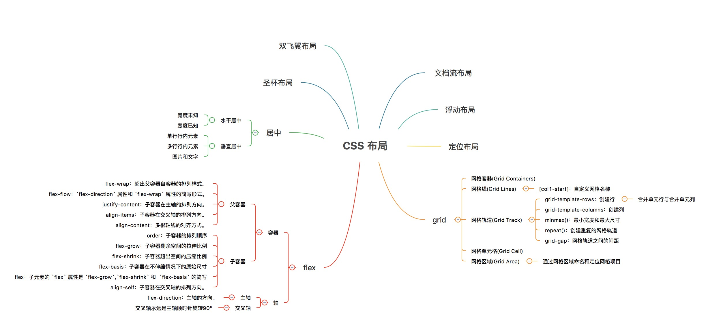

<Boxx type='tip' />


## html文件中meta标签
HTML 中的 `<meta>` 标签用于提供页面的元信息，这些信息不会直接显示在网页内容中，但对浏览器、搜索引擎和其他服务非常重要。

```html
<meta charset="utf-8">
<meta name="viewport" content="width=device-width, initial-scale=1.0">
<meta http-equiv="X-UA-Compatible" content="IE=edge">
<meta name="description" content="我的个人博客">
<meta name="keywords" content="前端,博客,HTML,CSS,JavaScript">
<meta name="author" content="小王">
```

## document 和 window 对象

- window：是整个浏览器窗口，包括地址栏、工具栏、控制台，以及最重要的——显示网页内容的“画布”。常用属性/方法 `window.innerHeight, window.location, window.setTimeout()`

- document：是铺在“画布”上的那张网页本身，包含了所有的HTML元素（如 `<div>, <p>, <a>` 等）, `Window` 的子对象，是 `window.document`，常用属性/方法 `document.getElementById(), document.body, document.title`

## DOM 节点的 attr 和 property 有何区别

- attr 指的是 HTML 属性（attribute），一般恒等于默认值，不会变。
- property 指的是 DOM 对象的属性（property），可以动态改变。

现代一般使用 `dataset` 用于 `data-*` 属性, dataset 会自动进行连字符到驼峰的命名转换：

```js
<div id="example" 
     data-simple-attribute="value1"
     data-multi-word-attribute="value2"
     data-very-long-attribute-name="value3">
</div>

const example = document.getElementById('example');

console.log(example.dataset.simpleAttribute);         // "value1"
console.log(example.dataset.multiWordAttribute);      // "value2"
console.log(example.dataset.veryLongAttributeName);   // "value3"

// 设置时也使用驼峰命名
example.dataset.newCustomAttribute = "new value";
// 对应 HTML: data-new-custom-attribute="new value"
```

## 如何一次性插入多个 DOM 节点？考虑性能

直接多次操作 `DOM`（如多次 `appendChild` 或 `innerHTML` 更新）会导致性能问题，因为每次操作都会触发 `DOM` 的重新渲染。

`DocumentFragment` 是一个轻量级的文档片段，可以在内存中操作节点，最后一次性插入到 `DOM` 中，从而减少重绘和回流。

```js
// 获取目标容器
const container = document.getElementById('list')

// 创建 DocumentFragment
const fragment = document.createDocumentFragment()

// 创建多个节点并添加到 fragment 中
for (let i = 1; i <= 1000; i++) {
  const li = document.createElement('li')
  li.textContent = `item ${i}`
  fragment.appendChild(li)
}

// 一次性插入到 DOM
container.appendChild(fragment)
```

## 常见的页面布局



参考[常见的布局](https://heptaluan.github.io/2019/09/12/CSS/11/)


## css 权重

```
`!important` > 行内样式 > ID选择器 > 类选择器 | 属性选择器 | 伪类选择器 > 元素选择器
```

权重规则总结:

1、`!important` 优先级最高，但也会被权重高的`!important`所覆盖

2、行内样式总会覆盖外部样式表的任何样式(除了`!important`)

3、单独使用一个选择器的时候，不能跨等级使css规则生效

例如： 无论多少个class组成的选择器，都没有一个ID选择器权重高 

4、如果两个权重不同的选择器作用在同一元素上，权重值高的css规则生效

5、如果两个相同权重的选择器作用在同一元素上：以后面出现的选择器为最后规则


其中通配符选择器 *，组合选择器 + ~ >，否定伪类选择器 :not() 对优先级无影响

> 通配符 *	权重固定为 0-0-0，
> 组合符 +, ~, > 仅描述元素关系，不参与权重计算
> 否定伪类 :not() 本身不增加权重，但括号内的选择器会正常计算优先级

建议：
- 避免使用!important;
- 利用id增加选择器权重;
- 减少选择器的个数（避免层层嵌套）;

参考[你对CSS权重真的足够了解吗？](https://juejin.cn/post/6844903608199151630)

## ’+’ 与 ’~’ 选择器有什么不同

```
// + 选择器匹配紧邻的兄弟元素

.btn + .btn {
  // 相邻按钮中间间隔10px
  margin-left: 10px;
}

// ~ 选择器匹配随后的所有兄弟元素

.list-title ~ .list-content {
  margin-bottom: 10px
}

```

## 常用的伪类选择器

### 状态类伪类

- :hover：鼠标指针悬停在元素上时。
- :active：元素处于激活状态（如被点击或触摸）时。
- :focus：元素获得焦点时（例如，输入框被选中）。
- :checked：复选框或单选框被选中时。
- :disabled：表单元素被禁用时。
- :read-only：元素为只读状态时。

### 结构类伪类

- :first-child：选择父元素的第一个子元素。
- :last-child：选择父元素的最后一个子元素。
- :nth-child(n)：选择父元素中第n 个子元素。
- :nth-last-child(n)：从最后一个子元素开始计数，选择第n 个子元素。
- :first-of-type：选择每个父元素中第一个特定类型的子元素。
- :last-of-type：选择每个父元素中最后一个特定类型的子元素。
- :nth-of-type(n)：选择每个父元素中特定类型（例如 p）的第n 个子元素。
- :only-child：选择成为父元素唯一子元素的元素。
- :only-of-type：选择成为父元素中唯一特定类型子元素的元素。
- :empty：选择没有子元素（包括文本节点）的元素。

## z-index 与层叠上下文

对于定位元素而言，若 z-index 属性值不是 auto，则会创建一个新的层叠上下文，并且其子孙盒子将属于这个新层叠上下文。判断堆叠顺序需要先判断层叠上线文。

参考阅读：[由Z Index引发的层叠上下文思考](https://lizh.gitbook.io/knowledge/css-tan-suo-xi-lie/02-you-zindex-yin-fa-de-ceng-die-shang-xia-wen-si-kao)


## 实现水平垂直居中

需要考虑元素固定宽高和不定宽高，行内或者块状

### 单行行内元素


1. 使用 `line-height` 和 `text-align`
  
```css 
.box {
  height: 24px;
  text-align: center;
  line-height: 24px;
  font-size: 14px;
} 
```


  
### 块状元素

1、绝对定位的方法 

- 绝对定位 + transform

```css
.box {
  postion: absolute;
  top: 50%;
  bottom: 50%;
  width: 100px;
  height: 100px;
  transform: translate(-50%, -50%);
}
```

- 绝对定位 + 负margin

缺点：需要知道box的宽高

```css
.box {
    position: relative;
}
.item {
    position: absolute;;
    top: 50%;
    left: 50%;
    margin-left: -50px;
    margin-top: -50px;
}
```

- 绝对定位，四个方向都写0 + `margin: auto`

缺点：如果item 没有设置宽高，会拉到和父元素相同的宽和高
```css
.container {
  position: relative;
  height: 300px;
  border: 1px solid red;
}
.item {
  width: 100px;
  height: 50px;
  position: absolute;
  left: 0;
  top: 0;
  right: 0;
  bottom: 0;
  margin: auto;
  border: 1px solid green;
}
```

2、flex布局法

`flex布局 + margin: auto`

```css
.box {
  display: flex;
}
.item {
  margin: auto;
}
```

`flex布局`: 最常用，也易理解
```css
.box {
  display: flex;
  justify-content: center;
  align-items: center;
}
```

3、table 布局

设置父元素为`display:table-cell`，子元素设置` display: inline-block`。利用`vertical`和`text-align`可以让所有的行内块级元素水平垂直居中

```css
.box7 {
  height: 44px;
  width: 200px;
  background-color: cadetblue;
  display: table-cell;
  text-align: center;
  vertical-align: middle;
}

.item7 {
  display: inline-block;
  width: 100px;
  height: 12px;
  background-color: chartreuse;
}
```

4、grid 网格布局

```css
.box8 {
  height: 44px;
  width: 200px;
  display: grid;
  background-color: cadetblue;
  justify-content: center;
  align-items: center;
}

.item8 {
  width: 100px;
  height: 12px;
  background-color: chartreuse;
}
```

[详细代码](https://code.juejin.cn/pen/7550629262517076004)


## 什么是BFC，大白话讲清楚

BFC，全称是 Block Formatting Context，也就是“块级格式化上下文”。它是CSS渲染过程中一个非常重要的概念，可以把它理解为一个独立的、隔离的容器（或者说区域），这个区域内部的元素布局不会影响到外部元素，同时外部的布局也不会影响它。

简单来说，**创建一个BFC，就相当于为里面的元素创建了一个封闭的“结界”**。

1、形成BFC的常见条件：

一个元素只要满足以下任意一个条件，就会成为一个BFC：

- 根元素（`<html>`）。
- 浮动元素（float 的值不是 none）。
- 绝对定位元素（position 是 absolute 或 fixed）。
- display 为 inline-block、table-cell、table-caption、flex、inline-flex、grid、inline-grid 等。
- overflow 的值不是 visible 的块级元素（比如 overflow: hidden、auto、scroll）。这是最常用也最无副作用的创建方式之一。
- contain 值为 layout, content, paint 的元素。

2、在实际开发中，我们利用BFC主要是为了解决以下三类常见的布局问题：

- 清除浮动，防止父元素高度塌陷
这是BFC最经典的应用场景。当一个父元素内部的子元素全部浮动后，由于脱离了文档流，父元素的高度会塌陷为0。
解决方案： 给父元素创建一个BFC（例如，设置 overflow: hidden）。BFC在计算高度时，会包含其内部所有的浮动元素，从而撑开父元素的高度。

```css
.parent {
  overflow: hidden; /* 创建BFC，清除内部浮动 */
  border: 2px solid red;
}
.child {
  float: left;
}
```

- 避免外边距重叠
在常规文档流中，相邻的两个垂直方向上的块级元素，它们的上下外边距会发生合并（重叠），取两者中的较大值。
解决方案： 将其中一个元素用一个BFC容器包裹起来。因为BFC内部的元素是一个独立环境，它与外部元素的外边距不会发生重叠。

```html
<div class="box"></div>
<div class="bfc-container">
  <div class="box"></div>
</div>
```
```css
.bfc-container {
  overflow: hidden; /* 创建BFC */
}
.box {
  margin: 20px 0;
}
```
这样，两个 .box 之间的外边距就是40px，而不是重叠后的20px。

- 阻止元素被浮动元素覆盖（实现两栏自适应布局）
当一个元素是浮动的，而另一个不是时，浮动元素可能会覆盖旁边的标准流元素。
解决方案： 给那个标准流元素创建一个BFC。BFC的区域不会与浮动的盒子重叠，它会自动适应剩余宽度，从而实现一个经典的两栏自适应布局。

```html
<div class="float-left">我是左侧浮动栏</div>
<div class="bfc-content">我是右侧自适应内容区</div>
```
```css
.float-left {
  float: left;
  width: 200px;
}
.bfc-content {
  overflow: hidden; /* 创建BFC，阻止被浮动元素覆盖 */
}
```


总结一下：

面试官，简单来说，BFC就是一个独立的布局空间，它的核心价值在于隔离。我们通过给元素添加特定的CSS属性来触发BFC，从而解决**浮动带来的高度塌陷、外边距合并以及实现更灵活的自适应布局**等问题。在实际项目中，overflow: hidden 是我最常用也认为副作用相对较小的创建BFC的方式之一。


## css、less、sass 的区别

css：层叠样式表，是网页样式的标准和基础，浏览器直接解析和渲染

Less / Sass：都是 CSS 预处理器，它们扩展了 CSS 的功能，但需要编译成纯 CSS 才能被浏览器识别

- CSS 是基础，浏览器直接支持，功能相对基础
- Less 是"温和的增强"，语法接近CSS，学习成本低
- Sass 是"强大的工具"，功能最丰富，生态最完善

在实际技术选型中：

- 对于新项目，Sass/SCSS 通常是更好的选择，功能强大且生态成熟
- 对于维护老项目或简单需求，Less 或现代 CSS 可能更合适
- 随着CSS原生能力的增强，很多预处理器的功能正在被CSS标准吸收


