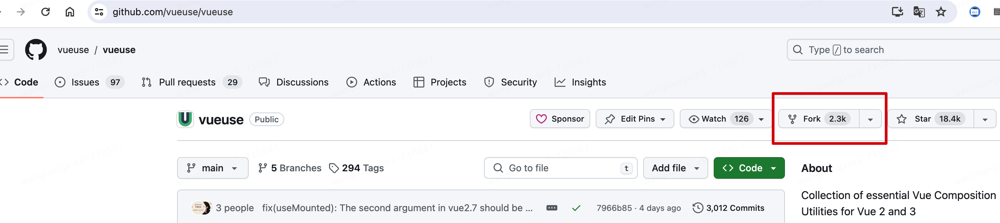
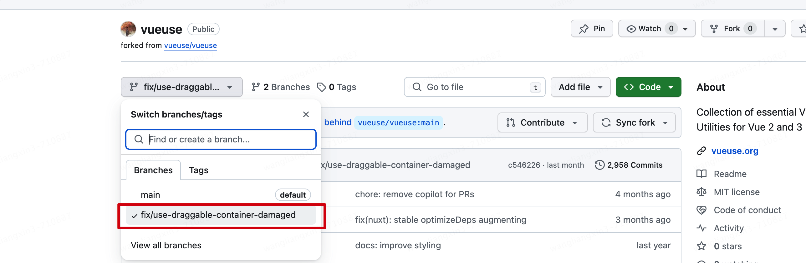
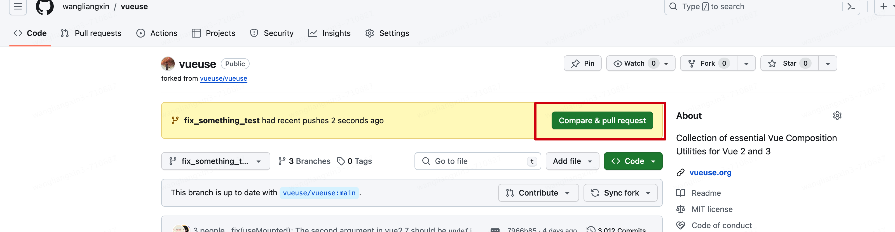
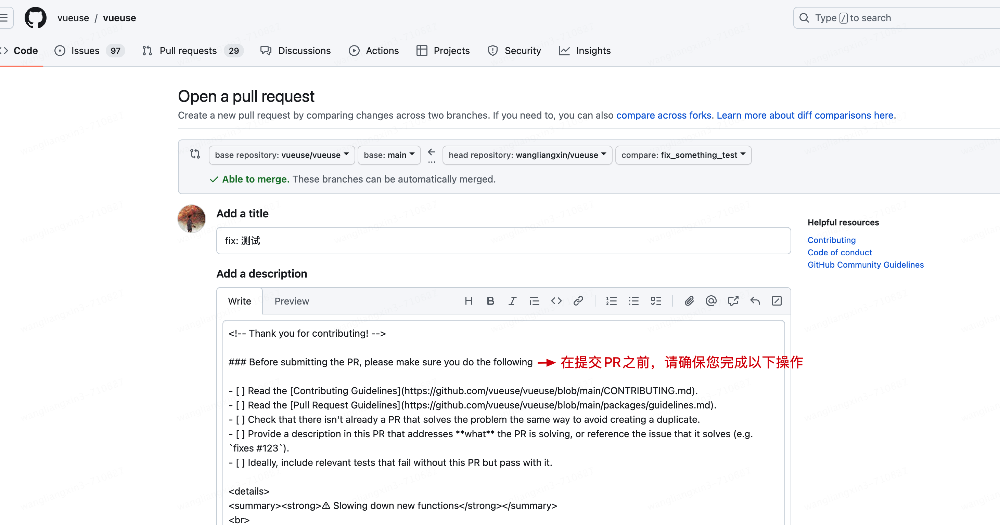
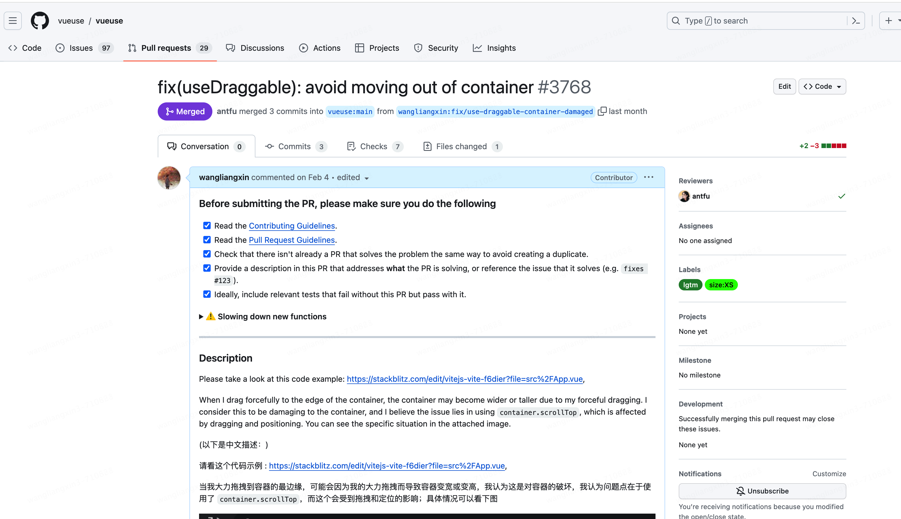
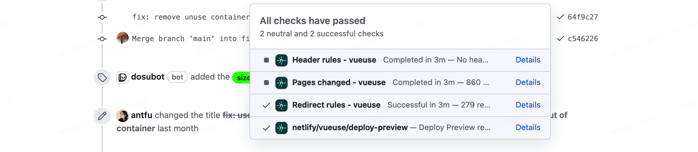

<Boxx type='tip' />

> 很久没写笔记了，这次给vueUse开源库，提交了一个代码优化的pr，最终成功被合并，我也算是**vueUse的贡献者**了，记录一下过程

整体分为4步

- 1、fork项目
- 2、clone项目
- 3、修改代码
- 4、提交pr

详细说明如下：

## 1、fork项目

fork项目，点击右上角的fork按钮，即可完成fork操作，之后在自己的github主页即可看到自己的fork项目;
> fork 操作会在你的github主页上创建一个与原项目同名的项目，它与原项目还是有联系的，当原项目有更新时，你可以点击 **sync fork**, 就可以同步更新

## 2、clone项目

clone项目，点击右上角的code按钮，复制仓库克隆地址的链接，在VScode 等编辑器使用git克隆即可；

## 3、修改代码

在VScode中打开项目，创建新的分支，（一般分支名需要表示你的修改内容，如新功能 **feature_xxxx**, 修复bug **fix_xxxx** ），然后修改代码，提交即可；

## 4、提交pr

返回你的github 仓库，会提示你和源仓库有差异，可以对比差异，并提交pr

每个开源库的要求可能不一致，这里需要你自己仔细阅读

需要说明你提交的内容，务必详细说明，最好有中英文对照，（英语大佬请省略）实例如下，然后等待审核即可；

注意：

合并前会有些校验，通过校验后才能合并；（有问题及时修改）

