## 题目 1：请解释 React Hooks 的实现原理，为什么 Hooks 不能在条件语句中使用？

::: details 参考答案

> Hook 就是 JavaScript 函数，但是使用它们会有两个额外的规则：
> 
> 1、只能在函数最外层调用 Hook。不要在循环、条件判断或者子函数中调用。
> 
> 2、只能在 React 的函数组件中调用 Hook。不要在其他 JavaScript 函数中调用。（还有一个地方可以调用 Hook —— 就是自定义的 Hook）

`Hooks` 在 `React` 内部通过链表（或数组）存储，每次组件渲染时，Hooks的调用顺序必须稳定，`React` 通过匹配来定位每个 `Hook`的 状态和数据。

*为什么不能再条件语句中使用？*

原因：顺序依赖

React 通过调用顺序来匹配 Hook。如果条件语句改变了调用顺序，匹配就会错位，导致状态混乱。

```js
// ❌ 错误示例
if (condition) {
  const [count, setCount] = useState(0);
}
const [name, setName] = useState('');

// 第一次渲染：condition 为 true
// Hook 顺序：useState(0) -> useState('')
// React 记录：[0, '']

// 第二次渲染：condition 为 false  
// Hook 顺序：useState('')  ← 这里顺序变了！
// React 期望：useState(0) -> useState('')
// 结果：useState('') 被匹配到了 useState(0) 的位置，数据错乱
```
::: 

## 题目 2：Vue 的 keep-alive 组件是如何实现的？它如何缓存组件状态？

::: details 参考答案

> **引言**：为什么需要路由缓存？
>
> 在现代单页应用（SPA）开发中，用户频繁在不同页面间切换是常态。每次路由切换时组件的销毁和重建不仅带来性能开销，还会导致用户状态丢失。想象一下，用户在一个复杂的表单页面填写了大量
> 信息，切换到其他页面查看资料后返回，所有填写的内容都消失了——这种体验无疑是糟糕的。
> 
> Vue 的 `<keep-alive>` 组件正是为解决这类问题而生。它能够缓存不活动的组件实例，而不是销毁它们，从而保持组件状态并避免重复渲染

`keep-alive` 是 vue 内置的抽象组件，它本身不会渲染成 DOM 元素，也不会出现在组件的父组件链中。 核心实现可以概括为： “缓存VNode， 操作实例”

```JS
// keep-alive 组件的简化实现
export default {
  name: 'KeepAlive',
  abstract: true, // 抽象组件标记
  
  props: {
    include: [String, RegExp, Array],
    exclude: [String, RegExp, Array],
    max: [String, Number]
  },
  
  created() {
    this.cache = Object.create(null); // 缓存对象
    this.keys = []; // 缓存键列表
  },
  
  render() {
    const slot = this.$slots.default;
    const vnode = getFirstComponentChild(slot);
    
    if (vnode) {
      const componentOptions = vnode.componentOptions;
      const name = getComponentName(componentOptions);
      
      // 检查是否需要缓存
      if (name && !this.isMatch(name)) {
        return vnode;
      }
      
      const key = vnode.key == null
        ? componentOptions.Ctor.cid + (componentOptions.tag ? `::${componentOptions.tag}` : '')
        : vnode.key;
      
      if (this.cache[key]) {
        // 从缓存中获取组件实例
        vnode.componentInstance = this.cache[key].componentInstance;
        // 更新 key 的位置（LRU）
        remove(this.keys, key);
        this.keys.push(key);
      } else {
        // 缓存新组件
        this.cache[key] = vnode;
        this.keys.push(key);
        
        // 超出缓存上限时删除最旧的缓存
        if (this.max && this.keys.length > parseInt(this.max)) {
          this.pruneCacheEntry(this.keys[0]);
        }
      }
      
      vnode.data.keepAlive = true;
    }
    
    return vnode;
  }
};
```


:::


---

## 题目 3：前端性能优化有哪些策略？请结合实际项目经验，说说你用过哪些优化手段?


::: details 参考答案


:::


---

## 题目 4：请解释浏览器的工作线程，Web Worker 和 Service Worker 的区别是什么？


::: details 参考答案

浏览器是多线程的，主要包含 **GUI 渲染线程、JavaScript 引擎线程、事件触发线程、定时触发器线程和异步 HTTP 请求线程**。其中，JavaScript 引擎线程是单线程的，用于执行 JavaScript 代码，并与 GUI 渲染线程互斥，避免同时执行导致冲突；而其他异步任务（如网络请求、定时器）则由专门的线程处理，并将结果放入事件队列，等待 JavaScript 引擎空闲时执行。

工作原理示例:

- 用户交互: 当用户点击按钮时，事件触发线程会捕获这个事件，并将其添加到事件队列中。

- JavaScript 执行: JavaScript 引擎线程会按照事件队列的顺序执行任务。如果队列中有事件，它会取出并执行相应的 JavaScript 代码。

- 异步任务: 当执行到 fetch 或 setTimeout 时，它们会被分配给对应的异步线程。在异步线程完成任务（如接收到数据或时间到达）后，会将回调函数推入事件队列，等待 JavaScript 引擎线程处理。

- 渲染和执行的交替: 由于 GUI 渲染线程和 JavaScript 引擎线程是互斥的，当 JavaScript 代码执行时，页面将停止渲染。这也就是为什么长时间运行的 JavaScript 会导致页面卡顿，因为 GUI 渲染线程被阻塞了。 


什么是 `Web Worker`？

大白话讲就是运行在浏览器主线程之外的线程中的脚本，相当于“打工兄弟”，让我们跑 JS 的时候有了真正的多线程。主线程可以开一个 `Web Worker` 把复杂计算丢过去，它在后台自己一步步算，算完用 `postMessage` 把结果传回来，互不干扰。
但注意：`Worker` 里拿不到` DOM`，也没有` window`，只能干纯计算，比如数据处理、图像分析、加密压缩这类 CPU 密集的活儿。
真遇到主线程卡顿的场景，Web Worker 还是很好用的，比如地图路径计算、富文本 diff、Canvas 大量绘制等。


什么是 `Service Worker` ？

- 这个是更“高级”的工种，生命周期独立于页面。
- 可以拦截网络请求，做代理缓存，秒级返回资源，所以经常用来做离线访问、请求加速、消息推送 （邮件客户端关闭了，还是可以收到消息推送）。
- 它跑在独立线程，不受页面刷新影响，甚至页面关闭了它还在。
- 一旦在项目里落地了 Service Worker，就可以灵活设计缓存策略，比如“先缓存后网络”“只缓存静态资源”等，还能增强安全性（必须走 HTTPS）。

:::


---

### 题目 5：如何优化 Webpack 的打包速度和体积？有哪些具体的优化策略？


::: details  参考答案

**首先什么是webpack？**

Webpack 是一个开源的**模块打包工具**，它将现代前端项目中的各种静态资源（如 JavaScript、CSS、图片等）视为模块，然后将它们打包成一个或多个浏览器可用的文件。它通过构建项目依赖图来管理模块，并将它们组合成优化过的静态资源，以提高网页加载速度。 

- 主要功能和作用

1. 模块化开发：它提供了前端开发所缺乏的模块化开发方式，允许开发者使用 ES6 模块或其他模块规范进行开发。
2. 资源打包：它能将项目中的多个文件打包成更少的、更优化的文件，这有助于减少 HTTP 请求，从而提高加载速度。
3. 代码处理：它可以使用加载器（loaders）将不同类型的文件（如 Sass、TypeScript）转换成浏览器可以识别的 JavaScript 或其他格式。
4. 插件系统：Webpack 拥有一个强大的插件系统，可以执行额外的任务，例如代码压缩、文件清理、热模块替换（HMR）等。
5. 高度可配置：虽然从 v4.0.0 开始可以不用配置文件，但 Webpack 仍然提供了高度的可配置性，开发者可以通过 webpack.config.js 文件来定制构建流程以满足项目需求。 
  
- 核心概念

1. 入口 (Entry)：指定 Webpack 从哪个模块开始打包的起点。
2. 输出 (Output)：告诉 Webpack 如何将打包好的静态资源输出到哪个目录。
3. 加载器 (Loaders)：在打包过程中，将不同类型的文件转换为模块。
4. 插件 (Plugins)：对打包的最终产物（bundle）进行更广泛的处理。
5. 模式 (Mode)：区分开发和生产模式，它会根据模式应用不同的优化配置


**webpack的构建流程？**

1、读取配置 → 2. 分析依赖 → 3. 转换模块 → 4. 组装输出

整体上，Webpack 的构建流程可以分成几个阶段：
1. 初始化阶段
读取配置文件（webpack.config.js）和命令行参数
合并参数，得到最终配置
创建 Compiler 对象，加载所有配置的插件
2. 编译阶段
确定入口（entry），从入口文件开始
递归分析依赖，构建依赖图
对每个模块调用配置的 Loader 进行转换（如 CSS、图片、ES6+ 等）
解析模块依赖，继续递归处理
3. 输出阶段
根据依赖关系组装成 Chunk
对 Chunk 进行优化（压缩、Tree Shaking 等）
根据 output 配置确定输出路径和文件名
将文件写入文件系统

::: 


---

### 题目 6：TCP 和 UDP 的区别是什么？TCP 的三次握手和四次挥手过程是什么？


::: details 参考答案

TCP 和 UDP 的区别

用大白话来说：

**TCP = 可靠传输**

- 像发快递，需要确认签收
- 保证数据不丢失、不重复、按顺序到达
- 适合重要数据的传输（如文件下载、网页浏览）

**UDP = 快速传输**
- 像发传单，发出去就不管了
- 不保证数据一定能到达，也不保证顺序
- 适合对实时性要求高的场景（如视频直播、游戏）

**详细对比：**
1. 连接方式
  
- TCP：面向连接，需要先建立连接（三次握手）
- UDP：无连接，直接发送数据
  
2. 可靠性
- TCP：有确认机制，丢包会重传，保证数据完整性
- UDP：没有确认机制，丢包不会重传

3. 传输速度
- TCP：较慢（因为需要确认和重传）
- UDP：较快（因为没有额外开销）

4. 应用场景
- TCP：HTTP/HTTPS、FTP、邮件传输
- UDP：DNS 查询、视频直播、在线游戏

5. 头部开销
- TCP：头部 20 字节，较大
- UDP：头部 8 字节，较小

**TCP 的三次握手（建立连接）**

用大白话说：

客户端想和服务器建立连接
需要双方都确认“我准备好了，你也准备好了”

详细过程：

第一次握手：客户端 → 服务器

客户端发送 SYN 包（SYN=1, seq=x）

含义：我要和你建立连接，我的初始序号是 x

第二次握手：服务器 → 客户端

服务器发送 SYN+ACK 包（SYN=1, ACK=1, seq=y, ack=x+1）

含义：我收到了，我同意建立连接，我的初始序号是 y，我期待你的下一个序号是 x+1

第三次握手：客户端 → 服务器

客户端发送 ACK 包（ACK=1, seq=x+1, ack=y+1）

含义：我收到了你的确认，我期待你的下一个序号是 y+1

三次握手完成，连接建立。

**为什么是三次？**

两次不够：服务器不知道客户端是否收到确认，可能出现半连接

三次刚好：双方都能确认对方收到了自己的消息，连接状态明确

实际例子：

客户端：你好，我想和你聊天（SYN）服务器：好的，我也准备好了（SYN+ACK）客户端：那我们开始吧（ACK）→ 连接建立，开始传输数据


**TCP 的四次挥手（断开连接）**
用大白话说：
一方想断开连接，需要双方都确认“我发完了，你也发完了”

详细过程：

第一次挥手：客户端 → 服务器

客户端发送 FIN 包（FIN=1, seq=u）

含义：我发完了，我要关闭连接

第二次挥手：服务器 → 客户端

服务器发送 ACK 包（ACK=1, seq=v, ack=u+1）

含义：我收到了，但我可能还有数据要发

第三次挥手：服务器 → 客户端

服务器发送 FIN 包（FIN=1, seq=w, ack=u+1）

含义：我也发完了，我要关闭连接

第四次挥手：客户端 → 服务器

客户端发送 ACK 包（ACK=1, seq=u+1, ack=w+1）

含义：我收到了，我们断开连接吧

四次挥手完成，连接关闭。

为什么是四次？

TCP 是全双工的，双方都可以发送数据

一方说“我发完了”，另一方可能还有数据要发，所以需要分开确认

实际例子：

客户端：我说完了，要断开（FIN）服务器：好的，我收到了（ACK），但我还有话要说...服务器继续发数据...服务器：我也说完了，要断开（FIN）客户端：好的，我们断开吧（ACK）→ 连接关闭


:::


---

### 题目 7：请实现一个函数，实现链表的反转。

::: details 参考答案

**在js中链表解决了什么问题？**

JavaScript 中的链表主要解决了**动态内存管理和在不确定大小的集合上进行高效插入和删除的问题**，与数组的连续内存和固定大小形成对比。

它允许创建可以动态增长或缩小的集合，特别适合在需要频繁增删元素时使用，同时也可以用于解决一些算法问题，如实现栈、队列，以及检测链表中的循环。 

主要解决的问题 动态内存管理: 链表允许你根据需要添加元素，不像传统的固定大小的数组那样需要提前分配内存，这在内存资源有限的环境中尤其有用。高效的插入和删除: 在链表的中间插入或删除元素时，只需要修改前后节点的指针，时间复杂度为 \(O(1)\)，这比需要移动大量元素的数组操作要高效得多。

数据量不确定: 当你不知道集合最终会有多少项时，链表是一种很好的选择，因为你不需要预先猜测一个最大的可能大小。

 链表的使用场景 

- 数据结构实现: 链表可以用来构建更复杂的数据结构，比如堆栈（stack）和队列（queue）。
- 算法应用: 链表在解决算法问题时很有用，例如：找到链表的中间节点。判断一个链表是否包含循环。在图中遍历或处理节点时。
- 内存管理: 虽然现代 JavaScript 引擎处理动态数组非常高效，但在一些特定场景下（例如，需要精确控制内存分配和管理时），链表仍然是一种有用的选择。

```js
class ListNode {
    constructor(val, next) {
        this.val = val;
        this.next = next;
    }
}


function createLinkedList(arr) {
    let head = new ListNode(arr[0]);
    let current = head;
    for (let i = 1; i < arr.length; i++) {
        current.next = new ListNode(arr[i]);
        current = current.next;
    }
    return head;
}

const arr = [1, 2, 3, 4, 5];
const head = createLinkedList(arr);


function printLinkedList(linksList) {
    let res = [];
    let current = linksList;
    while (current) {
        res.push(current.val);
        current = current.next;
    }
    return res.join('->');
}

console.log('简单链表', printLinkedList(head));


// 迭代法反转链表
function reverseLinkedList(head) {
    // 边界情况
    if (!head || !head.next) {
        return head;
    }
    let prev = null;
    let current = head;
    let next = null;

    while (current) {
        // 1. 先保存下一个节点（否则反转后找不到）
        next = current.current;
        // 2. 反转指针：当前节点指向前一个节点
        current.next = prev;

        // 3. 移动指针：prev 和 current 向前移动
        prev = current;
        current = next;
    }
    // 4. 返回新的头节点
    return prev;
}

// 递归法反转链表
function reverseLinkedList2(head) {
    // 边界情况
    if (!head || !head.next) {
        return head;
    }
    // 递归反转下一个节点
    let newHead = reverseLinkedList2(head.next);
    // 将当前节点插入到新链表的头部
    head.next.next = head;
    head.next = null;
    return newHead;
}
```

:::

---

### 题目 8：请实现一个防抖（debounce）和节流（throttle）函数，并说明它们的应用场景。

- 防抖：函数防抖就是法师发技能的时候要读条，技能读条没完再按技能就会重新读条。 场景：**搜索输入框、窗口大小调整、按钮提交等**

- 节流：函数节流就是fps游戏的射速，就算一直按着鼠标射击，也只会在规定射速内射出子弹。或者类似于游戏攻击，普攻按的再快也会受攻速限制； 场景： **滚动事件处理、滚动事件的懒加载**

**代码实现：**

```js

function debounce (fn, delay) {
  let timer = null

  return function (...arg) {
    if(timer) {
      clearTimeout(timer)
    }
    timer = setTimeout(() => {
      fn.apply(this, args)
    }, delay);
  }
}


function throttle (fn,  delay) {
  let last = 0 // 上次触发的时间戳
  return function (...arg) {
    let now = Date.now()
    if(now - last > delay) {
      last = now
      fn.apply(this,arg)
    }
  }
}

```

---

### 题目 9：如何实现一个状态管理方案？请对比 Vuex、Pinia、Redux 的差异。

::: details 参考答案

**为什么需要 状态管理？**

- 组件间共享数据（如用户信息、购物车）
- 避免 prop drilling（深层传递）
- 统一管理，便于维护和调试

**Vuex、Pinia、Redux 对比**

1. Vuex（Vue 2 时代的主流）

特点：
- 专为 Vue 设计，与 Vue 深度集成
- 单一状态树（一个 store）
- 通过 mutations 同步修改，actions 异步操作

核心概念：
```js
// Store 结构
{
  state: {},      // 状态数据
  mutations: {},  // 同步修改（必须通过 mutations）
  actions: {},    // 异步操作
  getters: {}     // 计算属性
}
```
优点： 官方支持，生态成熟严格的数据流，便于追踪

缺点： 代码较繁琐（mutations + actions）, 对 TypeScript 支持一般

2. Pinia（Vue 3 推荐）
   
特点：
- Vue 3 官方推荐
- 更简洁的 API，无需 mutations
- 更好的 TypeScript 支持
- 支持多个 store
  
核心概念：

```js
// 更简洁的写法
export const useStore = defineStore('main', {
  state: () => ({
    count: 0
  }),
  actions: {
    increment() {
      this.count++  // 直接修改，不需要 mutations
    }
  },
  getters: {
    doubleCount: (state) => state.count * 2
  }
})

```

优点： API 更简洁，学习成本低，更好的 TypeScript 支持，支持多个 store，模块化更灵活，体积更小

缺点：相对较新，生态不如 Vuex 成熟，主要适用于 Vue 3

3. Redux（React 生态）
   
特点：
- React 生态的主流方案
- 函数式编程思想
- 不可变数据（immutable）
- 需要配合 React-Redux 使用
  
核心概念：

```js
// Redux 三大原则
1. 单一数据源（一个 store）
2. 状态只读（只能通过 actions 修改）
3. 使用纯函数修改（reducers）
```

**如何实现一个简单的状态管理**

核心思路：
1.创建一个全局 store
2.提供响应式数据
3.提供修改数据的方法
4.让组件可以访问和修改

简单实现（Vue 3）：
```js
// 简单的状态管理
const state = reactive({
  count: 0,
  user: null
})

const store = {
  state,
  setCount(count) {
    state.count = count
  },
  setUser(user) {
    state.user = user
  }
}

// 在组件中使用
import { store } from './store'
store.setCount(10)
```
这就是状态管理的本质：集中管理 + 统一修改。

::: 


---

### 题目 10：TypeScript 的声明文件（.d.ts）是什么？如何编写？

::: details 参考答案

**TypeScript 的声明文件（.d.ts）是什么？**

有些库是 JavaScript 写的，没有类型，TypeScript 需要类型才能检查
.d.ts 文件就是告诉 TypeScript：“这个库长什么样，有什么类型”

```js
// 这是一个 JavaScript 库（没有类型）
// utils.js
export function formatDate(date) {
  return date.toLocaleDateString();
}
```

```js
import { formatDate } from './utils';
formatDate(new Date()); // ❌ TypeScript 报错：找不到类型定义
```

解决方案：写一个声明文件：

```js
// utils.d.ts
export function formatDate(date: Date): string;
```

如何编写声明文件？

1. 为函数声明类型

```ts
// math.d.ts
export function add(a: number, b: number): number;
export function subtract(a: number, b: number): number;
```

2. 为对象/类声明类型

```ts
// user.d.ts
export interface User {
  id: number;
  name: string;
  email: string;
}

export class UserService {
  getUser(id: number): User;
  createUser(user: User): void;
}
```

3. 为模块声明类型

```js
// jquery.d.ts
declare module 'jquery' {
  export function $(selector: string): JQuery;
  export interface JQuery {
    html(): string;
    html(content: string): JQuery;
    click(handler: () => void): JQuery;
  }
}
```

4. 全局声明

```ts
// global.d.ts
declare global {
  interface Window {
    myCustomProperty: string;
  }
  
  const MY_CONSTANT: string;
}

export {};
```

5. 为第三方库声明类型（最常见）

```ts
// types/custom-lib.d.ts
declare module 'custom-lib' {
  export interface Config {
    apiKey: string;
    timeout?: number;
  }
  
  export function init(config: Config): void;
  export function getData(): Promise<any>;
}
```

实际项目中常使用的例子

1. 为团队内部工具库写声明文件

```ts
// types/internal-utils.d.ts
declare module '@company/utils' {
  export function formatCurrency(amount: number): string;
  export function validateEmail(email: string): boolean;
}
```

2. 为全局变量声明类型

```ts
// types/global.d.ts
declare const API_BASE_URL: string;
declare const ENV: 'development' | 'production';
```

3. 扩展 Window 对象

```ts
// types/window.d.ts
interface Window {
  gtag: (...args: any[]) => void;
  dataLayer: any[];
}
```

:::


---


