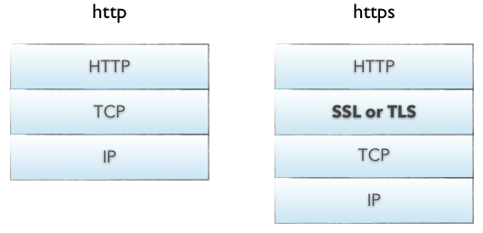

<Boxx type='tip' />

推荐阅读：  
1，[超逸の博客](https://yangchaoyi.vip/posts/vue-family/)


## 页面布局
题目： 假设高度已知，请写出三栏布局，其中左、右栏宽度各为300px，中间自适应  
- 浮动解决方式
- 绝对定位
- flexbox 解决方式，  [flex 布局](http://www.ruanyifeng.com/blog/2015/07/flex-grammar.html?utm_source=tuicool)
- 表格布局
- 网格布局

:dolphin: **优缺点**   
- 浮动
> 优点：兼容性比较好 

> 缺点：设置浮动之后，脱离了文档流，（需要清除浮动和其它浮动周边元素的关系处理好）处理不好的话，会带来很多问题，这是它本身的局限性。

- 绝对定位
> 优点: 快捷，不容易出问题       

> 缺点：本身脱离了文档流，就会导致子元素跟着脱离文档流。因此，导致绝对定位的有效性、可使用性比较差。

- flexbox

> css3中推出的flex布局，就是为了解决上述两种方式不足而出现的，算是比较完美的一种方式，尤其是对于移动端

- table
> 优点: 尽管多数人吐槽表格布局，但其实，表格布局在很多场景都适用的。比如上文写的三栏布局设计当中，表格布局是不是很轻松就实现了呢？同时，表格布局的兼容性是非常好的，当用flex解决不了问题的时候，对于PC端 IE8是不支持flex的，此时就可以尝试表格布局

> 缺点: 除开历史上一些诟病外，还有一个：比如我们把三栏理解成为三个小单元格，那么当其中某一个单元格高度超出的时候，其余两侧也会跟着调整，于是对于有些场景是不合适的。因此，对于不同场景，我们可以在flex和表格布局进行选优操作


## HTTP

```
POST和GET的区别（重点前5条）
get在浏览器回退时是无害的，而post会再次提交请求

get请求会被浏览器主动缓存，而post不会，除非手动设置

get请求参数会被完整保留在浏览器历史记录里，而post中的参数不会被保留

get请求在URL中传送的参数是有长度限制的，而POST没有限制

get参数通过URL传递，post放在Request body中

get请求只能进行url编码，而post支持多种编码方式

对参数的数据类型，get只接受ASCALL字符，而post没有限制

get比post更不安全，因为参数直接暴露在URL上，所以不能用来传递敏感信息

get产生的URL地址可以被收藏，而post不可以

```


## 浏览器的渲染机制
在浏览器的输入栏输入url到你看见的网页，是个怎样的过程？       

:strawberry: 一共可分为下面几步：     
- DNS 解析
- TCP 连接
- 发送HTTP 请求
- 服务器处理请求并返回HTTP报文
- 浏览器解析渲染页面
- 连接结束

#### 具体过程
1，DNS 解析   
DNS解析，就是**ip地址解析**，（例如将www.google.com 解析成 64.233.189.104），就是寻找哪台机器上有你需要资源的过程。
当你在浏览器中输入一个地址时，例如www.baidu.com，其实不是百度网站真正意义上的地址。互联网上每一台计算机的唯一标识是它的IP地址，但是IP地址并不方便记忆。用户更喜欢用方便记忆的网址去寻找互联网上的其它计算机，也就是上面提到的百度的网址。所以互联网设计者需要在用户的方便性与可用性方面做一个权衡，这个权衡就是一个网址到IP地址的转换，这个过程就是DNS解析。它实际上充当了一个翻译的角色，实现了网址到IP地址的转换。  

DNS 的解析是一个**递归查询的过程**， 举个例子,:chestnut: 查找www.google.com的IP地址过程。首先在本地域名服务器中查询IP地址，如果没有找到的情况下，本地域名服务器会向根域名服务器发送一个请求，如果根域名服务器也不存在该域名时，本地域名会向com顶级域名服务器发送一个请求，……， 解析过程为: . -> .com -> google.com. -> www.google.com.。

:dolphin: 拓展  
DNS 缓存： DNS存在着多级缓存，从离浏览器的距离排序的话，有以下几种: 浏览器缓存，系统缓存，路由器缓存，IPS服务器缓存，根域名服务器缓存，顶级域名服务器缓存，主域名服务器缓存。（例如：系统缓存主要存在/etc/hosts）， 这样的话就不需要经历上面的所有查询过程

DNS 负载均衡：不知道大家有没有思考过一个问题: DNS返回的IP地址是否每次都一样？   
如果每次都一样是否说明你请求的资源都位于同一台机器上面，那么这台机器需要多高的性能和储存才能满足亿万请求呢？其实真实的互联网世界背后存在成千上百台服务器，大型的网站甚至更多。但是在用户的眼中，它需要的只是处理他的请求，哪台机器处理请求并不重要。DNS可以返回一个合适的机器的IP给用户，例如可以根据每台机器的负载量，该机器离用户地理位置的距离等等，这种过程就是DNS负载均衡

DNS 重定向：也就是DNS负载均衡，大家耳熟能详的CDN(Content Delivery Network)就是利用DNS的重定向技术，DNS服务器会返回一个跟用户最接近的点的IP地址给用户，CDN节点的服务器负责响应用户的请求，提供所需的内容。

---


2，TCP 连接(三次握手,四次挥手)   
[简单理解](https://www.jianshu.com/p/d3725391af59)      
什么是TCP连接？为什么要TCP连接？       
> 为实现数据的可靠传输，TCP要在应用进程间建立传输连接。它是在两个传输用户之间建立一种逻辑联系，使得通信双方都确认对方为自己的传输连接端点。

通俗理解：    
三次握手：     
1，clint： 服务器啊，我是客户端，你能听见我说话吗？  （证明客户端能发送数据）          
2，server：客户端啊，我收到了。  （证明客户端能接收数据，发送数据）            
3，client：服务器啊，我收到了你的消息，下面我们可以互相发数据了。（证明客户端能接收数据）          

四次挥手：  
1）Client：我所有东西都说完了      
2）Server：我已经全部听到了，但是等等我，我还没说完      
3）Server：好了，我已经说完了        
4）Client：好的，我接收完了，那我们的通信结束l

---

3，发送HTTP 请求     
发送HTTP请求的过程就是构建HTTP请求报文并通过TCP协议中发送到服务器指定端口  

http 与 https：      
HTTPS协议的本质就是HTTP + SSL(or TLS)。在HTTP报文进入TCP报文之前，先使用SSL对HTTP报文进行加密。 



HTTP请求报文是由三部分组成: 请求行, 请求报头和请求正文。（在网页中发f12中的network查看请求的报文）

- 请求行
```
Method Request-URL HTTP-Version CRLF
```
常见的method： GET, POST, PUT, DELETE, OPTIONS, HEAD。

::: details GET 和 POST 的区别
GET请求在URL中传送的参数是有长度限制的，而POST没有。

GET比POST更不安全，因为参数直接暴露在URL上，所以不能用来传递敏感信息。

GET参数通过URL传递，POST放在Request body中。

GET请求参数会被完整保留在浏览器历史记录里，而POST中的参数不会被保留。

GET请求只能进行url编码，而POST支持多种编码方式。

GET请求会被浏览器主动cache，而POST不会，除非手动设置。

GET产生的URL地址可以被Bookmark，而POST不可以。

GET在浏览器回退时是无害的，而POST会再次提交请求。
:::

---

4，服务处理请求并返回http报文
HTTP响应报文也是由三部分组成: 状态码, 响应报头和响应报文。    
常见的状态码：      
1xx：指示信息——表示请求已接收，继续处理     
2xx：成功——表示请求已经被成功接收        
3xx：重定向——要完成请求必须进行更进一步的操作      
4xx：客户端错误——请求有语法错误或请求无法实现       
5xx：服务器错误——服务器未能实现合法的请求    


200 OK：客户端请求成功          
206 Partial Content：客户发送了一个带有Range（范围）头的GET请求，服务器完成了它（比如客户端请求0-1w字节，服务器就会返回206,常见播放视频和音频地址，文件过大时一般返回206）

---

301 Moved Permanently：所请求的页面已经转移至新的URL           
302 Found：所请求的页面已经临时转移至新的URL             
304 Not Modified：客户端有缓冲的文档并发出一个条件性的请求，服务器告诉客户，原来缓冲的文档还可以继续使用             

---

400 Bad Request：客户端请求有语法错误，不能被服务器所理解         
401 Unauthorized：请求未经授权，这个状态码必须和WWW-Authenticate报头域一起使用          
403 Forbidden：请求访问的页面被禁止（比如页面只能通过服务端去访问）           
404 Not Found：请求资源不存在      

---

500 Internal Server Error：服务器发生不可预料的错误但原来缓冲的文档还可以继续使用       
503 Server Unavailable：请求未完成，服务器临时过载或当机，一段时候后可能恢复正常        

响应报文：服务器返回给浏览器的文本信息，通常HTML, CSS, JS, 图片等文件就放在这一部分。

---

5， 浏览器渲染页面


第一步，HTML经过HTML解析器解析成为DOM Tree

第二步，CSS通过CSS解析器形成样式规则

第三步，将两个DOM结合形成Render Tree(渲染树)，这里就类似于告诉浏览器渲染树结构基本出来了，此时有一个平行操作，Layout，经过这个，就能知道元素具体应该显示在屏幕在哪个位置（宽、高、颜色等）

最后一步，浏览器通过GUI画图，呈现页面内容，最后Display显示页面

::: details reflow(回流) 和 repaint(重绘) 
当render tree的一部分或者全部元素因改变了自身的宽高，布局，显示或隐藏，或元素内部的文字结构发生变化，导致需要重新构建页面的时候，回流就产生了.

当一个元素自身的宽高，布局，及显示或隐藏没有改变，而只是改变了元素的外观风格的时候，就产生了重绘。

回流必定触发重绘，而重绘不一定出发回流
:::

:fish: js解析   
js 的解析是由浏览器中的js 解析引擎完成的，**js 是单线程运行的**， 也就是说，在同一个时间内只能做一件事情，所有的任务都需要排队
，前一个任务结束，后一个任务才开始。 但是很多任务是很耗时间的（比如下载文件），所以需要一种机制可以先执行排在后面的任务，这就是：同步任务(synchronous)和异步任务(asynchronous)。JS的执行机制就可以看做是一个主线程加上一个任务队列(task queue)。同步任务就是放在主线程上执行的任务，异步任务是放在任务队列中的任务。所有的同步任务在主线程上执行，形成一个执行栈;异步任务有了运行结果就会在任务队列中放置一个事件；脚本运行时先依次运行执行栈，然后会从任务队列里提取事件，运行任务队列中的任务，这个过程是不断重复的，所以又叫做事件循环(Event loop)。

举个例子： 输出结果为 1,3,2,
```js
console.log(1)
setTimeout(() => {
    console.log(2)
}, 0);
console.log(3)
```

当文档加载过程中遇到JS文件，HTML文档会挂起渲染过程，不仅要等到文档中JS文件加载完毕还要等待解析执行完毕，才会继续HTML的渲染过程。原因是因为JS有可能修改DOM结构，这就意味着JS执行完成前，后续所有资源的下载是没有必要的，这就是JS阻塞后续资源下载的根本原因。CSS文件的加载不影响JS文件的加载，但是却影响JS文件的执行。JS代码执行前浏览器必须保证CSS文件已经下载并加载完毕。


---

## 网站优化

推荐阅读：   
1，[雅虎WEB前端网站优化—34条军规](https://blog.csdn.net/damys/article/details/11521809)
- 减少http请求数
- 利用CDN技术
- 设置头文件过期或者静态缓存
- Gzip压缩
- 把css放顶部
- 把js放底部
……

提升页面性能的方法有哪些？              
1、资源压缩合并，减少HTTP请求        
2、非核心代码异步加载——异步加载的方式——异步加载的区别           
3、利用浏览器缓存——缓存的分类——缓存的原理         
4、使用CDN             
5、预解析DNS          

你知道浏览器与缓存相关的http头有哪些？ 

- 强缓存（不用任何请求，拿过来就用，如果两个都下发，以第二个Cache为准）

**Expires**（过期时间-服务器绝对时间） Expires:Thu,21 Jan 2017 23:39:02 GMT
（会导致客户端时间和服务器时间之间时间差问题）
**Cache-Control**（客户端相对时间，单位秒） Cache-Control:max-age=3600

- 协商缓存（浏览器发现本地有这个副本，但是不确定用不用它，于是得向服务器问一下，这个副本要不要用）

**Last-Modified**（拿到某个资源文件时，通过这个字段服务器下发一个时间）
**If-Modified-Since** （当下次请求这个资源是否发生变化时，是用这个key值，对比两个时间）

Last-Modified: Web,26 Jan 2017 00:35:11 GMT

（上述方式会存在问题，例如我可能时间上修改了，但是内容并没有修改）

**Etage**（解决上述问题，服务器给Etage值，当过了强缓存时间，浏览器请求是否可用副本时，会在http请求头中用 If-None-Match 当做key值，加上value，此value就是Etage的值）  


## html5 新特性
html5 新特性，移除了哪些元素？               
说到 h5 当然要说到语义化标签啦，比如article、footer、header、nav、section       
绘画： canvas
媒体：video、audio
存储：localStorage（长期存储数据）、sessionStorage（页面关闭删除）
表单控件：calendar、date、time、email、url、search

:unicorn: 移除元素：   
纯表现的元素：basefont、big、center、font、 s、strike、tt、u    
对可用性产生负面影响的元素：frame、frameset、noframes 

---

:dolphin: **请描述一下 cookies，sessionStorage 和 localStorage 的区别？**        
- ```cookie``` 是网站为了标示用户身份而存储在用户本地终端（client Side）上的数据（例如： Token）

- ```cookie``` 数据失踪在同源的http请求中携带，即使不需要，即会在浏览器和服务器来回传递

- ```sessionStrorage```和```localStorage```不会自动把数据发给服务器，仅保存在本地

存储大小： 

- ```cookie```数据大小不能超过 4k
- ```sessionStorage``` 和```localStorage``` 可以达到5M或者更大

有效时间：  

- ```localStorage``` 存储持久数据，浏览器关闭后数据不会丢失，除非主动删除
- ```sessionStorage``` 数据在当前浏览器窗口关闭后自动删除
- ```cookie``` 在设置的 expires（过期时间）之前，一直有效，即使当前浏览器关闭


---

:dolphin: **行内元素有哪些？块级元素有哪些？空（void）元素有哪些？**  
行内元素不可以设置宽高，不独占一行    
块级元素可以设置宽高，独占一行      

- :unicorn:  行内
```
<a>、<abbr>、<acronym>、<b>、<bdo>、<big>、<br>、
<cite>、<code>、<dfn>、<em>、<i>、、<input>、
<kbd>、<label>、<q>、<samp>、<select>、<small>、<span>、
<strong>、<sub>、<sup>、<textarea>、<tt>、<var>
``` 
- :unicorn:  块级 

```
<address>、<caption>、<dd>、<div>、<dl>、<dt>、<fieldset>、
<form>、<h1>、<h2>、<h3>、<h4>、<h5>、<h6>、<hr>、<legend>、
<li>、<noframes>、<noscript>、<ol>、<ul>、<p>、<pre>、<table>、
<tbody>、<td>、<tfoot>、<th>、<thead>、<tr>
```


--- 

