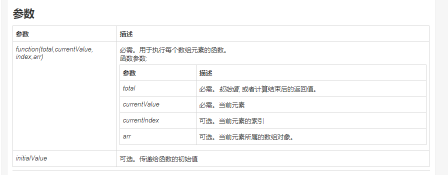

<Boxx type='tip' />

## js

### js常用api

- 下面代码会输出什么？
```js
[[1,0],[1,1]].reduce((acc,cur)=>{
    return acc.concat(cur);
},[0,1]);
```
```reduce()``` 接收一个函数作为累加器，数组中的每个值（从左到右）开始缩减，最终计算为一个值。  
参数： 


```concat```  连接两个或多个数组,参数可以是具体的值，也可以是数组对象。可以是任意多个。

[0,1] 就是 acc 的初始值，[0,1].concat([1,0]).concat([1,1]) 返回结果为 

```js
var res = [[1,0],[1,1]].reduce((acc,cur)=>{
    return acc.concat(cur);
},[0,1]);
console.log(res);  // [0,1,1,0,1,1]
```
---


### 类 class

- 下面代码会输出什么？
```js
class Counter {
    #number = 10
    increment() {
      this.#number++
    }
    getNum() {
      return this.#number
    }
}
const counter = new Counter()
counter.increment()
console.log(counter.#number)
```

**报错**
在 ES2020 中，通过 # 我们可以给 class 添加私有变量。在 class 的外部我们无法获取该值。当我们尝试输出 counter.#number，语法错误被抛出：我们无法在 class Counter 外部获取它!


---

```localStroage ``` API不支持设置过期时间  （true）

localstorage 原生是不支持设置过期时间的，想要设置的话，就只能自己来封装一层逻辑来实现，

---


## 算法

- 插入排序的定义？      
直接插入排序（Straight Insertion Sort）是一种最简单的排序方法，其基本操作是将一条记录插入到已排好的有序表中，从而得到一个新的、记录数量增1的有序表


## 计算机

- 进程和线程的区别  
 
> 进程是运行中的程序，线程是进程的内部的一个执行序列         
> 进程是资源分配的单元，线程是执行单元       
> 进程间切换代价大，线程间切换代价小        
> 进程拥有资源多，线程拥有资源少        
> 多个线程共享进程的资源        


---

## css

- transition有什么需要注意的地方？

transition 表示过渡，可以用来做过渡动作，简易的动画。
transition：(pro)


- px和rem的区别，举个例子说明一下?

px(css 像素,逻辑像素)   


### 常见状态码知道哪些？ 304 403 405分别是什么？
- 1xx,  继续，服务器接收到了请求 
- 2xx,  成功，服务器成功处理了请求
- 3xx,  重定向，
- 4xx,  客户端错误，
- 5xx,  服务器错误，

---

### 常见的状态码

- 200   ok，请求成功
- 206   partile content, 内容不完全， 表示服务器完成了请求，但是返回的文件过大。

---

- 301  （永久）Moved Permanently， 所有的请求已经转移到了新的url
- 302  （临时）所请求的页面已经临时转移至新的URL
- 304   not modified  缓冲的文档还可以继续使用

---

- 400   bad request  客户端有语法错误，不被服务器理解，可能是url不对，或者参数不对
- 401   请求未经授权，大多出现在一些需要授权的网页
- 403   访问被禁止（服务器理解客户端的请求，但是拒绝处理）
- 404   未找到，请求的资源不存在

---

- 500   服务器发生不可预料的错误但原来缓冲的文档还可以继续使用
- 503   请求未完成，服务器临时过载或当机，一段时候后可能恢复正常


### GET和POST 的区别？

- get参数在url中，有长度限制 4k， post 参数在 报文中，长度为 5M
- get由于暴露参数相对于post，不安全
- get回退无害，post会重新提交
- get会被浏览器主动缓存，post不会，除非手动设置
- get请求参数会被完整的保留在浏览器的历史记录里面，post不会


---

### tcp和udp 的区别？

- tcp 面向连接(如打电话要先拨号建立连接)、 udp无连接
---
- TCP 提供可靠的服务，保证无差错、不重复、不丢失，当数据不正确时，要求重新发送
- udp 最大努力交付，不保证可靠
---
- TCP 传输效率低， UDP传输效率高（适用于 与高速、实时性有较高要求的通信或广播通信）
---
- TCP 点对点， UDP一对一、一对多、多对一、多对多


### 同源是什么意思？
所谓同源是指"协议+域名+端口"三者相同，即便两个不同的域名指向同一个 ip 地址，也非同源。所以这里要注意一定是要相同的 **域名**


## setTimeout 和 promise

```js
console.log('打印'+1);
setTimeout(function(){
    console.log('打印'+2);
})
new Promise(function(resolve){
        console.log('打印'+3);
        resolve();
      }).then(function(){
        console.log(4);
      }
  );
console.log('打印'+10);
new Promise(function(resolve){
      setTimeout(function () {
        console.log('打印'+5);
      });
      resolve();
  }).then(function(){

  console.log('打印'+6)});
setTimeout(function(){
    new Promise(function(resolve){
        console.log('打印'+7);
      });
})
//执行结果：
//1;3;10;4;6;2;5;7
```

**Promise比setTimeout()先执行。**

因为Promise定义之后便会立即执行（宏事件），其后的.then()是异步里面的微任务。

而setTimeout()是异步的宏任务。

## 微任务与宏任务
:dolphin: **推荐阅读**   

宏任务和微任务表示异步任务的两种分类。  
先执行宏任务，当所有的宏任务执行完毕后，取出微任务顺序执行，当所有的微任务执行完毕后，开启新的宏任务。

## vue 的特征？
5大特性：

- 组件： 为了更好的管理大型程序，往往将应用切割成小而独立具有复用性的组件
- 模板渲染：在底层的实现上，Vue.js 将模板编译成虚拟DOM渲染函数
- 响应式设计：
- 过渡效果：
- 单文件组件： .vue 文件

## 父子组件传值的方式？  数据上的限制？

