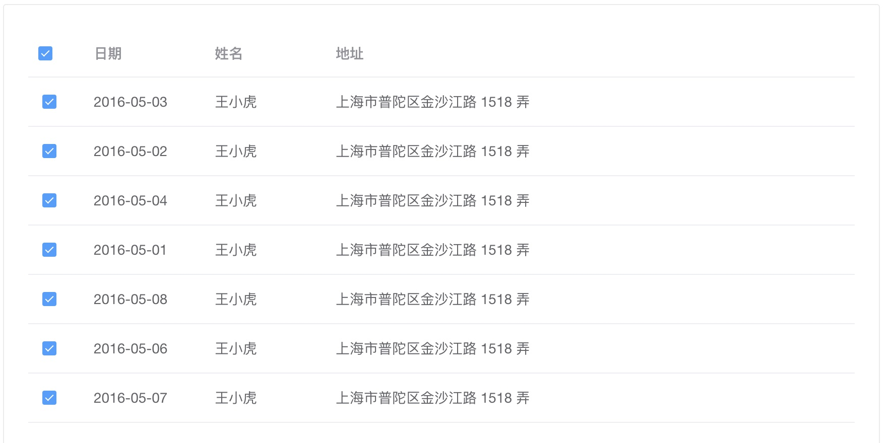

<Boxx type='tip' />

## 批量操作

在列表中，常见批量操作。 如下图：

 <br>


### :strawberry: 实现：

1，图一中使用的是element的table组件，可查看文档即可。


2，图二，思路： **首先**需要手绘 ```checkbox``` 圆框 or 方框

参考代码：

圆框如下，方框修改```border-radius```即可
```css
@include e(checkbox){
    position: relative;
    width: 16px;
    height: 16px;
    border: 2px solid #dcdcdc;
    line-height: 1.1;
    border-radius: 50%;
    color: #fff;
    background: #fff;
    vertical-align: middle;
    transition: background .2s;
    box-sizing: border-box;
    display: inline-flex;
    align-content: center;
    justify-content: center;
    @include m(is-checked){
        background-color: #4d80f0;
        border:0;
        &::after{
          box-sizing: content-box;
          content: "";
          border: 2px solid #fff;
          border-left: 0;
          border-top: 0;
          height: 8px;
          left: 5px;
          position: absolute;
          top: 2px;
          transform: rotate(45deg) scaleY(1);
          width: 3px;
          transition: transform .15s ease-in .05s;
          transform-origin: center;
        }
    }
}
```

**然后**，批量操作，实际上就是多选，先定义一个数组，表示选中的值，例如 ```selectedList: ['001','002','003']```, 当item被选中时
就将该item的id，push到数组中，当该item的id已经在数组中时，就删除该id； 全选时，将列表中的item的id全部push到数组中。 参考代码如下：

```js
/**
 * @description 批量分配时选中线索
 * @param id  线索id
 */
handleCheckBoxClick (id) {
  if (!this.handoutList.includes(id)) { // 不存在时，添加
    this.handoutList.push(id)
  } else { // 存在时，删除
    const index = this.handoutList.indexOf(id)
    this.handoutList.splice(index, 1)
  }
},
/**
 * @description 选中全部
 */
selectAll (checkall) {
  if (checkall) {
    this.handoutList = this.clueList.map((item) => item.id)
  } else {
    this.handoutList = []
  }
},
```