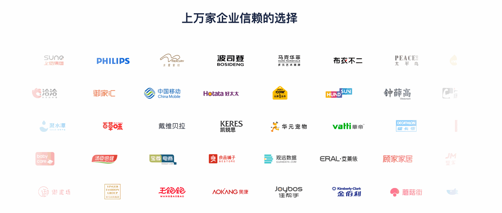
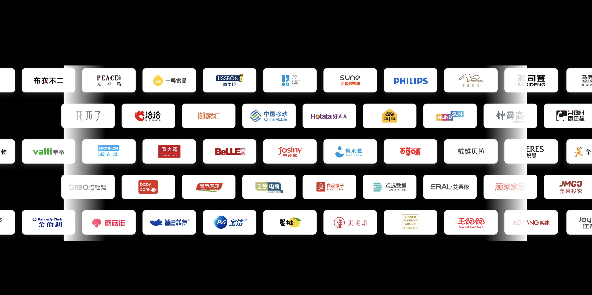
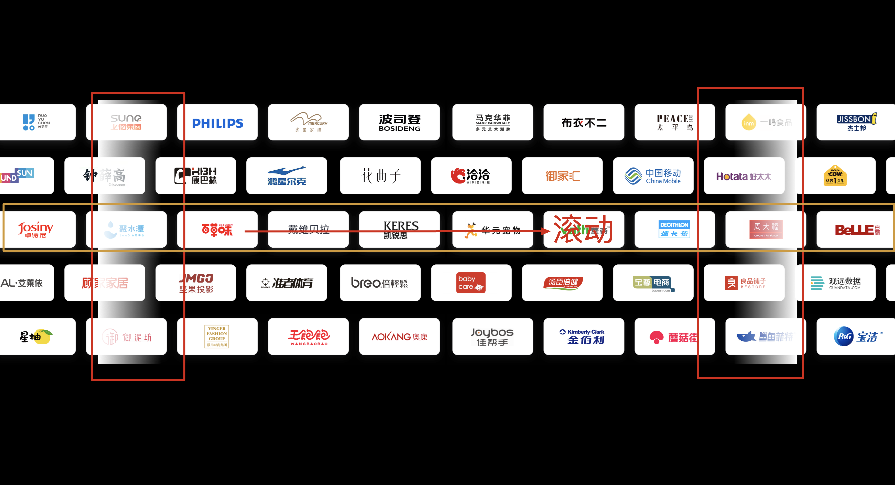

<Boxx type='tip' />

## 品牌流动效果



怎么实现呢？ 看下面这张图



解构




html 代码    

完整代码： [gitee](https://gitee.com/willwong/snippet/tree/master/%E6%B5%81%E5%8A%A8%E6%95%88%E6%9E%9Cdemo)

```html
<!DOCTYPE html>
<html lang="en">

<head>
    <meta charset="UTF-8">
    <meta http-equiv="X-UA-Compatible" content="IE=edge">
    <meta name="viewport" content="width=device-width, initial-scale=1.0">
    <title>Document</title>
    <style>
        body{
            background-color: #000;
        }
        .flowPic{
            width: 1400px;
            height: 530px;
            /* border: 1px solid red; */
            position: relative;
            /* overflow: hidden; */
            margin: 200px auto;
        }
        .mask{
            z-index: 10;
            height: 530px;
        }
        .right_mask{
            transform: rotate(180deg);
            position:absolute;
            right: 0;
        }
        .left_mask{
            position:absolute;
            left: 0;
        }
        .line_odd{
            width: 3650px;
            animation: scrollToRight 36s linear infinite;
        }
        .line_even{
            width: 3650px;
            animation: scrollToRight 30s linear infinite;
        }
        .logo_img{
            width: 1822px;
            display: inline-block;
        }
        .flowbrand{
            position:absolute;
            top: 0;
        }
        @keyframes scrollToRight {
            0% {
                transform: translate3d(-50%,0,0);
            }
            100% {
                transform: translateZ(0);
            }
        }
    </style>
</head>

<body>
    <div class="flowPic">
        
        
        <div class="flowbrand">
            <div class="line_odd">
                
                
            </div>
            <div class="line_even">
                 
                
            </div>
            <div class="line_odd">
                 
                
            </div>
            <div class="line_even">
                 
                
            </div>
            <div class="line_odd">
                 
                
            </div>
        </div>  
    </div>
</body>

</html>
```
