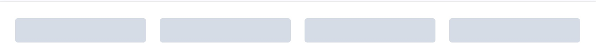
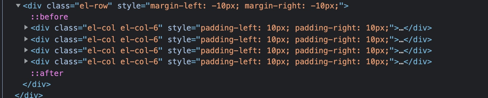

<Boxx type='tip' />

结合源码与使用文档阅读，进一步复习Vue2.0 和 了解element的使用，和以及源码实现与风格。

## alert
非浮层元素，静态呈现警告信息，具有一定的时效性，非功能性。

1, transition : transition 有 name 这一个属性（可自己定义name值），且一般只有一个子元素，这个子元素需要 v-if 或 v-show 来控制是否显示。 
- [vue的transition的name作用](https://www.cnblogs.com/zhuxingqing/p/11171526.html)
- [Vue文档transition](https://cn.vuejs.org/v2/guide/transitions.html)

:chestnut: 简单🌰， 复杂的可以细度 Vue文档
```html
<template>
  <div>
      <el-button type="info" @click="show=!show">toggle</el-button>
      <transition name="myfade">
          <div v-show="show">
              123
          </div>
      </transition>
  </div>
</template>
```
```css
.myfade-enter{
    opacity: 0;
}
.myfade-enter-active{
    transition: opacity 3s;
}
.myfade-leave-active{
    transition: opacity .5s;
}
.myfade-leave-to{
    opacity: 0;
}
```


2, slot 插槽
[Vue 插槽](https://cn.vuejs.org/v2/guide/components-slots.html)
在阅读alert源码时，我发现，title可直接通过props传递，也可以通过具名插槽传递。

匹配具名插槽 ```v-solt:title```
```html
<el-alert  type="success">
    <template v-slot:title>
        123
    </template>
</el-alert>
```
具名插槽 和 ```$slots.titile```
```html
<span  v-if="title || $slots.title">
  <slot name="title">{{ title }}</slot>
</span>
```
3，props

```js
props: {
  // 基础的类型检查 (`null` 匹配任何类型)
  propA: Number,
  // 多个可能的类型
  propB: [String, Number],
  // 必填的字符串
  propC: {
    type: String,
    required: true
  },
  // 带有默认值的数字
  propD: {
    type: Number,
    default: 100
  },
  // 带有默认值的对象
  propE: {
    type: Object,
    // 对象或数组且一定会从一个工厂函数返回默认值
    default: function () {
      return { message: 'hello' }
    }
  },
  // 自定义验证函数
  propF: {
    type: String,
    validator: function (t) {
      // 这个值必须匹配下列字符串中的一个, 未成功匹配时，控制台会报错
      return t === 'fade' || t === 'slide'
    },
    defalut:'slide'
}
```

4，set和map数据结构

推荐阅读：[深入理解：ES6中的Set和Map数据结构，Map与其它数据结构的互相转换](https://segmentfault.com/a/1190000016411261)

在阅读alert源码时，我发现，icon是根据type决定的，比如type=info 时，iconClass = el-icon-info，也就是iconClass和type存在一一对应的关系，本来可以直接传iconclass,但iconClass太长了，不好记忆，所以引入type，再通过Map结构，完成需求。

```js
const TYPE_CLASSES_MAP = {
  'success': 'el-icon-success',
  'warning': 'el-icon-warning',
  'error': 'el-icon-error'
};
```
```js
comptuted{
    iconClass() {
      return TYPE_CLASSES_MAP[this.type] || 'el-icon-info';
    }
}
```

## Sass - 变量默认(!default)

阅读alert样式时，我发现 ```$--alert-padding: 8px 16px !default;```

> 如果在此之前变量已经赋值，那就不使用默认值，如果没有赋值，则使用默认值。

推荐阅读：[Sass - 变量默认(!default)](https://blog.csdn.net/weixin_44198965/article/details/101169272)

## BEM

1，```:class=" ['is-center','is-dark'] ```

```css
@mixin when($state) {
  @at-root {
    &.#{$state-prefix + $state} {
      @content;
    }
  }
}
```

## vue中的keep-alive的用法详细讲解

[vue中的keep-alive的用法详细讲解](https://segmentfault.com/a/1190000040006753)

## el-row 和 el-col

1，render

el-row 中出现了，下面这段代码。让我们来复习一下 `render`渲染函数。推荐阅读：[Vue 中的 Render 全面详解](https://segmentfault.com/a/1190000021042790)

```js
render(h) {
    return h(this.tag, {
      class: [
        'el-row',
        this.justify !== 'start' ? `is-justify-${this.justify}` : '',
        this.align ? `is-align-${this.align}` : '',
        { 'el-row--flex': this.type === 'flex' }
      ],
      style: this.style
    }, this.$slots.default);
  }
```

`h()`其实就是 `createElement()`，创建虚拟dom。

:strawberry: 参数

createElement（TagName，Option，Content）接受三个参数     
createElement(" 定义的元素 "，{ 元素的性质 }，" 元素的内容"/[元素的内容]) 

所以上面这段代码的意思是：渲染一个`tag`（标签，默认为 `div` 标签），`div`里面的内容是`this.$slots.default`(插在el-row里的)，样式为class

2，gutter

`gutter` 属性来指定每一栏之间的间隔，默认间隔为 0。
渲染效果



```js
style() {
  const ret = {};
  if (this.gutter) {
    ret.marginLeft = `-${this.gutter / 2}px`;
    ret.marginRight = ret.marginLeft;
  }
  return ret;
}
```
```js
gutter() {
      let parent = this.$parent;
      while (parent && parent.$options.componentName !== 'ElRow') {
        parent = parent.$parent;
      }
      return parent ? parent.gutter : 0;
    }
```

el-col

```js
 if (this.gutter) {
      style.paddingLeft = this.gutter / 2 + 'px';
      style.paddingRight = style.paddingLeft;
    }
```

```js
 if (this.gutter) {
      style.paddingLeft = this.gutter / 2 + 'px';
      style.paddingRight = style.paddingLeft;
    }
```

3, 


