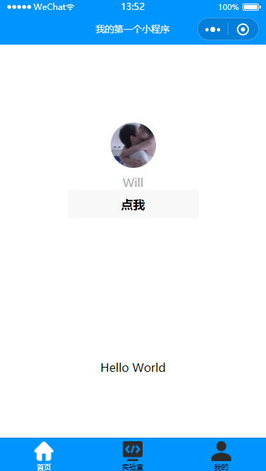
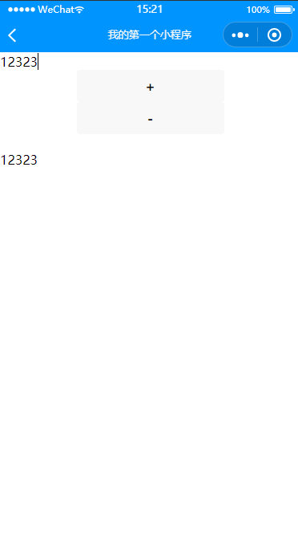
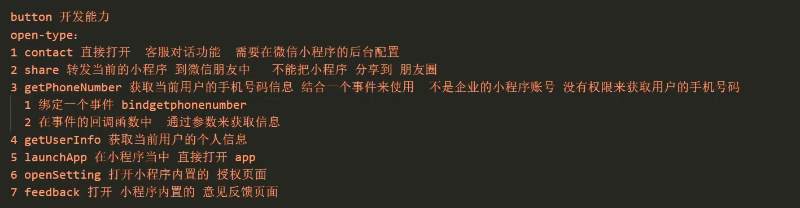
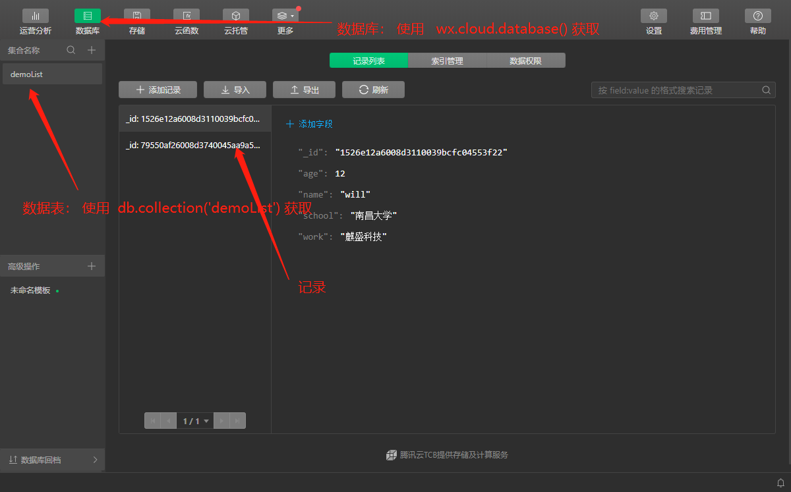
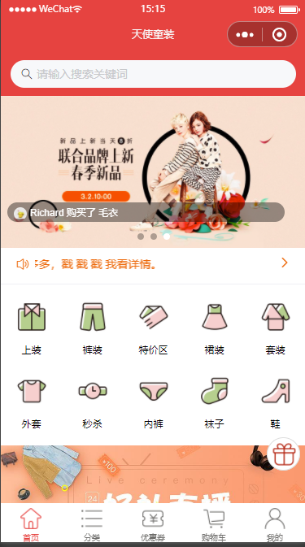

<Boxx type='tip' />

在学校的时候就说想学一学小程序来着，但是忙于其他的事情，加上自己也没有足够的重视，就拖拉到现在了。       
一句话： ***当你想做什么时，你就去做，不要拖沓。*** 

## 写在前面
以前在学校学习过 **安卓开发**，觉得特别好玩，也有兴趣，奈何当项目稍微大一些时，开发体验感极差，卡的不行。   
今天随便玩了玩微信小程序，感觉使用体验很好，开发体验也不错，开发工具、框架、文档都很俱全。

## hello world
安装微信开发者工具可以在官网下载安装，然后新建项目即可。 
- app.json

[app.json](https://developers.weixin.qq.com/miniprogram/dev/reference/configuration/app.html) 为全局配置文件，可以配置页面的标题及其颜色、背景颜色、taBbar等等     
1，pages 页面路径列表, 在微信开发者工具中，填写，将自动创建文件（wxml，wxss，js，json）       
2，window  窗口页面的一些配置，如顶部标题及其颜色背景   
3，tabBar   导航栏，可设置item

例：   其中的icon 来着[阿里巴巴矢量图标库](https://www.iconfont.cn)       




## 基础知识

> text  相当于 web 中的 span， 不换行， 行内

> view  相当于 web 中的 div， 换行， 块级

### 数据的双向绑定
1, 设置值： 
```
this.setData({
        num: e.detail.value
})
```

2, 函数参数需借助自定义属性
```
<view>
  <button bindtap="handleTap" data-opration="{{1}}">+</button>
  <button bindtap="handleTap" data-opration="{{-1}}">-</button>
</view>
```




### css

1, rpx     
规定屏幕的尺寸统一为 ```750rpx```,    
当设计稿上的 ```div```要求 ```500px```， 则应该这样计算：500 * 750 / 实际屏幕尺寸  
原理：     
```    
750 rpx == 实际屏幕尺寸 px    
    rpx ==  500 px  
```

2, 导入      
使用@import("url") 导入

3, 选择器     
不支持 * 通配符，下面代码将无效
```
*{
    padding: 0,
    margin: 0
}
```
 
### [组件](https://developers.weixin.qq.com/miniprogram/dev/component/text.html)     
这里只列举部分常用的组件，具体请看文档。
- text    
1，只有text组件能让文字变得可选，方法是添加 ```user-select ``` 属性   
2，解码 decode
```
<text user-select = "true"  decode="true">
    这里用来测试text 标签的 user-select 属性
    &nbsp;
    &lt;
</text>
```

- image    
1, 小程序的打包大小有限制， 所以图片等资源需要放到外部，可以借助图床。   
2，图片默认大小为 320px *  240 px      
3，image组件中二维码/小程序码图片不支持长按识别。仅在wx.previewImage中支持长按识别
4，懒加载 lazy-load 
5，缩放 mode 

- swiper
滑块视图容器。其中只可放置swiper-item组件，否则会导致未定义的行为。   
1，存在默认值， 默认高度为150px， 而且无法因为swiper-item内容撑开，但可以由css修改
```
- swiper 的宽度 为  100%

- swiper 宽度 / swiper 高度 =  图片的宽度 / 图片的高度 

- 根据上面的计算公司将 swiper 的高度计算出来，然后再将image 的 宽高比不变， 高度/ 宽度 自动填充  
```


- navigator        
导航组件，块级函数，默认会换行， 可以直接加宽度和高度。 


- rich-text     
可以解析代码，实际上这样写不安全

- button   
按钮，用法和web中类似        
1， type       
2， form-type         
3， **open-type**  



---
---
***大概学习了一边小程序的基础语法，与web基本相似，有略微差别，具体可以看官方文档***

## 云开发

### :strawberry: 数据库


:fish:  获取 demoList中的数据：
```js
db.collection('demoList').get(
      {
        success: res=>{
          console.log(res)
        }
      }
    ) 
```
:fish: 条件获取   
获取 id为 ```1526e12a6008d3110039bcfc04553f22 ```的记录
```js{1}
db.collection('demoList').doc("1526e12a6008d3110039bcfc04553f22").get(
      {
        success: res=>{
          console.log(res)
        }
      }
    ) 
```

避免回调地域，也可以使用 promise 的风格调用
```js {1}
db.collection("demoList").get().then(
            res => {
                this.setData({
                    personList: res.data
                })
            }
        )
```

:fish: 前台使用数据库数据的简单demo

-   连接数据库
```js
const db = wx.cloud.database()
```
-   连接数据表
```js{1}
db.collection("demoList").get({
   success: res=>{

   } 
})
```

-   赋值给前台变量
```js{5}
db.collection("demoList").get({
   success: res=>{
       this.setData(
           {
               personList: res.data
           }
       )
   } 
})
```

-   前台显示
```
<view wx:for = "{{personList}}">{{item.name}} </view>
```


#### :fish: where 查询指令    
-   简单实例：
```js {1,2,3}
  db.collection("demoList").where({
      name: "will"
  }).get().then(
      res => {
          this.setData({
              personList: res.data
          })
      }
  )
```

#### :fish: add 添加记录

-   添加一条记录
```js {1,2,3,4}
db.collection("demoList").add({
    data: {
        name: '小鹿',
        age: '12',
        school: '北大'
    }
}).then(
    res => {
    }
)
```
-   表单添加
```html
<form bindsubmit="btnSub">
    <input name= 'name' placeholder="姓名"/>
    <input name= 'age' placeholder="年龄"/>
    <input name= 'school' placeholder="学校"/>
    <input name= 'work' placeholder="公司"/>
    <button type="primary" form-type="submit">提交</button>
    <button type="primary" form-type="reset">重置</button>
</form>
```
```js
btnSub(res) {
    var {
        name,
        age,
        school,
        work
    } = res.detail.value
    db.collection("demoList").add({
        data: {
            name,
            age,
            school,
            work
        }
    }).then(
        res => {}
    )
},
```

####  :fish: 更改

- update  局部更新一个或多个记录      
注意： 要添加筛选条件, 字段有则替换，无则添加
```js
updateData() {
    db.collection('demoList').where({
        name: '王玉',
        money: '10000'
    }).update({
        data: {
            name: '罗柳'
        }
    }).then()
},
```

- set   替换更新一个记录      
注意： 下面代码将记录 的name值修改，其他字段将全部删除， （慎用！）

```js
updateData() {
    db.collection('demoList').where({
        name: '王玉'
    }).set({
        data: {
            name: '罗柳'
        }
    }).then()
},
```

####  :fish: remove 删除数据
- 删除一条记录
注意： 在大多数情况下，我们希望用户只能操作自己的数据（自己的代表事项），不能操作其他人的数据（其他人的待办事项），这就需要引入权限控制了。
自己只能删除自己往数据库中添加的数据，小程序并不希望你删除其他人的数据。
``` js
removeData() {
    db.collection("demoList").where({
        name: '小鹿'
    }).remove().then()
},
```

#### :fish: count 记录条数
```js
db.collection("demoList").count().then(
    res=>{
        console.log(res)
    }
)
```

#### :fish: command 数据库操作符
```const _ = db.command ``` ```_```对象有很多方法：[api](https://developers.weixin.qq.com/miniprogram/dev/wxcloud/reference-sdk-api/database/Command.html)   

- 筛选出年龄大于15的     
gt 大于； lt 小于； eq  等于；  neq  不等于； gte  大于或等于； ……  更多见文档 [api](https://developers.weixin.qq.com/miniprogram/dev/wxcloud/reference-sdk-api/database/Command.html)   
```js
selectByAge() {
    db.collection('demoList').where({
        age: _.gt(15)
    }).get().then(
        res => {
            console.log(res)
            this.setData({
                personList: res.data
            })
        }
    )
},
```

in 和 nin  

```js
db.collection('demoList').where({
    age: _.in([18, 14])
}).get().then(
    res => {
        console.log(res)
        this.setData({
            personList: res.data
        })
    }
)
```

and   取 10岁到 20岁的人

```js{2}
db.collection('demoList').where({
    age: _.and(_.gt(10), _.lt(20))
}).get().then(
    res => {
        console.log(res)
        this.setData({
            personList: res.data
        })
    }
)
```

 
### :strawberry: 云函数
云函数是一段运行在云端的代码，无需管理服务器，在开发工具内编写、一键上传部署即可运行后端代码。 函数名类似于云接口，前端通过云函数名
即可启动云函数，并且可以给云函数传参数，云函数接受参数，并直接操作数据库。
- 简单示例：     
**注意：** 更改后的云函数一定要重新上传并部署

```js
onLoad: function(options) {
    wx.cloud.callFunction({
        name: 'getData',
    }).then(res => {
        console.log(res)
    })
}
```

- 给云函数传递参数   

传递参数
```js {4}
wx.cloud.callFunction({
    name: "getDemoList",
    data:{
        num: 3
    }
}).then(res=>{
    console.log(res)
})
```
接受参数
```js {4,3}
// 云函数入口函数
exports.main = async (event, context) => {
   var  num  = event.num
   return await db.collection("demoList").limit(num).get()  
}  
```


### :strawberry: 云存储

> 云开发提供了一块存储空间，提供了上传文件到云端、带权限管理的云端下载能力，开发者可以在小程序端和云函数端通过 API 使用云存储功能。

> 在小程序端可以分别调用 wx.cloud.uploadFile 和 wx.cloud.downloadFile 完成上传和下载云文件操作。下面简单的几行代码，即可实现在小程序内让用户选择一张图片，然后上传到云端管理的功能

- 上传图片到云存储案例：
```js {3, 15}
  // 选择图片，并生成临时地址
  loadImage(){
    wx.chooseImage({
      count: 1,
    }).then(res=>{
      console.log(res)
      
      var pathFile =  res.tempFilePaths[0]
      this.cloudFile(pathFile)
     
    })
  },

  // 利用临时地址将图片传到云存储空间
  cloudFile(path){
      wx.cloud.uploadFile({
        cloudPath: Date.now() + '.jpg',
        filePath: path
      }).then(res =>{
        console.log(res)
      })
  },
```


## 小程序ui 组件库
[友情链接](https://zhuanlan.zhihu.com/p/204245080?utm_source=qq)
9款小程序ui框架比较：  
这些UI组件库各有所长，适合不同的小程序类型，Vant 适合电商类的，TaroUI 与 Wux 适合工具类的，而蘑菇街的 MinUI 当然更适合社区类的了。
- TouchUI WX
- [lin-ui](https://doc.mini.talelin.com/component/view/loading.html)
- [we-ui](https://github.com/Tencent/weui-wxss)
- [iview weapp](https://github.com/TalkingData/iview-weapp)
- [ColorUI](https://github.com/weilanwl/ColorUI)
- [Vant Weapp](https://github.com/youzan/vant-weapp)
- [TaroUI](https://github.com/NervJS/taro-ui)
- [WuxUI](https://wux-weapp.github.io/wux-weapp-docs/#/introduce)
- [MinUI](https://meili.github.io/min/)


### :strawberry: Vant Weapp 小程序 UI 组件库初体验
UI 组件库的使用较为简单，具体可以看文档
- npm 初始化   
在 miniprogram 目录下并没有 package.json 文件， 所以我们在 miniprogram 目录下打开终端， 使用 ```npm init``` 初始化包管理

- 安装 @vant/weapp  
在 miniprogram 目录终端 ```npm i @vant/weapp -S --production```

- 使用npm模块    
在 微信开发者工具中点击 详情->本地设置->使用npm模块

- 构建npm    
在工具->构建npm

- 修改app.json
将app.json中的"style": "v2"移除，小程序的新版本基础组件强行加上了很多样式，难以覆盖，不关闭将造成部分组件样式混乱。

- 修改project.config.json       
开发者工具创建的项目，miniprogramRoot替代为miniprogram，package.json在其外部，npm建立无法正常工作。         
手动需要在project.config.json内添加如下配置，使开发者工具可以正确索引到故宫依赖的位置。
```json
{
  ...
  "setting": {
    ...
    "packNpmManually": true,
    "packNpmRelationList": [
      {
        "packageJsonPath": "./package.json",
        "miniprogramNpmDistDir": "./miniprogram/"
      }
    ]
  }
}
```
注意：由于现有的新版本开发者工具创建的小程序目录文件结构问题，npm建立的文件目录为miniprogram_npm，并且开发工具会在当前目录下创建miniprogram_npm的文件名，所以新版本的miniprogramNpmDistDir配置为'。/ '即可

- 引入组件                    
以Button组件为例，只需要在app.json或index.json中配置Button对应的路径即可。
所有组件文档中的引入路径均以npm安装为例，如果您是通过下载源代码的方式使用@ vant / weapp，则将路径修改为项目中@ vant / weapp所在的目录。
```json
// 通过 npm 安装
// app.json
"usingComponents": {
  "van-button": "@vant/weapp/button/index"
}
// 通过下载源码使用 es6版本
// app.json
"usingComponents": {
  "van-button": "path/to/@vant/weapp/dist/button/index"
}
// 通过下载源码使用 es5版本
// app.json
"usingComponents": {
  "van-button": "path/to/@vant/weapp/lib/button/index"
}
```
- 显示组件         
引入组件后，可以在wxml中直接使用组件
```html
<van-button type="primary">按钮</van-button>
```

## 设计指南
> 基于微信小程序轻快的特点，我们拟定了小程序界面设计指南和建议。 设计指南建立在充分尊重用户知情权与操作权的基础之上。旨在微信生态体系内，建立友好、高效、一致的用户体验，同时最大程度适应和支持不同需求，实现用户与小程序服务方的共赢。

[推荐阅读](https://developers.weixin.qq.com/miniprogram/design/)


## api工厂
在看一个名为 天使童装的开源项目时，发现一个 [api-wxapi](https://www.it120.cc/)的 api工厂，有点点类似云开发，就是别人给你做好了一个后台，你直接可以调用api访问数据，并且数据可
由你自己上传。但是免费版访问受限，这里只推荐作为 前端人员学习使用，不建议做项目时使用，除非你使用专业版，但其实也不安全，还不如自己构建后台。

- 注册       
[官网](https://www.it120.cc/)，点击又上角即可以注册使用，注册完成后登录后台管理系统，即可使用。

- 数据克隆         
免费注册开通新后台后登录，登录后的首页，请记下你的专属域名(可自己修改)，左侧菜单 “工厂设置” --> “数据克隆” --> “将别人的数据克隆给我”，对方商户ID填写 ```951```（天使童装的数据），点击 “立即克隆”，克隆成功后，F5 刷新一下后台

- 使用

```npm install apifm-wxapi```  npm安装模块， 引入模块， 初始化模块（用专属域名初始化）
```js
const WXAPI = require('apifm-wxapi')
WXAPI.init('will')
```

调用接口， 更多接口见[接口文档](https://github.com/gooking/apifm-wxapi/blob/master/instructions.md)
```js
 WXAPI.banners().then(res => {

      console.log('请在控制台看打印出来的数据：', res)  

  })
```

## 启动页
下面将使用 apifm-wxapi、原生组件、创建一个项目的启动页。启动页是一个app，第一次进入时加载的图片或者动画，可以缓解第一次长时间加载带给用户的焦虑。
还可以对app功能做一些介绍。

**多看注释的备注**

- 新建启动页        
在 ```app.json``` 中 的 pages 中添加 ``` "pages/start/start", ``` 保存后将自动创建start页面。    

start.wxml
```html
<swiper class="swiper_box" bindchange="swiperchange" indicator-dots="true" indicator-active-color="#fff">
  <swiper-item wx:for="{{banners}}" wx:key="id">
    <image mode="aspectFill" bindtap="imgClick" src="{{item.picUrl}}" />
  </swiper-item>
</swiper>

<view class="btn">
  <button 
  wx:if="{{swiperCurrent + 1 == swiperMaxNumber}}" 
  type="primary" 
  size="mini" 
  bindtap="goToIndex" 
  class="weui-btn mini-btn"
  >
  进入店铺
  </button>
</view>
```

::: details start.js 点击查看代码


```js
const WXAPI = require('apifm-wxapi')
const CONFIG = require('../../config.js')


//获取应用实例
var app = getApp();

Page({
    data: {
        banners: [],
        swiperMaxNumber: 0,
        swiperCurrent: 0
    },
    onLoad: function() {
        const _this = this
        wx.setNavigationBarTitle({
            title: wx.getStorageSync('mallName')
        })
        let shopMod = wx.getStorageSync('shopMod')
        if (!shopMod) {
            shopMod = 0
        }
        const app_show_pic_version = wx.getStorageSync('app_show_pic_version')

        // 有缓存，并且没有版本更新
        if (app_show_pic_version && app_show_pic_version == CONFIG.version) {
            if (shopMod == 1) {
                wx.redirectTo({
                    url: '/pages/shop/select',
                });
            } else {

                // redirectTo：关闭当前页，跳转到指定页； 
                // navigateTo： 保留当前页， 跳转到指定页；
                // switchTab： 只能用于跳转到tabbar页面， 并关闭其他非tabbar页面。

                wx.switchTab({
                    url: '/pages/index/index',
                });
            }
        } else {
            // 展示启动页
            WXAPI.banners({
                type: 'app'
            }).then(function(res) {
                if (res.code == 700) {
                    if (shopMod == 1) {
                        wx.redirectTo({
                            url: '/pages/shop/select',
                        });
                    } else {
                        wx.switchTab({
                            url: '/pages/index/index',
                        });
                    }
                } else {
                    _this.setData({
                        banners: res.data,
                        swiperMaxNumber: res.data.length
                    });
                }
            }).catch(function(e) {
                if (shopMod == 1) {
                    wx.redirectTo({
                        url: '/pages/shop/select',
                    });
                } else {
                    wx.switchTab({
                        url: '/pages/index/index',
                    });
                }
            })
        }
    },
    onShow: function() {

    },
    swiperchange: function(e) {
        // console.log(e.detail.current)
        //  swiperchange  轮播改变 ， e.detail.current 显示当前index （从0 开始）
        this.setData({
            swiperCurrent: e.detail.current
        })
    },
    goToIndex: function(e) {
        let shopMod = wx.getStorageSync('shopMod')
        if (!shopMod) {
            shopMod = 0
        }

        // app.globalData.isConnected 全局变量的使用
        // 在 app.json 中 配置， 
        // 在使用页面//获取应用实例
        // var app = getApp();
        // 即可使用
        if (app.globalData.isConnected) {
            wx.setStorage({
                key: 'app_show_pic_version',
                data: CONFIG.version
            })
            if (shopMod == 1) {
                wx.redirectTo({
                    url: '/pages/shop/select',
                });
            } else {
                wx.switchTab({
                    url: '/pages/index/index',
                });
            }
        } else {
            wx.showToast({
                title: '当前无网络',
                icon: 'none',
            })
        }
    },
    imgClick() {
        if (this.data.swiperCurrent + 1 != this.data.swiperMaxNumber) {
            wx.showToast({
                title: '左滑进入',
                icon: 'none',
            })
        }
    }
});
```
:::

- 详细见 [gitee](https://gitee.com/willwong/miniapp/tree/master/01%20apifm-wxapi)


## 首页 

### navigator 和弹性布局

```html
<!-- navgator 相当于链接a  -->
<navigator wx:if="{{true}}" url="/pages/shop/select">

  <!-- 这里要复习一下 css 的弹性盒子布局 -->
  <view class="shops-container">
    <view class="l">
      <image src="/images/order-details/icon-address.png"></image>
      <text>{{shopInfo.name}}</text>
    </view>
    <view class="r">
      <text>切换门店</text>
      <image src="/images/icon/next.png"></image>
    </view>
  </view>
</navigator>
```

```css
.shops-container {
  display: flex;
  /* 两端对齐 */
  justify-content: space-between;
  align-items: center;
  margin: 16rpx;
}
.shops-container .l {
  display: flex;
  align-items: center;
}
.shops-container .l text {
  color: #666;
  margin-left: 16rpx;
}
.shops-container .l image {
  width: 40rpx;
  height: 40rpx;
}
.shops-container .r {
  display: flex;
  align-items: center;
}
.shops-container .r text {
  color: #666;
}
.shops-container .r image {
  width: 40rpx;
  height: 40rpx;
}
```

::: details  弹性布局
参考[链接](https://www.cnblogs.com/hellocd/p/10443237.html),它之所以被称为 Flexbox ，是因为它能够扩展和收缩 flex 容器内的元素，
以最大限度地填充可用空间。与以前布局方式（如 table 布局和浮动元素内嵌块元素）相比，

Flexbox 是一个更强大的方式：        
- 在不同方向排列元素
- 重新排列元素的显示顺序
- 更改元素的对齐方式
- 动态地将元素装入容器


::: 


### 完成首页
:fish: 后面的知识基本相似，具体代码可参考 [gitee](https://gitee.com/willwong/miniapp/tree/master/02%20vant),        
:fish: 完整项目参考 [天使童装](https://github.com/EastWorld/wechat-app-mall), 建议细读代码， 自己完成一个商城项目。

