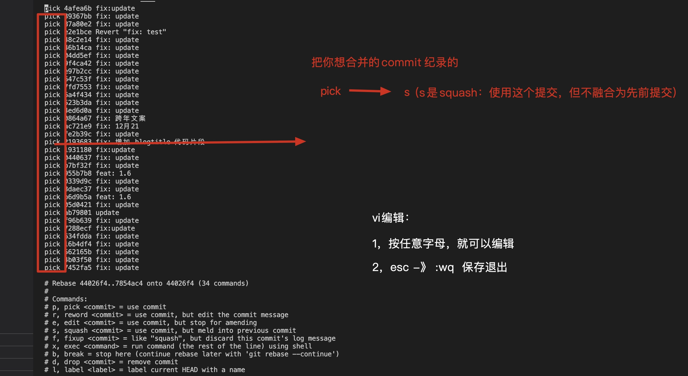
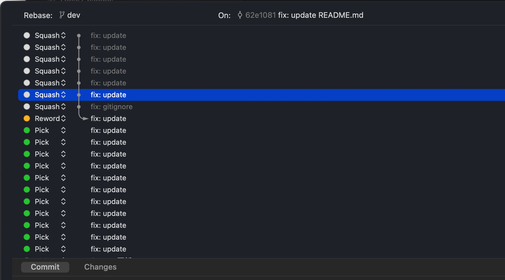

<Boxx type='tip' />

## 写在前面

新手推荐学习并熟练掌握下面的命令；  
老油条一般会使用集成工具啦，这里作者推荐 [fork](https://git-fork.com/)（用于rebase，等操作），简单的代码提交就用vscode自带的；

## git有什么用？
1. 版本控制
2. 多人协作 [推荐阅读](https://blog.csdn.net/wangliang888888/article/details/80536277)

git的基本操作        


## git clone
git clone 使用较多，通常是从远程仓库克隆一个版本库。                
在终端写下面代码即可克隆远程仓库的某个分支
```
git clone [-b] [<指定分支名>] <远程仓库地址> // []表示可选，不写，默认克隆master分支
```

## git remote
为了便于管理，Git要求每个远程仓库都必须指定一个仓库名。git remote命令就用于管理仓库名。          
不带选项的时候，git remote命令列出所有远程仓库。一个本地仓库可以添加多个远程仓库。             
- 查看远程仓库
```
git remote
// origin
```
- 远程仓库网址
```
git remote -v
```
- 添加远程仓库
```
git remote add <仓库名> <远程仓库地址>
```
- 删除远程仓库连接
```
git remote rm <仓库名>
```

- 修改远程仓库的名字
```
git remote rename <原仓库名> <新仓库名>
```

## git fetch
```git fetch ``` 命令通常用来**查看其他人的进程**，因为它取回的代码对你本地的开发代码没有影响。在多人协作开发时使用较多，主要是查看远程仓库更新，先拉取到本地，再查看是否与自己的代码冲突，**若无冲突就合并到自己的本地分支，若冲突则手动解决后合并分支。**
```
git fetch <远程主机名> <分支名>

// 不写分支名时，将取回所有分支的更新
```
- 查看更新
```
git log -p FETCH_HEAD
```

- 合并到master要使用下面的命令，避免落后master分支
```
git fetch origin

git merge origin/master
```

## git branch

- 合并分支（重要） [参考链接](https://www.cnblogs.com/panxuejun/p/7009195.html)     
```git merge``` 命令用于合并**指定分支到当前分支**,

因为创建、合并和删除分支非常快，所以Git鼓励你使用分支完成某个任务，合并后再删掉分支，这和直接在master分支上工作效果是一样的，但过程更安全。  

创建分支是依照master分支创建的（例如 dev ），-> 修改dev分支，-> 合并到master分支（实际上是将master指向dev的当前提交） -> 删除dev分支     

:chestnut: 举个例子：     
1, 创建并切换到dev分支 ```git checkout -b dev```  （从未提交过的仓库不存在任何分支）             
2, 在dev分支上修改内容（例如添加 test.html 文件）          
3, commit修改 ``` git add test.html ```,```git commit -m "add test.html" ```         
4, 切换到master分支 ``` git checkout master ``` (发现master中并没有 test.html, 即master不会被修改)          
5, 合并分支 ```git merge dev ``` ( 将dev分支合并到master分支上 )          
6, 删除dev分支```git branch -d dev```

- 查看远程分支
```
git branch -r
```
- 查看所有分支（远程+本地）
```
git branch -a
```
- 创建分支
```
git branch <branchName>

```
- 创建并切换到该分支
```
git branch -b <branchName>
```
- 删除分支
```
git branch -d <branchName>
```
- 删除远程分支
```
git remote origin --delete  dev
```


## git pull 
:fish:  相信你在学习前面的团队协作时一定遇到了，push时显示 **当前分支过期** 的情况    
> 这是因为你在修改时，远程的分支已经被其他程序员修改了，你本地就不是最新的版本了
这时需要使用```git pull```将远程分支拉取到本地再push，所以大多数人上班第一件事是 ```git pull ``` 将远程代码拉取到本地，然后再开发(最好创建新分支，开发完成后再合并)，在提交前又得```git pull```一次，这是为了在提交前使得版本最新。


```
git pull <远程主机名> <远程分支名>:<本地分支名>

// 如果远程分支是与当前分支合并，则冒号后面的部分可以省略。
// 例： git pull origin master
```
- git pull 与 git fetch
git pull = git fetch + git merge


## git push 
```git push```命令用于将本地分支的更新，推送到远程主机。它的格式与```git pull```命令相仿。
```
git push <远程主机名> <本地分支名>:<远程分支名>
```

## git reset 和 git revert 
有时候我们后面修改代码后可能会有bug，这时候需要回退为原来的版本，就可以使用git reset 和 git revert 
- [Git恢复之前版本的两种方法reset、revert（图文详解）](https://blog.csdn.net/yxlshk/article/details/79944535)
- [git reset 和 git revert](https://juejin.cn/post/6844903614767448072)  

> 1、git revert 后多出一条commit ，提醒同事，这里有回撤操作，<br/>
> 2、git reset 直接把之前 commit 删掉，非git reset --hard的操作是不会删掉修改代码，如果远程已经有之前代码，需要强推 git push -f

注意：git revert xxx 会回到xxx版本号之前的版本，XXX修改会被抹除。


## git rebase

推荐阅读：

- [彻底搞懂 Git-Rebase](http://jartto.wang/2018/12/11/git-rebase/)


git rebase主要作用：  1，变基； 2，合并提交纪录

- 变基

```
branch1 % git fetch origin master

branch1 % git rebase master

```


- 合并提交纪录（重要）

场景: 在开发时，我们常常会有多条提交纪录，某个功能上线，可能会存在100多条提交，或者**测试**，**走查**时，存在一些并不重要的提交纪录。
我们上线前将自己开发的分支合并到master上时，就会存在超级多的提交纪录，实际上，我们应该只留下一条或几条关键的提交纪录即可，这时，我们就可以用
上```git rebase -i```。

流程如下：

```
git rebase -i HEAD~4     // 准备合并4条提交纪录 

```




保存退出后，可以编辑 信息


**重要：**

1，``git log``` 查看是否合并成功了

2，有时候需要解决冲突，解决完毕 ```git add .```  ```git rebase --continue```

3，任何时候都可以使用 ```git rebase --abort``` 终止变基

4，```rebase -i```(压缩提交) 之后，不要提交代码， 这时可以 ```git log```看看合并成你想要的样子了没有，然后 ```git checkout -b branchName-relase```, 新建一个分支，然后再新分支上提交，就可以了，然后再用新分支 去合并到 master分支，这样master分支就很干净。


- 使用工具fork



fork工具的其他使用：参考[基于 fork 的 git 常规操作及解析 - 掘金](https://juejin.cn/post/6933552407242604551)


## git cherry-pick

git cherry-pick xxxx  在某分支上输入，即可克隆commit id 为xxxx 的提交；

