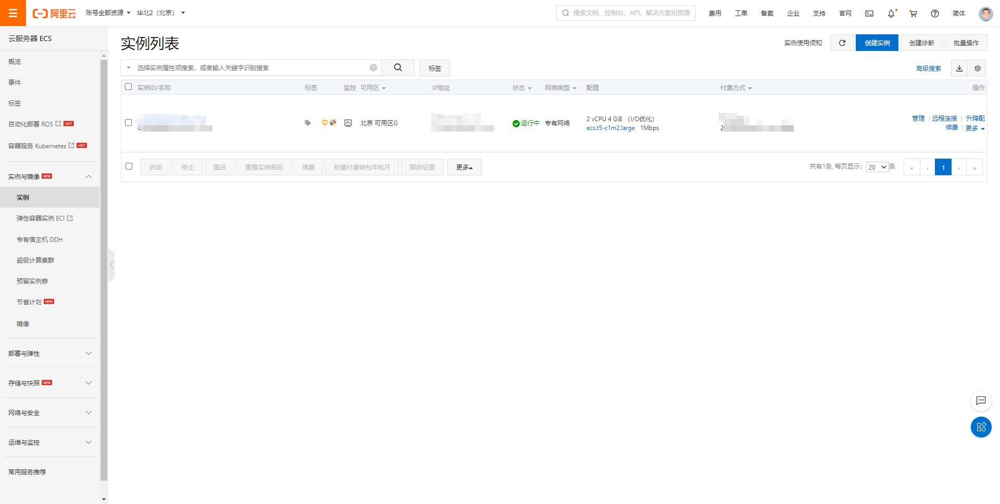
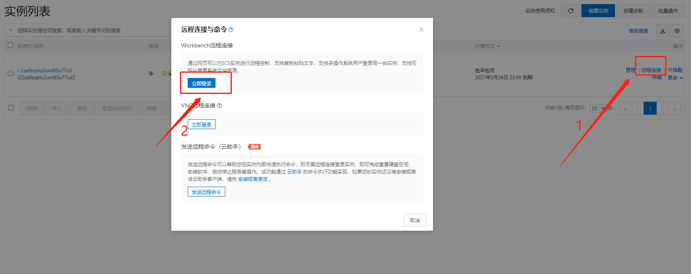
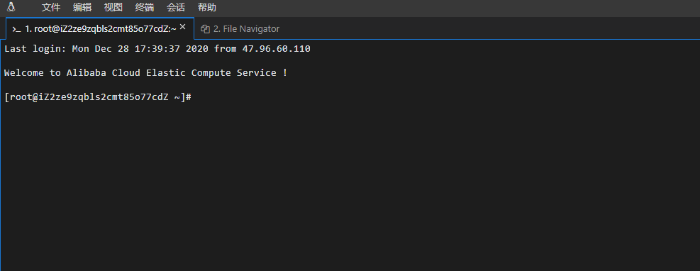
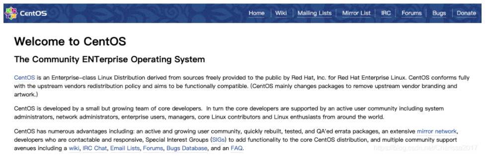
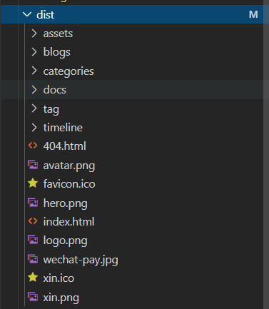
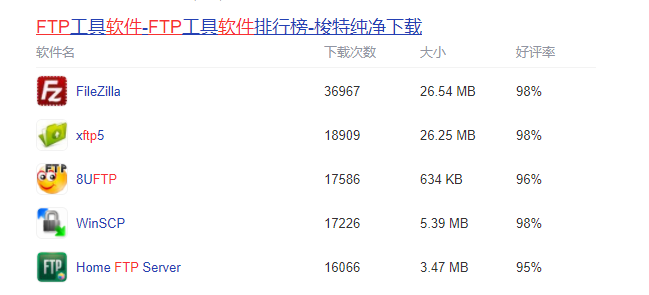
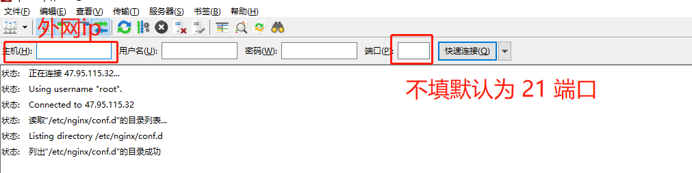
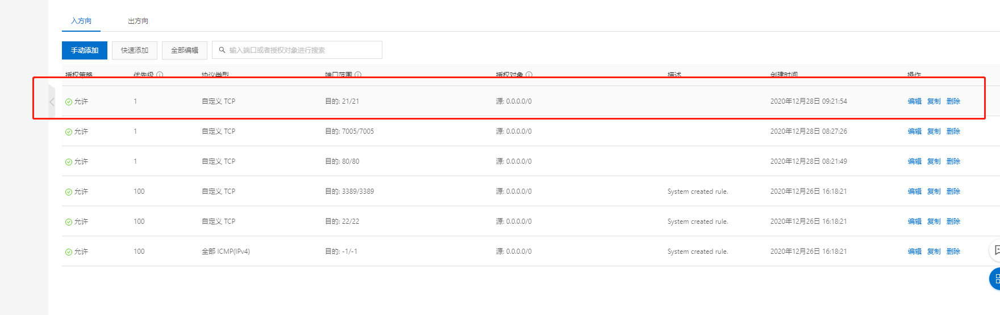
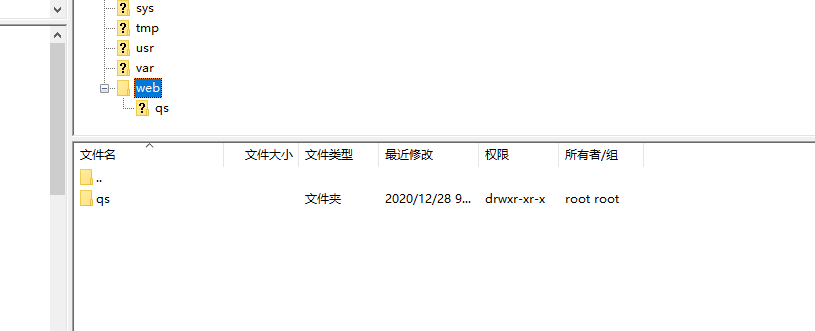

<Boxx type='tip' />

:tropical_fish:  前端开发完成的项目，不管是使用vue、react、或者是别的web项目，最终都是要部署到外网上，让用户可以通过域名来访问。   
- 静态网站，我们可以使用github或者gitee的pages服务完成部署（例如本博客）。    
- 动态网站，需要部署到web服务器上，我们可以购买阿里云服务器，在云服务器中构建**web服务器**（常见的web服务器：IIS、Apache、Tomcat、Nginx）。   
[参考链接](https://blog.csdn.net/Charissa2017/article/details/105886521)


## :tropical_fish: 阿里云服务器
首先你得需要有阿里云服务器，可以在阿里云购买。




## :tropical_fish: 本地连接阿里云服务器
方法：


连接成功后，可以使用终端操作云服务器




## :tropical_fish: 安装epel仓库
终端中继续输入下面的命令，安装epel仓库，-y表示一路确认。   
```yum install epel-release -y```   

epel仓库是软件仓库，安装完成之后你就可以直接使用yum来安装额外的软件包了


## :tropical_fish: 服务器安装nginx
终端中执行下面的命令，安装nginx。   
```yum install nginx -y```

## :tropical_fish: 启动Nginx
在终端执行下面的命令，启动nginx，执行命令后如果没有报错，则说明执行成功。  

 - 1、开启防火墙：systemctl start nginx   

 - 2、启动nginx：service nginx start  

重启nginx：nginx -s reload  

关闭nginx：service nginx stop  

nginx 启动成功后，在浏览器中输入主机名（公网ip），看是否启动成功，如果出现下面这个页面，则说明服务器连接成功。



## :tropical_fish: 项目打包
终端进入到项目根目录，执行```npm run build```，对项目进行打包，打包成功显示如下，打包完成后在根目录下会生成一个 build 的文件夹（如果是vue项目，会生成 dist 文件夹），部署就是将 build 或者 dist 文件夹里的内容放在公网上。


## :tropical_fish: 上传文件到服务器
1，上传文件到服务器可以使用FTP软件，常见的FTP软件有 


2，连接远程服务器：


**如果出现连接不成功，检查以下几点：**
- 主机是否正确，应该是外网IP；
- 端口号是否一致，FileZilla的默认端口号是21，检查阿里云后台安全组规则里是否设置了对应的端口；
- 检查用户名和密码是否正确；  



3， 上传文件
在远程服务器中的 ```/```目录下新建一个自己的文件夹，例如：web。 在web中再新建项目文件夹，例如/web/qs


<!--  -->

## :tropical_fish: 配置nginx代理
在本地新建 will.conf 文件（内容如下），注意修改外网ip，上传到远程服务器的 ```/etc/nginx/conf.d``` 目录下，改完配置文件后，执行 
```nginx -s reload``` 重启 nginx 服务。如果不报错的话，就是重启成功了。重启成功后，在浏览器中输入主机名（公网ip）+ 端口（nginx中监听的端口号），看是否能访问项目。

```{3,7}
server {
  #端口号
  listen 80;
  #域名或者ip
  server_name 47.95.115.32;
  #文件的路径
  root /web/qs;
  #配置默认访问的页面
  index index.html;
  #配置代理
  
location / {
  #当输入错误路径时，跳转到index.html页面
  try_files $uri $uri/ /index.html;
 }
}
```


<Vssue  />

