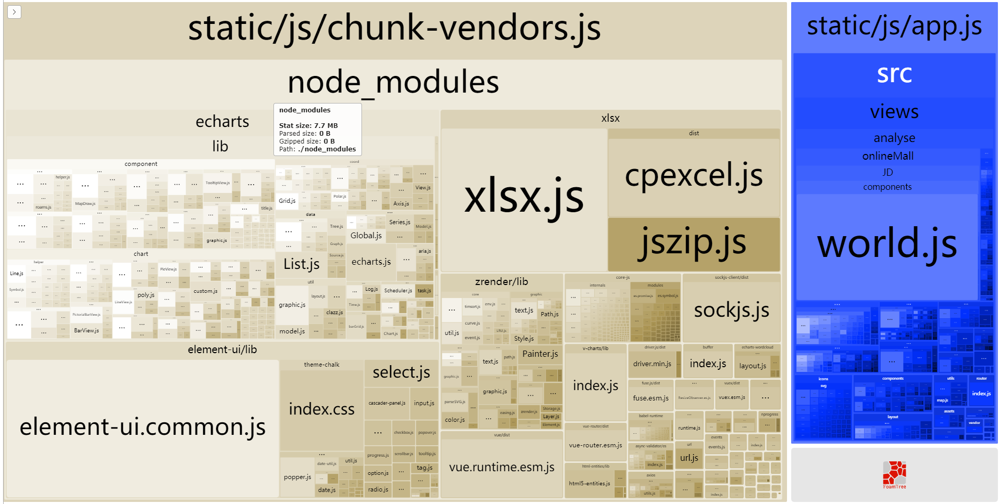

<Boxx type='tip' />
最近公司的项目差不多完成了第一阶段了，部署上线后发现首屏时间太长，长时间是白屏，体验感很差，一般的解决方案为项目优化和添加过渡动画。  

:fish: 推荐阅读：   
1，[首屏过长的解决方案](https://juejin.cn/post/6844903961154207757#heading-0)

## 打包分析工具
webpack-bundle-analyzer      
我们可以使用 analyzer 分析项目编译后的文件组成，以便进行加载速度优化。      


### 使用
- 安装：

```
npm install --save-dev webpack-bundle-analyzer
```


- 在vue.config.js 
```js
const BundleAnalyzerPlugin = require('webpack-bundle-analyzer').BundleAnalyzerPlugin;
```

- 在vue.config.js 的configureWebpack中配置：

```js
plugins: [
    new BundleAnalyzerPlugin({
        //  可以是`server`，`static`或`disabled`。
        //  在`server`模式下，分析器将启动HTTP服务器来显示软件包报告。
        //  在“静态”模式下，会生成带有报告的单个HTML文件。
        //  在`disabled`模式下，你可以使用这个插件来将`generateStatsFile`设置为`true`来生成Webpack Stats JSON文件。
        analyzerMode: 'server',
        //  将在“服务器”模式下使用的主机启动HTTP服务器。
        analyzerHost: '127.0.0.1',
        //  将在“服务器”模式下使用的端口启动HTTP服务器。
        analyzerPort: 8888,
        //  路径捆绑，将在`static`模式下生成的报告文件。
        //  相对于捆绑输出目录。
        reportFilename: 'report.html',
        //  模块大小默认显示在报告中。
        //  应该是`stat`，`parsed`或者`gzip`中的一个。
        //  有关更多信息，请参见“定义”一节。
        defaultSizes: 'parsed',
        //  在默认浏览器中自动打开报告
        openAnalyzer: true,
        //  如果为true，则Webpack Stats JSON文件将在bundle输出目录中生成
        generateStatsFile: false,
        //  如果`generateStatsFile`为`true`，将会生成Webpack Stats JSON文件的名字。
        //  相对于捆绑输出目录。
        statsFilename: 'stats.json',
        //  stats.toJson（）方法的选项。
        //  例如，您可以使用`source：false`选项排除统计文件中模块的来源。
        //  在这里查看更多选项：https：  //github.com/webpack/webpack/blob/webpack-1/lib/Stats.js#L21
        statsOptions: null,
        logLevel: 'info' // 日志级别。可以是'信息'，'警告'，'错误'或'沉默'。
    })
]
```

- 启动

```npm run dev``` 就可以启动， 8888 端口，也可以自行修改


## vue路由懒加载及组件懒加载
懒加载简单来说就是延迟加载或按需加载，即在需要的时候的时候进行加载。
[参考链接](https://router.vuejs.org/zh/guide/advanced/lazy-loading.html#%E8%B7%AF%E7%94%B1%E6%87%92%E5%8A%A0%E8%BD%BD)
- 组件懒加载
```js
const Home = () => import('./views/Home.vue')
const Login = () => import('./views/Login.vue')
```
- 路由懒加载
```js
const Foo = () => import('./Foo.vue')
```
```js
const router = new VueRouter({
  routes: [
    { path: '/foo', component: Foo }
  ]
})
```
## element 组件按需引入
只能缩小一点点体积，但也算是一种参考方式。
[参考链接](/docs/note/m4.html#快速上手)

## gzip打包
- 安装插件
```
npm install --save-dev compression-webpack-plugin
```

- vue.config.js 配置插件
```js
const webpack = require('webpack')
const CompressionWebpackPlugin = require('compression-webpack-plugin')
const productionGzipExtensions = ['js', 'css']
const isProduction = process.env.NODE_ENV === 'production'

module.exports = {
    configureWebpack:{
    plugins: [
      new webpack.IgnorePlugin(/^\.\/locale$/, /moment$/),
      
      // 下面是下载的插件的配置
      new CompressionWebpackPlugin({
        algorithm: 'gzip',
        test: new RegExp('\\.(' + productionGzipExtensions.join('|') + ')$'),
        threshold: 10240,
        minRatio: 0.8
      }),
      new webpack.optimize.LimitChunkCountPlugin({
        maxChunks: 5, 
        minChunkSize: 100
      })
    ]
    }
}

```

- Nginx服务器也要有相应的配置

```
server{
    listen 8087;
    server_name localhost;

    gzip on;
    gzip_min_length 1k;
    gzip_comp_level 9;
    gzip_types text/plain application/javascript application/x-javascript text/css application/xml text/javascript application/x-httpd-php image/jpeg image/gif image/png;
    gzip_vary on;
    gzip_disable "MSIE [1-6]\.";
}
```

:tomato: **踩坑：**     
报错：Cannot read property ‘tapPromise‘ of undefined
compression-webpack-plugin 版本太高，可以先卸载，再安装旧版本。
```
npm uninstall compression-webpack-plugin
```

```
npm i compression-webpack-plugin@5.0.1
```

## CDN加速
那我们就把那些不太可能改动的代码或者库分离出来，继续减小单个chunk-vendors，然后通过CDN加载进行加速加载资源。
:fish: **推荐阅读**
[1，Vue项目CDN引入ElementUI](https://juejin.cn/post/6898907771362607118)


## 细节优化
1，使用 transform-remove-console 插件清除 console 输出
2，