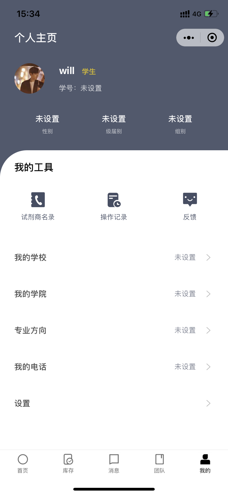

<Boxx type='tip' />

:100: 不知不觉，大学就到了最后的阶段了，以此文记录我的毕业设计。

我的课题是**基于微信小程序的实验室综合服务系统的设计与实现**，然而我从来都没有学过微信小程序。    
选择该课题，第一出于对微信小程序开发的
兴趣；第二是对微信小程序属于前端技术，自己希望能掌握更多的技术。
## 1，需求分析
### 1.1 询问导师
课题中设计的是实验室综合服务系统，所以我先询问导师，课题中的实验室是指什么类型的实验室，功能模块大概有哪些？
> 实验室就是指我们学院的实验室类型，一类是普通实验室，另一类是专业实验室（如数字电路实验室）。   

> 系统需提供课程信息查询、失物招领、问卷调查、故障报修等功能

### 1.2 上网查资料
出去微信小程序的限制，搜索 高校实验室综合服务管理系统，得到很多结果，我也是总结如下

> 综合管理（实验室建制、人员队伍、获奖成果、环境与安全、实验室评估、实验室建设）、   

> 实践教学（实验排课、开放实验、创新实验、实验室开放、实验成绩、实验考勤、实验预习、实验报告、实验过程、毕业实习、学科竞赛）、   

> 设备仪器（采购、审批、领用、借用、修理、报废等）、   

> 耗材低值品（耗材申报、采购、入库、领用、报废等）、   

> 大型仪器（仪器共享、仪器开放、仪器培训、仪器授权、仪器预约等）、   

> 实验资源（虚拟仿真、教学模拟软件、视频、课件、指导书、文档）、   

> 实验办公（课件、讲义、报告、视频、文件、邮件管理、在线交流、答疑、论坛）、   

> 报表与统计（人员统计、设备统计、实验室统计、数据上报7张基表）、  

> 安全与环境（安全制度、安全评估、安全准入、安全考试）  

### 1.3 整理需求
- 课程信息查询（实验室名称和实验室位置如 机房522）
- 实验室失物招领（例如：502 实验室丢失u盘）
- 设备仪器管理（领用、外借、报修、报废等）
- 查看实验室（因为实验室有多种，所以用户都应该可以查看实验室的基本信息，以及是否占用，座位剩余量）
- 实验资源（虚拟仿真、视频、课件、指导书、文档）
- 打卡考勤


## 2，设计功能模块

- **登录：**
***学生*** 和 ***教工*** 统一使用**学号+密码**登录该系统，不提供找回密码功能，基本样式如下（只作参考图）

 


 

 - **个人中心：**
包括个人的**基本信息**、**课表**和**设置**，基本样式如下（只作参考图），设置详细见后面

  


- **失物招领：**
包括 **lost** 和 **find**  ，基本样式如下（只作参考图）

 

 

 

- **设备仪器管理：**
包括**领用**、**外界**、**报修**、**报废**


- **实验室管理**
包括查看实验室基本信息（类型、容纳人数、位置） 和 状态（是否占用）

- **实验室资源**
包括课件、指导书、文档等

- **问卷调查**
与失物招领类似，包含问卷大厅、和发布问卷（最好是利用第三方接口导入）


## 3，小程序开发文档
通过之前的学习，我发现，比较好的学习文档永远都是官方文档，因为官方文档详细又有顺序。
[微信小程序开发文档](https://developers.weixin.qq.com/miniprogram/dev/framework/quickstart/)    
***出于篇幅的考虑，这里只记录部分学习笔记，有需要时可以去官网翻翻***

> 微信发布了一整套网页开发工具包，称之为 JS-SDK，开放了拍摄、录音、语音识别、二维码、地图、支付、分享、卡券等几十个API。给所有的 Web 开发者打开了一扇全新的窗户，让所有开发者都可以使用到微信的原生能力，去完成一些之前做不到或者难以做到的事情。

### 小程序与普通网页开发的区别

> ​网页开发渲染线程和脚本线程是互斥的，这也是为什么长时间的脚本运行可能会导致页面失去响应，而在小程序中，二者是分开的，分别运行在不同的线程中。网页开发者可以使用到各种浏览器暴露出来的 DOM API，进行 DOM 选中和操作。而如上文所述，小程序的逻辑层和渲染层是分开的，逻辑层运行在 JSCore 中，并没有一个完整浏览器对象，因而缺少相关的DOM API和BOM API。这一区别导致了前端开发非常熟悉的一些库，例如 jQuery、 Zepto 等，在小程序中是无法运行的。同时 JSCore 的环境同 NodeJS 环境也是不尽相同，所以一些 NPM 的包在小程序中也是无法运行的。

### 开始
- 申请账号
成功后登录小程序管理界面，界面和公众号类似，都是微信开发平台的产品（订阅号、服务号、企业微信、小程序、……）


### 代码构成

1，.json 后缀的 JSON 配置文件   
2，.wxml 后缀的 WXML 模板文件   
3，.wxss 后缀的 WXSS 样式文件   
4，.js 后缀的 JS 脚本逻辑文件   

- app.json ： 当前小程序的全局配置，包括了小程序的所有页面路径、界面表现、网络超时时间、底部 tab 等。   
**注意：** JSON的Key必须包裹在一个双引号中，在实践中，编写 JSON 的时候，忘了给 Key 值加双引号或者是把双引号写成单引号是常见错误。    
> JSON的值只能是以下几种数据格式，其他任何格式都会触发报错，例如 JavaScript 中的 undefined。   
数字，包含浮点数和整数   
字符串，需要包裹在双引号中   
Bool值，true 或者 false    
数组，需要包裹在方括号中 []   
对象，需要包裹在大括号中 {}   
Null   


> 还需要注意的是 JSON 文件中无法使用注释，试图添加注释将会引发报错。

- WXML 模板: 和 HTML 非常相似，WXML 由标签、属性等等构成。
**不同点：**
1，小程序的 WXML 用的标签是 view, button, text； 倾向组件化   
2，小程序利用的是 MVVM的开发模式，把渲染和逻辑分离，类似React、Vue   


- WXSS 样式： WXSS 具有 CSS 大部分的特性，小程序在 WXSS 也做了一些扩充和修改。

1， 新增尺寸单位：在写 CSS 样式时，开发者需要考虑到手机设备的屏幕会有不同的宽度和设备像素比，采用一些技巧来换算一些像素单位。WXSS 在底层支持新的尺寸单位 rpx

2， 提供了全局的样式和局部样式。和前边 app.json, page.json 的概念相同，你可以写一个 app.wxss 作为全局样式，会作用于当前小程序的所有页面，局部页面样式 page.wxss 仅对当前页面生效。

3， 此外 WXSS 仅支持部分 CSS 选择器


- JS 逻辑交互：一个服务仅仅只有界面展示是不够的，还需要和用户做交互：响应用户的点击、获取用户的位置等等。在小程序里边，我们就通过编写 JS 脚本文件来处理用户的操作。例如： button的click：  ``` <button bindtap = 'changeWord'> 点我试一下 </button> ```


### 小程序宿主环境

- 逻辑层与渲染层


- 程序与界面   
微信客户端在打开小程序之前，会把整个小程序的代码包下载到本地。  
紧接着通过 app.json 的 pages 字段就可以知道你当前小程序的所有页面路径:   
```{3}
{
  "pages":[
    "pages/index/index",  // 写在第一行的被当作 首页
    "pages/logs/logs"
  ]
}
```

- 组件    
小程序提供了丰富的基础组件给开发者，开发者可以像搭积木一样，组合各种组件拼合成自己的小程序。例如： ```<map></map>```

- api   
为了让开发者可以很方便的调起微信提供的能力，例如获取用户信息、微信支付等等，小程序提供了很多 API 给开发者去使用。

### 小程序框架

#### 1，逻辑层

- 注册小程序  
每个小程序都需要在 app.js 中调用 App 方法注册小程序实例，绑定生命周期回调函数、错误监听和页面不存在监听函数等。     
整个小程序只有一个 App 实例，是全部页面共享的。
```javascript
// app.js
App({
  onLaunch (options) {
    // Do something initial when launch.
  },
  onShow (options) {
    // Do something when show.
  },
  onHide () {
    // Do something when hide.
  },
  onError (msg) {
    console.log(msg)
  },
  globalData: 'I am global data'
})
```

- 注册页面   
简单的页面可以使用 Page() 进行构造。
```javascript
//index.js
Page({
  data: {
    text: "This is page data."
  },
  onLoad: function(options) {
    // 页面创建时执行
  },
  onShow: function() {
    // 页面出现在前台时执行
  },
  onReady: function() {
    // 页面首次渲染完毕时执行
  },
  onHide: function() {
    // 页面从前台变为后台时执行
  },
  onUnload: function() {
    // 页面销毁时执行
  },
  onPullDownRefresh: function() {
    // 触发下拉刷新时执行
  },
  onReachBottom: function() {
    // 页面触底时执行
  },
  onShareAppMessage: function () {
    // 页面被用户分享时执行
  },
  onPageScroll: function() {
    // 页面滚动时执行
  },
  onResize: function() {
    // 页面尺寸变化时执行
  },
  onTabItemTap(item) {
    // tab 点击时执行
    console.log(item.index)
    console.log(item.pagePath)
    console.log(item.text)
  },
  // 事件响应函数
  viewTap: function() {
    this.setData({
      text: 'Set some data for updating view.'
    }, function() {
      // this is setData callback
    })
  },
  // 自由数据
  customData: {
    hi: 'MINA'
  }
})
```
- 在页面中使用 behaviors
页面可以引用 behaviors 。 behaviors 可以用来让多个页面有相同的数据字段和方法。
```js
// my-behavior.js
module.exports = Behavior({
  data: {
    sharedText: 'This is a piece of data shared between pages.'
  },
  methods: {
    sharedMethod: function() {
      this.data.sharedText === 'This is a piece of data shared between pages.'
    }
  }
})
```

```js
// page-a.js
var myBehavior = require('./my-behavior.js')
Page({
  behaviors: [myBehavior],
  onLoad: function() {
    this.data.sharedText === 'This is a piece of data shared between pages.'
  }
})
```


- 使用 Component 构造器构造页面：      
age 构造器适用于简单的页面。但对于复杂的页面， Page 构造器可能并不好用。      
此时，可以使用 Component 构造器来构造页面。 Component 构造器的主要区别是：方法需要放在 methods: { } 里面。

- rpx：相应像素，可以根据屏幕宽度进行自适应


### 初始渲染缓存
启用初始渲染缓存，可以使视图层不需要等待逻辑层初始化完毕，而直接提前将页面初始 data 的渲染结果展示给用户，这可以使得页面对用户可见的时间大大提前，提升用户体验。     
利用初始渲染缓存，可以：  
> 快速展示出页面中永远不会变的部分：  
如导航栏；   
预先展示一个骨架页，提升用户体验；   
展示自定义的加载提示；   
提前展示广告，等等。    


## 4，看教学视频
😂，看文档看吐了，确实有一定的收获，但是速度太慢了，还是找找教学视频看吧。


由于在公司一边上班，所以进度很慢。

## 5，小程序ui组件库
[友情链接](https://zhuanlan.zhihu.com/p/204245080?utm_source=qq)
9款小程序ui框架比较：  
这些UI组件库各有所长，适合不同的小程序类型，Vant 适合电商类的，TaroUI 与 Wux 适合工具类的，而蘑菇街的 MinUI 当然更适合社区类的了。
- TouchUI WX
- [lin-ui](https://doc.mini.talelin.com/component/view/loading.html)
- [we-ui](https://github.com/Tencent/weui-wxss)
- [iview weapp](https://github.com/TalkingData/iview-weapp)
- [ColorUI](https://github.com/weilanwl/ColorUI)
- [Vant Weapp](https://github.com/youzan/vant-weapp)
- [TaroUI](https://github.com/NervJS/taro-ui)
- [WuxUI](https://wux-weapp.github.io/wux-weapp-docs/#/introduce)
- [MinUI](https://meili.github.io/min/)

## 6，书籍工具
今天有在看《微信小程序项目开发实战：用wepy、mpvue、taro打造高效的小程序》