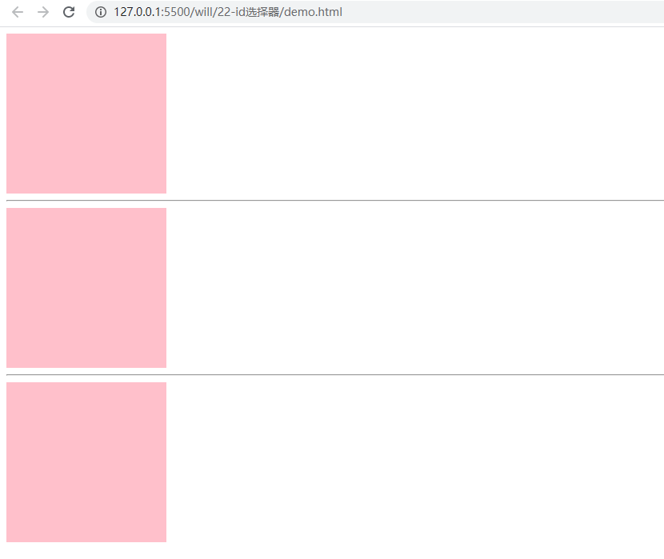
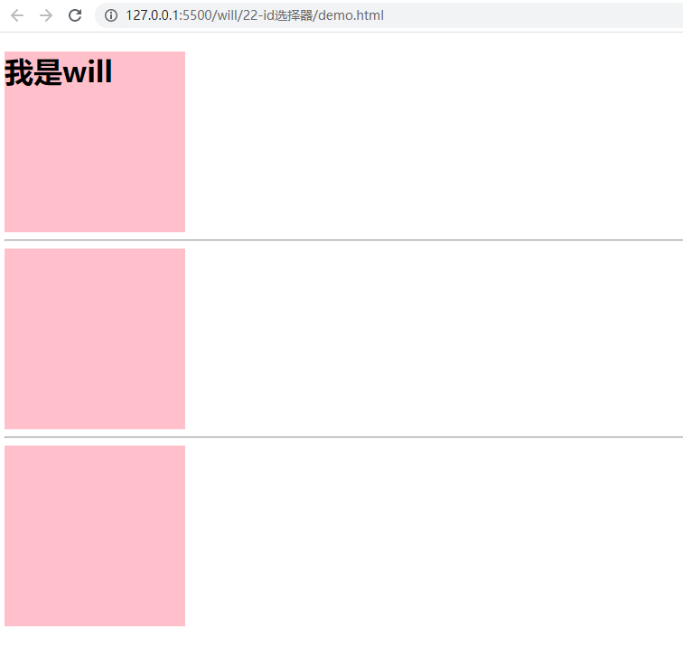

<Boxx type = 'tips' />

:dolphin: 记得在某次面试时，面试官问道：多个div使用相同的 id，会发生什么？  我想 id选择器是具有唯一性的，应该会报错吧，也有可能正常运行，给个警告。 面试官笑而不语。

:love_letter: 结论：什么也不会发生，该正确解析的还是正确解析，但是开发时不建议使用相同的 id，因为容易造成文档结构混乱。

## css解析
:smile: 看下面代码:
```html
<div id="demo">
</div>
<hr>
<div id="demo">
</div>
<hr>
<div id="demo">
</div>
```

```css
#demo {
    width: 200px;
    height: 200px;
    background-color: pink;
}
```
:unicorn: 显示效果


:smile: **我们会发现css能被正确解析，控制台也没有报任何的错误和警告。**

## js解析

```js
<script>
    document.getElementById('demo').innerHTML = '<h1>我是will</h1>'
</script>
```



:smile: **我们会发现js能被正确解析，控制台也没有报任何的错误和警告。**